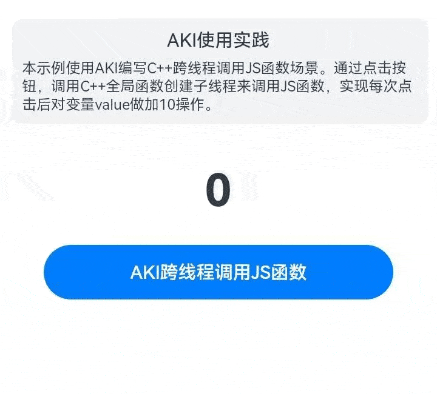

# 使用AKI轻松实现跨语言调用

### 介绍

针对JS与C/C++跨语言访问场景，NAPI使用比较繁琐。而AKI提供了极简语法糖使用方式，一行代码完成JS与C/C++的无障碍跨语言互调，使用方便。本示例将介绍使用AKI编写C++跨线程调用JS函数场景。通过调用C++全局函数，创建子线程来调用JS函数，实现对变量value的加10操作，为开发者使用AKI提供参考。

### 效果图预览



**使用说明**

1. 点击页面“AKI跨线程调用JS函数”按钮，每次点击，显示数值加10。

### 实现思路

以下是使用AKI和NPAI的libuv实现跨线程调用JS函数的实现对比：

1. AKI和NAPI初始化。

   AKI初始化使用JSBIND_ADDON注册Native插件，使用AKI的JSBIND_GLOBAL注册FFI特性，然后在JSBIND_GLOBAL作用域下使用AKI的JSBIND_FUNCTION绑定C++全局函数AkiThreadsCallJs。源码参考[akiusepractice.cpp](https://gitee.com/harmonyos-cases/cases/blob/master/CommonAppDevelopment/feature/akiusepractice/src/main/cpp/akiusepractice.cpp)。

   ```c++
   ...
   // 使用JSBIND_ADDON注册Native插件，可从JavaScript import导入插件。注册AKI插件名:即为编译*.so名称，规则与NAPI一致。
   JSBIND_ADDON(aki_use_practice)
   // 使用JSBIND_GLOBAL注册FFI特性。用于圈定需要绑定的全局函数作用域。
   JSBIND_GLOBAL() {
     // 在JSBIND_GLOBAL作用域下使用JSBIND_FUNCTION绑定C++全局函数后，可从JavaScript直接调用。
     JSBIND_FUNCTION(AkiThreadsCallJs);
   }
   ...
   ```

   NAPI的libuv初始化需要定义napi_property_descriptor结构体，准备模块加载相关信息，将Init函数与模块名等信息记录下来。源码参考[hello.cpp](https://gitee.com/openharmony/applications_app_samples/blob/master/code/Performance/PerformanceLibrary/feature/nativeThreadsCallJS/src/main/cpp/hello.cpp)。

   ```c++
   ...
   static napi_value Init(napi_env env, napi_value exports)
   {
       // 第一个参数"add"为ArkTS侧对应方法的名称。
       napi_property_descriptor desc[] = {
           {"UvWorkTest", nullptr, UvWorkTest, nullptr, nullptr, nullptr, napi_default, nullptr}
   };
   napi_define_properties(env, exports, sizeof(desc) / sizeof(desc[0]), desc);
   return exports;
   }
   
   // 准备模块加载相关信息，将Init函数与本模块名等信息记录下来。
   static napi_module demoModule = {
     .nm_version = 1,
     .nm_flags = 0,
     .nm_filename = nullptr,
     .nm_register_func = Init,
     .nm_modname = "entry",
     .nm_priv = ((void *)0),
     .reserved = {0},
   };
   
   extern "C" __attribute__((constructor)) void RegisterModule(void) { napi_module_register(&demoModule); } 
   ```

2. AKI和NAPI在native侧的业务函数实现。

   AKI在native侧业务函数实现是在AkiThreadsCallJs中创建子线程，子线程中使用aki::JSBind::
   GetJSFunction获取指定JavaScript函数akiAccumulate的句柄后，使用Invoke触发调用。源码参考[akiusepractice.cpp](https://gitee.com/harmonyos-cases/cases/blob/master/CommonAppDevelopment/feature/akiusepractice/src/main/cpp/akiusepractice.cpp)。

   ```c++
   // 定义C++函数AkiThreadsCallJs。从native主线程中创建子线程subThread调用JavaScript函数。
   void AkiThreadsCallJs(int value) {
       // 创建子线程subThread
       std::thread subThread([=]() {
           // 使用aki::JSBind::GetJSFunction获取指定JavaScript函数句柄后，使用Invoke触发调用。这里获取JS侧定义的函数akiAccumulate。
           if (auto func = aki::JSBind::GetJSFunction("akiAccumulate")) {
               // 定义一个函数对象callback，该函数对象接受一个整数参数并返回void。
               std::function<void(int)> callback = [](int value) {};
               // 调用JavaScript函数，Invoke<T>指定返回值类型。
               func->Invoke<void>(value, callback);
           }
       });
       // 将子线程subThread从主线程中分离出来,独立运行。
       subThread.detach();
       return;
   }
   ```

   NAPI的libuv在native侧业务函数实现是在native主线程中实现UvWorkTest接口。接口接收到ArkTS传入的JS回调函数后创建子线程，执行函数CallbackUvWorkTest。在CallbackUvWorkTest中创建工作任务workReq，通过uv_queue_work将工作任务添加到libuv队列中，等待被执行。源码参考[hello.cpp](https://gitee.com/openharmony/applications_app_samples/blob/master/code/Performance/PerformanceLibrary/feature/nativeThreadsCallJS/src/main/cpp/hello.cpp)。

   ```c++
   static napi_value UvWorkTest(napi_env env, napi_callback_info info) {
       size_t argc = 1;
       napi_value argv[1] = {0};
       napi_get_cb_info(env, info, &argc, argv, nullptr, nullptr);
   
       napi_valuetype valueType = napi_undefined;
       napi_typeof(env, argv[0], &valueType);
       if (valueType != napi_function) {
           OH_LOG_ERROR(LOG_APP, "UvWorkTest param is not function");
           return nullptr;
       }
   
       OH_LOG_INFO(LOG_APP, "UvWorkTest current value:[%{public}d]", g_cValue);
       for (int i = 0; i < g_threadNum; i++) {
           auto asyncContext = new CallbackContext();
           if (asyncContext == nullptr) {
               OH_LOG_ERROR(LOG_APP, "UvWorkTest new asyncContext fail!");
               return nullptr;
           }
           asyncContext->env = env;
           asyncContext->retData = i;
           OH_LOG_INFO(LOG_APP, "UvWorkTest thread begin index:[%{public}d], value:[%{public}d]", i, g_cValue);
           napi_create_reference(env, argv[0], 1, &asyncContext->callbackRef);
           std::thread testThread(CallbackUvWorkTest, asyncContext);
           testThread.detach();
           OH_LOG_INFO(LOG_APP, "UvWorkTest thread end index:[%{public}d], value:[%{public}d]", i, g_cValue);
       }
       return nullptr;
   }
   
   void CallbackUvWorkTest(CallbackContext *context) {
       if (context == nullptr) {
           OH_LOG_ERROR(LOG_APP, "UvWorkTest context is nullptr");
           return;
       }
       uv_loop_s *loop = nullptr;
       napi_get_uv_event_loop(context->env, &loop);
       // 创建工作数据结构,自定义数据结构添加在data中
       uv_work_t *workReq = new uv_work_t;
       if (workReq == nullptr) {
           if (context != nullptr) {
               napi_delete_reference(context->env, context->callbackRef);
               delete context;
               OH_LOG_INFO(LOG_APP, "UvWorkTest delete context");
               context = nullptr;
           }
           OH_LOG_ERROR(LOG_APP, "UvWorkTest new uv_work_t fail!");
           return;
       }
       workReq->data = (void *)context;
       // 此打印位于子线程
       OH_LOG_INFO(LOG_APP, "UvWorkTest childThread_1 [%{public}d]", g_cValue);
       // 添加工作任务到libuv的队列中
       uv_queue_work(loop, workReq, WorkCallback, AfterWorkCallback);
   }
   ```

3. AKI和NAPI在ArkTS侧调用JS函数。

   AKI在ArkTS侧使用AKI的JSBind.bindFunction绑定JavaScript全局函数akiAccumulate。使用AKI调用C++全局函数AkiThreadsCallJs。源码参考[AkiView.ets](https://gitee.com/harmonyos-cases/cases/blob/master/CommonAppDevelopment/feature/akiusepractice/src/main/ets/view/AkiView.ets)。

   ```typescript
   ...
   // 使用AKI的JSBind.bindFunction绑定JavaScript全局函数。
   libaki.JSBind.bindFunction("akiAccumulate", (values: number) => {
     // 对变量value做加10操作，刷新Text组件的value值。
     values += 10;
     this.value = values;
   });
   // TODO：知识点：使用AKI调用C++全局函数AkiThreadsCallJs，并传入参数value。
   libaki.AkiThreadsCallJs(this.value);
   ...
   ```

   NAPI的libuv在ArkTS侧调用C++全局函数UvWorkTest。源码参考[Index.ets](https://gitee.com/openharmony/applications_app_samples/blob/master/code/Performance/PerformanceLibrary/feature/nativeThreadsCallJS/src/main/ets/pages/Index.ets)。

   ```typescript
   entry.UvWorkTest((values: number) => {
     values += 10;
     logger.info('UvWorkTest js callback value = ', values.toString());
     this.value = values;
     return values;
   }
   ```

通过以上AKI和NAPI实现跨线程调用JS的实现步骤的对比，可以发现AKI在native侧相较于NAPI实现的代码量要少很多，使用也更加方便。

### 高性能知识点

1. AKI使用方便，但相比于NPAI，对性能的损耗相对会多一些。对性能要求不高，且更需要易用性开发的场景，推荐使用AKI。

### 工程结构&模块类型

   ```
   akiusepractice                                 // har类型
   |---src\main\cpp
   |   |---akiusepractice.cpp                     // native层-native侧业务处理
   |   |---CMakeLists.txt                         // native层-AKI相关CMake配置
   |---src\main\ets\view
   |   |---AkiView.ets                            // 视图层-AKI跨线程调用JS函数页面 
   ```

### 模块依赖

1. 本实例依赖[AKI](https://gitee.com/openharmony-sig/aki#-%E5%BF%AB%E9%80%9F%E6%8E%A5%E5%85%A5-)。
2. 本实例依赖common模块来实现[公共组件FunctionDescription](../../common/utils/src/main/ets/component/FunctionDescription.ets)。

### 参考资料

1. [AKI](https://gitee.com/openharmony-sig/aki)
2. [公共组件FunctionDescription](../../common/utils/src/main/ets/component/FunctionDescription.ets)