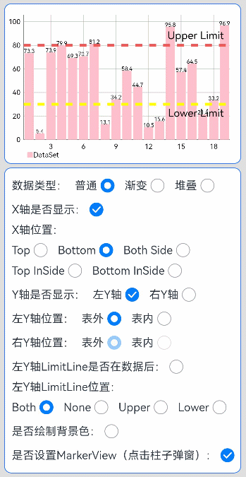

# MpChart图表实现案例

### 介绍

MpChart是一个包含各种类型图表的图表库，主要用于业务数据汇总，例如销售数据走势图，股价走势图等场景中使用，方便开发者快速实现图表UI。本示例主要介绍如何使用三方库MpChart实现柱状图UI效果。如堆叠数据类型显示，Y轴是否显示，左Y轴位置，右Y轴位置，是否显示X轴，是否绘制背景色，是否设置MarkerView等。

### 效果图预览



**使用说明**

1. 点击页面上控制项即可查看效果。需要注意的是选项”是否设置MarkerView“勾选后，点击柱状图中柱子会有弹窗效果。

### 实现思路

1. 通过this.model = new BarChartModel()初始化图表配置构建类。源码参考[BarChart.ets](https://gitee.com/harmonyos-cases/cases/blob/master/CommonAppDevelopment/feature/barchart/src/main/ets/view/BarChart.ets)。

   ```typescript
   // 图表数据初始化
   aboutToAppear() {
       // 初始化图表配置构建类
       this.model = new BarChartModel();
       ...
   }
   ```

2. 配置图表指定样式，为图表添加数据选择的监听器。源码参考[BarChart.ets](https://gitee.com/harmonyos-cases/cases/blob/master/CommonAppDevelopment/feature/barchart/src/main/ets/view/BarChart.ets)。

   ```typescript
   // 图表数据初始化
   aboutToAppear() {
       // 为图表添加数据选择的监听器。
       this.model.setOnChartValueSelectedListener(this.valueSelectedListener);
       ...
       // 配置图表指定样式：如启用绘制网格背景。
       this.model.setDrawGridBackground(false);
       ...
   }
   ```

3. 通过this.model.setData(this.data)将数据与图表配置类绑定。源码参考[BarChart.ets](https://gitee.com/harmonyos-cases/cases/blob/master/CommonAppDevelopment/feature/barchart/src/main/ets/view/BarChart.ets)。

   ```typescript
   // 图表数据初始化
   aboutToAppear() {
       ...
       // 生成单一颜色数据
       this.data = this.getNormalData();
       // 将数据与图表配置类绑定
       this.model.setData(this.data);
       ...
   }
   ```

4. 通过BarChart({ model: this.model })为组件设置配置构建类。源码参考[BarChart.ets](https://gitee.com/harmonyos-cases/cases/blob/master/CommonAppDevelopment/feature/barchart/src/main/ets/view/BarChart.ets)。

   ```typescript
   build() {
       Column() {
       ...
       // 为组件设置配置构建类。
       BarChart({ model: this.model })
       ...
       }
   }
   ```

### 高性能知识点

**不涉及**

### FAQ

1. 使用三方库MpChart老版本3.0.0-rc.1，发现从应用首页进入MpChart页面然后返回首页，重复操作，应用内存上涨较大，每次上涨达2-5M。

   答：使用@ohos/mpchart的版本3.0.1-rc.0后，重复上述操作，应用内存上涨大幅降低，每次上涨几百kB。补充说明：MpChart占用的内存，在退出页面后不会立即释放，底层会自动管理MpChart内存的释放。

### 工程结构&模块类型

   ```
   barchart                                        // har类型
   |---src\main\ets\view
   |   |---BarChart.ets                            // 视图层-MpChart柱状图页面
   ```

### 模块依赖

[@ohos/routermodule(动态路由)](../../feature/routermodule)

### 参考资料

[MpChart三方库](https://gitee.com/openharmony-sig/ohos-MPChart)