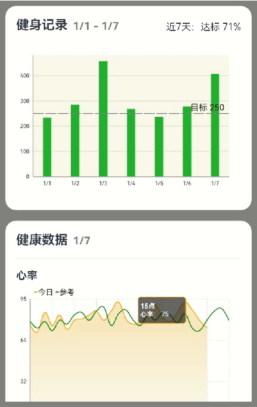

# MpChart运动健康场景实践案例

### 介绍

MpChart是一个包含各种类型图表的图表库，主要用于业务数据汇总，例如销售数据走势图，股价走势图等场景中使用，方便开发者快速实现图表UI，MpChart主要包括线形图、柱状图、饼状图、蜡烛图、气泡图、雷达图、瀑布图等自定义图表库。
本示例介绍了[MpChart](https://gitee.com/openharmony-sig/ohos-MPChart)图表组件的使用方法。
该组件多用于可视化等场景。

### 效果图预览



**使用说明**：

* 滑动屏幕，查看各图表组件。
* 点击曲线图内容，展示图表信息。

### 实现思路

1. 健身记录部分：使用柱状图描述近七日每日的热量消耗情况，主要实现点在于柱状图的创建过程。
- 初始化图表配置构建类

```ts
  // 初始化图表配置构建类
  this.model = new BarChartModel();
  // 设置图表数据最大的绘制数，如果超过该数值，则不进行绘制图表的数值标签
  this.model.setMaxVisibleValueCount(VISIBLE_VALUE_COUNT);
  // 是否绘制图表的背景色，绘制范围为图表柱状图的绘制范围，不包含轴线之外的部分
  this.model.setDrawGridBackground(true);
  // 设置图表的背景色，颜色的规格需要满足CanvasRenderingContext2D.fillstyle/strokestyle规格
  this.model.setGridBackgroundColor(GRID_BG_COLOR);
  // 设置不绘制柱状图的柱体阴影背景
  this.model.setDrawBarShadow(false);
  // 设置柱状图的数值在柱体上方
  this.model.setDrawValueAboveBar(true);
  // 设置柱状图的高亮范围是否为整个柱体，只在堆叠柱状图中有区别
  this.model.setHighlightFullBarEnabled(true);
```

- 限制线的设置

```ts
  // 为左Y轴设置LimitLine,可设置限制线的宽度，线段样式，限制标签的位置，标签字体大小等
  this.limitLine = new LimitLine(STEP_TARGET_NUMBER, STEP_TARGET);
  // 设置限制线的宽度
  this.limitLine.setLineWidth(LINE_WIDTH);
  // 设置限制线虚线类型的长度
  this.limitLine.enableDashedLine(DASHED_LINE_LENGTH, DASHED_SPACE_LENGTH, ZERO);
  // 设置限制线的颜色
  this.limitLine.setLineColor(Color.Gray);
  // 设置限制线的位置
  this.limitLine.setLabelPosition(LimitLabelPosition.RIGHT_TOP);
  // 设置限制线上文本的大小
  this.limitLine.setTextSize(vp2px(TEXT_SIZE));
```

- X轴Y轴设置

```ts
  // 设置图表左Y轴信息
  this.leftAxis = this.model.getAxisLeft();
  if (this.leftAxis) {
    // 设置图表左Y轴最小值
    this.leftAxis.setAxisMinimum(ZERO);
    // 设置图表左Y轴是否在数据后绘制限制线
    this.leftAxis.setDrawLimitLinesBehindData(false);
    // 设置图表左Y轴数据的格式转换器
    this.leftAxis.setValueFormatter(new YValueFormatter());
    // 添加LimitLines
    this.leftAxis.addLimitLine(this.limitLine);
  }
  // 设置图表右Y轴信息
  this.rightAxis = this.model.getAxisRight();
  if (this.rightAxis) {
    // 设置图表右Y轴是否显示
    this.rightAxis.setEnabled(false);
    // 设置图表右Y轴最小值
    this.rightAxis.setAxisMinimum(ZERO);
  }
  // 设置X轴信息
  this.xAxis = this.model.getXAxis();
  if (this.xAxis) {
    // 设置X轴是否绘制网格线
    this.xAxis.setDrawGridLines(false);
    // 设置绘制标签个数
    this.xAxis.setLabelCount(LABEL_COUNT, false);
    //设置标签位置
    this.xAxis.setPosition(XAxisPosition.BOTTOM);
    // 设置数据的格式转换器
    this.xAxis.setValueFormatter(new XValueFormatter());
  }
```

- 绑定图表数据

```ts
  // 生成数据
  this.data = this.getNormalData();
  // TODO 知识点：将数据与图表配置类绑定
  this.model.setData(this.data);
```

2. 健康数据部分：使用曲线图展示每日的热量消耗情况，主要实现点在于曲线图的创建过程。

- 初始化图表配置构建类

```ts
  // 初始化图表配置构建类
  this.model = new LineChartModel();
  this.model.setPinchZoom(false);
  this.model.setDrawGridBackground(false);
```

- X轴Y轴设置

```ts
  // 设置X轴信息
  this.xAxis = this.model.getXAxis();
  if (this.xAxis) {
    //设置标签位置
    this.xAxis.setPosition(XAxisPosition.BOTTOM);
    // 设置X轴是否绘制网格线
    this.xAxis.setDrawGridLines(true);
    this.xAxis.setGranularity(1);
    // 设置数据的格式转换器
    this.xAxis.setValueFormatter(new XValueFormatter());
    // 设置绘制标签个数
    this.xAxis.setLabelCount(10);
    this.xAxis.enableGridDashedLine(2, 2, 0);
  }
  // 设置图表左Y轴信息
  this.leftAxis = this.model.getAxisLeft();
  if (this.leftAxis) {
    this.leftAxis.setLabelCount(4, true);
    this.leftAxis.setDrawGridLines(true);
    // 设置图表左Y轴是否在数据后绘制限制线
    this.leftAxis.setDrawGridLinesBehindData(true);
    this.leftAxis.setPosition(YAxisLabelPosition.OUTSIDE_CHART);
    this.leftAxis.setAxisMinimum(0);
    // 设置图表左Y轴数据的格式转换器
    this.leftAxis.setValueFormatter(new YValueFormatter());
    this.leftAxis.setEnabled(true);
    this.leftAxis.enableGridDashedLine(2, 2, 0);
  }
  // 设置图表右Y轴信息
  this.rightAxis = this.model.getAxisRight();
  if (this.rightAxis) {
    // 设置图表右Y轴是否显示
    this.rightAxis.setEnabled(false);
  }
```

- 图表图例部分

```ts
  // 获取图表图例部件，设置图表图例部件不可用
  let legend: Legend | null = this.model.getLegend();
  if (legend) {
    legend.setEnabled(true);
    // 设置图例类型
    legend.setForm(LegendForm.LINE);
    // 设置图例文本大小
    legend.setTextSize(vp2px(14));
    // 设置图例方向为水平
    legend.setOrientation(LegendOrientation.HORIZONTAL);
    // 设置图例垂直对齐方式为顶部
    legend.setVerticalAlignment(LegendVerticalAlignment.TOP);
    // 设置图例水平对齐方式为左对齐
    legend.setHorizontalAlignment(LegendHorizontalAlignment.LEFT);
  }
```

- 绑定图表数据

```ts
  // 生成数据
  this.lineData = this.getLineData();
  // TODO 知识点：将数据与图表配置类绑定
  this.model.setData(this.lineData);
```

### 高性能知识点

**不涉及**

### 工程结构&模块类型

```
  health                                       // 运动健康场景实践案例
  |---model                                         
  |   |---BasicDataSource.ets                  // 数据类型文件
  |---view
  |   |---BarCharts.ets                        // 柱状图组件
  |   |---MpCharts.ets                         // 图表列表页面
  |   |---LineCharts.ets                       // 曲线图组件
```

### 模块依赖

[@ohos/routermodule(动态路由)](../../../../../../feature/routermodule)

### 参考资料

[@ohos/barchart(柱状图配置)](../view/BarChart.ets)

[MpChart](https://gitee.com/openharmony-sig/ohos-MPChart)
