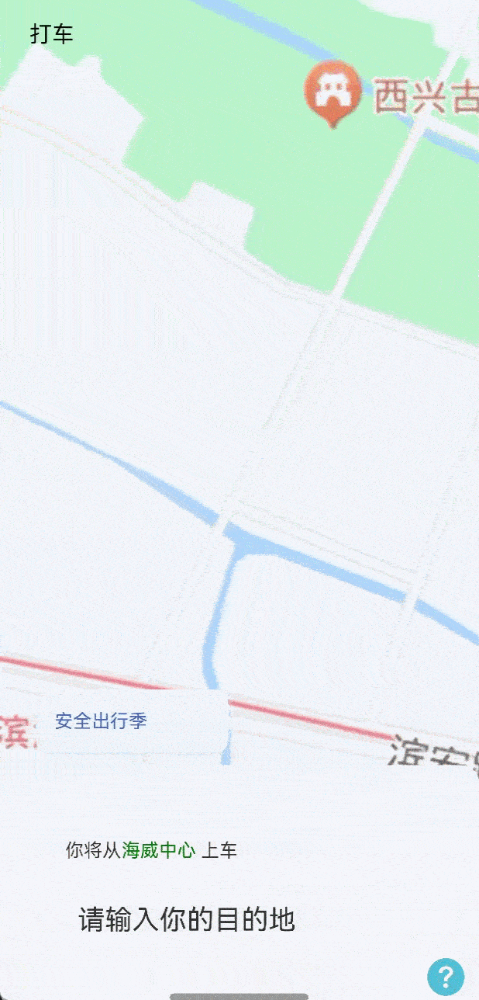

# 底部抽屉滑动效果案例

### 介绍

本示例主要介绍了利用List实现底部抽屉滑动效果场景，并将界面沉浸式（全屏）显示，及背景地图可拖动。

### 效果图预览



**使用说明**

1. 向上滑动底部列表，支持根据滑动距离进行分阶抽屉式段滑动。

### 实现思路

本例涉及的关键特性和实现方案如下：

1. 使用RelativeContainer和Stack布局，实现可滑动列表在页面在底部，且在列表滑动到页面顶部时，显示页面顶部标题栏。

```typescript
Stack({ alignContent: Alignment.TopStart }) {
  RelativeContainer() {
    // Image地图
    ImageMapView()
    // 底部可变分阶段滑动列表
    List({ scroller: this.listScroller }) {
    ...
    }
    .alignRules({
      'bottom': { 'anchor': '__container__', 'align': VerticalAlign.Bottom },
      'left': { 'anchor': '__container__', 'align': HorizontalAlign.Start },
      'right': { 'anchor': '__container__', 'align': HorizontalAlign.End },
    })
  }
  StatusHead({
    statusBarHeight: this.statusBarHeight,
    topHeaderHeight: CommonConstants.PAGE_HEADER_HEIGHT,
    isShow: this.isShow
  })
}
```

2. 通过对List设置onTouch属性，记录手指按下和离开屏幕纵坐标，判断手势是上/下滑。

```typescript
List({ scroller: this.listScroller }) {
  ListItemGroup({ header: this.itemHead("安全出行季") }){
  ...
  }
}
.onTouch((event) => {
  switch (event.type) {
    // 手指按下触摸屏幕
    case TouchType.Down: {
      this.yStart = event.touches[0].y;  // 手指按压屏幕的纵坐标
      break;
    }
    // 手指在屏幕移动      
    case TouchType.Move: {
      let yEnd = event.touches[0].y; // 手指离开屏幕的纵坐标
      let height = Math.abs(Math.abs(yEnd) - Math.abs(this.yStart)); // 手指在屏幕上的滑动距离
      let maxHeight = this.windowHeight - this.statusBarHeight; // list列表的最大高度
      // 判断上滑，且list跟随手势滑动
      if (yEnd < this.yStart) {
        this.isUp = true;
        ...
      }
      else {
        this.isUp = false;
        ...
      }
    }
  }
})
```

3. 根据手指滑动的长度对列表高度进行改变（以上滑为例）。

```typescript
this.isScroll = false;
this.listHeight = temHeight;
```

4. 在手指滑动结束离开屏幕后，通过判断此时列表高度处于哪个区间，为列表赋予相应的高度（以上滑为例）。

```typescript
switch (event.type) {
  case TouchType.Up: {
    this.yStart = event.touches[0].y;
    let maxHeight = this.windowHeight - this.statusBarHeight; // 设置list最大高度
    // 列表上滑时，分阶段滑动
    if (this.isUp) {
      // 分阶段滑动，当list高度位于第一个item和第二个item之间时，滑动到第二个item
      if (this.listHeight > CommonConstants.LIST_HEADER_HEIGHT + this.firstListItemHeight && this.listHeight <= CommonConstants.LIST_HEADER_HEIGHT + this.firstListItemHeight + this.bottomAvoidHeight + this.secondListItemHeight) {
        this.listHeight = CommonConstants.LIST_HEADER_HEIGHT + this.firstListItemHeight + this.secondListItemHeight;
        this.isShow = false;
        return;
      }
      // 分阶段滑动，当list高度位于顶部和第二个item之间时，滑动到页面顶部
      if (CommonConstants.LIST_HEADER_HEIGHT + this.firstListItemHeight + this.bottomAvoidHeight + this.secondListItemHeight < this.listHeight && this.listHeight <= maxHeight) {
        this.listHeight = maxHeight;
        this.isScroll = true;
        this.isShow = true;
        return;
      }
      // 分阶段滑动，当list高度大于最大高度，list滑动到页面顶部内容可滚动
      if (this.listHeight >= maxHeight) {
        this.isScroll = true;
        this.isShow = true;
        return;
      }
    }
    else {
      // 下滑阶段
      ...
    }
    break;
  }
}
```

### 高性能知识点

不涉及

### 工程结构&模块类型

   ```
   bottomdrawerslidecase                // har类型
   |---src/main/ets/constants
   |   |---CommonConstants              // 常量
   |---src/main/ets/components
   |   |---Component                    // 自定义组件
   |---src/main/ets/utils
   |   |---ArrayUtil.ets                // 数组控制
   |   |---dataSource.ets               // 数据类型文件
   |   |---WindowModel.ets              // 窗口管理器
   |---src/main/ets/view
   |   |---BottomDrawerSlideCase.ets    // 列表吸顶穿透界面
   ```

### 模块依赖

- 依赖[har包-common库中日志打印模块](../../common/utils/src/main/ets/log/Logger.ets)
- 依赖[路由管理模块](../../feature/routermodule)

### 参考资料

- [@ohos.window](https://developer.huawei.com/consumer/cn/doc/harmonyos-references/js-apis-window-0000001820880785)
- [触摸事件](https://developer.huawei.com/consumer/cn/doc/harmonyos-references/ts-universal-events-touch-0000001774121158)
- [基础手势](https://developer.huawei.com/consumer/cn/doc/harmonyos-references/ts-basic-gestures-pangesture-0000001774280890)