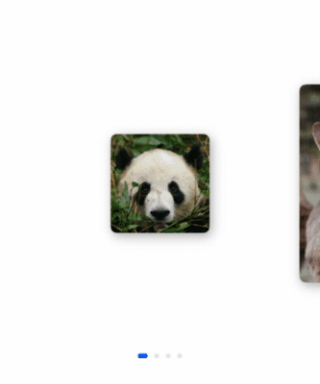
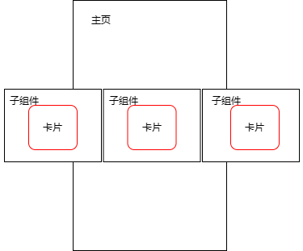
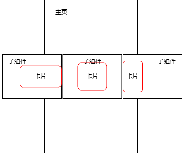

# 自定义Swiper卡片预览效果实现

### 介绍
本方案做的是采用Swiper组件实现容器视图居中完全展示，两边等长露出，并且跟手滑动效果。

### 效果图预览


### 实现思路
本解决方案通过维护所有卡片偏移的数组，实时更新卡片的偏移量，以实现swiper子组件内图片居中展示，两边等长露出。

1. 左右露出效果静态实现。

Swiper组件基础视图效果如下。



如果所有子组件卡片大小一样，子组件内卡片居中展示即可实现效果。但是当子组件的卡片大小不一样时，无法通过简单的设置居中布局实现左右的等长露出。
此时需要计算当前状态下的卡片的偏移量。



```typescript
  /**
   * 计算指定卡片的最大偏移量。
   * @param index {number} target card's index.
   * @returns offset value.
   */
  getMaxOffset(index: number): number {
    /*
     * 这里的偏移量指相对容器左侧的值。
     * 计算公式为：屏幕宽度 - Swiper两侧突出的偏移量 - 卡片自身的宽度。
     * 此值即为卡片可偏移的最大值，也就是卡片右对齐的状态值。
     * 如果居中，则将最大偏移量 / 2。
     */
    return this.displayWidth - this.cardsList[index].width - 2 * this.swiperMargin;
  }
        
  /**
   * 计算卡片偏移量，并维护偏移量列表。
   * @param targetIndex { number } swiper target card's index.
   */
  calculateOffset(target: number) {
    let left = target - 1;
    let right = target + 1;

    // 计算上一张卡片的偏移值
    if (this.isIndexValid(left)) {
      this.cardsOffset[left] = this.getMaxOffset(left);
    }
    // 计算当前卡片的偏移值
    if (this.isIndexValid(target)) {
      this.cardsOffset[target] = this.getMaxOffset(target) / 2;
    }
    // 下一张片的偏移值
    if (this.isIndexValid(right)) {
      this.cardsOffset[right] = 0;
    }
  }
```

2. 滑动跟手实现

滑动swiper组件动态位置更新原理和上一步静态位置获取原理一样，只不过在滑动过程通过相应的回调函数实时位置更新。
在以下这三个swiper回调接口中，分别实现卡片跟手、离手、导航点切换时的卡片**偏移量更新**。

| 接口名            | 基本功能              |
|:-----------------|:--------------------|
| onGestureSwipe   | 在页面跟手滑动过程中，逐帧触发该回调。 | 
| onAnimationStart | 切换动画开始时触发该回调。       |
| onChange         | 子组件索引变化时触发该事件。     |

具体api接口信息查看：[Swiper事件](https://developer.huawei.com/consumer/cn/doc/harmonyos-references/ts-container-swiper-0000001774121298#ZH-CN_TOPIC_0000001774121298__事件)。

- 在onGestureSwiper回调中，根据手指滑动的距离实时维护卡片的偏移量。

```typescript
.onGestureSwipe((index, event) => {
  let currentOffset = event.currentOffset;
  // 获取当前卡片（居中）的原始偏移量
  let maxOffset = this.getMaxOffset(index) / 2;
  // 实时维护卡片的偏移量列表，做到跟手效果
  if (currentOffset < 0) {
    // 向左偏移
    /*
     * 此处计算原理为：按照比例设置卡片的偏移量。
     * 当前卡片居中，向左滑动后将在左边，此时卡片偏移量即为 maxOffset * 2（因为向右对齐）。
     * 所以手指能够滑动的最大距离（this.displayWidth）所带来的偏移量即为 maxOffset。
     * 易得公式：卡片实时偏移量 = （手指滑动长度 / 屏幕宽度） * 卡片最大可偏移量 + 当前偏移量。
     * 之后的计算原理相同，将不再赘述。
     */
    this.cardsOffset[index] = (-currentOffset / this.displayWidth) * maxOffset + maxOffset;
    if (this.isIndexValid(index + 1)) {
      // 下一个卡片的偏移量
      let maxOffset = this.getMaxOffset(index + 1) / 2;
      this.cardsOffset[index + 1] = (-currentOffset / this.displayWidth) * maxOffset;
    }
    if (this.isIndexValid(index - 1)) {
      // 上一个卡片的偏移量
      let maxOffset = this.getMaxOffset(index - 1) / 2;
      this.cardsOffset[index - 1] = (currentOffset / this.displayWidth) * maxOffset + 2 * maxOffset;
    }
  } else if (currentOffset > 0) {
    // 向右滑动
    this.cardsOffset[index] = maxOffset - (currentOffset / this.displayWidth) * maxOffset;
    if (this.isIndexValid(index + 1)) {
      let maxOffset = this.getMaxOffset(index + 1) / 2;
      this.cardsOffset[index + 1] = (currentOffset / this.displayWidth) * maxOffset;
    }
    if (this.isIndexValid(index - 1)) {
      let maxOffset = this.getMaxOffset(index -1) / 2;
      this.cardsOffset[index - 1] = 2 * maxOffset - (currentOffset / this.displayWidth) * maxOffset;
    }
  }
})
```

- 在onAnimationStart回调中，计算手指离开屏幕时卡片的偏移量，避免产生突变的偏移量。

```typescript
.onAnimationStart((_, targetIndex) => {
  this.calculateOffset(targetIndex);
})
```
这里的 calculateOffset 函数即步骤1中维护卡片偏移量的函数。

- 在onChange回调中提前计算Swiper滑动后卡片的位置。

```typescript
.onChange((index) => {
  logger.info(TAG, `Target index: ${index}`);
  this.calculateOffset(index);
})
```

计算方式同上一步。

3. 图片预览效果实现

图片预览动效是通过**共享元素转场**结合**全屏模态**实现的。
通过geometryTransition属性绑定两个需要“一镜到底”的组件（本案例中的图片），结合模态窗口转场即可。

```typescript
// 以下代码仅展示关键部分，详请查看源码
Row() {
  Image(this.cardInfo.src)
    .objectFit(ImageFit.Cover)
    .borderRadius($r('app.integer.photo_radius'))
      // TODO 知识点：geometryTransition通过id参数绑定两个组件转场关系，实现一镜到底动画
    .geometryTransition(this.cardIndex.toString(), { follow: true })
    .transition(TransitionEffect.OPACITY.animation({ duration: Constants.DURATION, curve: Curve.Friction }))
}
...
.bindContentCover(
  this.isPhotoShow,
  this.photoShowBuilder(this.cardInfo.src, this.cardIndex.toString()),
  { backgroundColor: $r('app.color.photo_preview_build_background'), modalTransition: ModalTransition.ALPHA }
)
...
// 全屏模态组件
@Builder photoShowBuilder(img: Resource, id: string) {
  Column() {
    Image(img)
      .borderRadius($r('app.integer.photo_radius'))
      .geometryTransition(id, { follow: true })
      .width($r('app.string.photo_preview_width'))
      .transition(TransitionEffect.opacity(Constants.OPACITY))
  }
  ...
  .onClick(() => {
    animateTo({
      duration: Constants.DURATION,
      curve: Curve.Friction
    }, () => {
      this.isPhotoShow = !this.isPhotoShow;
    })
  })
}
```

### 高性能知识点
- 本示例使用了LazyForEach进行数据懒加载以降低内存占用。
- Swiper组件的onGestureSwipe事件是个高频回调，注意在里面不要调用冗余操作和耗时操作。

### 工程结构&模块类型

```shell
cardswiperanimation            // har包
 ├─components
 │  ├─mainpage
 │  │  └─ CardSwiper.ets       // 卡片滑动组件入口
 │  ├─model
 │  │  └─ CardModel.ets        // 定义卡片类型
 │  ├─viewmodel
 │     └─ CardViewModel.ets    // 定义卡片组件
 ├─utils
 │  ├─ Constants.ets           // 常量数据
```

### 模块依赖

- [**routermodule**](../routermodule)

### 参考资料

- [Swiper容器组件](https://developer.huawei.com/consumer/cn/doc/harmonyos-references/ts-container-swiper-0000001774121298)
- [共享元素转场](https://developer.huawei.com/consumer/cn/doc/harmonyos-guides/arkts-shared-element-transition-0000001820999789)