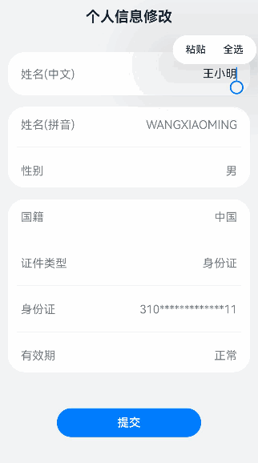

# 汉字转拼音案例

### 介绍

本示例介绍使用第三方库的pinyin4js组件实现汉字转大写拼音。

### 效果图预览



**使用说明**

1. 进入页面，修改姓名(中文)项，下方姓名(拼音)列表会自动更改并显示对应姓名大写拼音。

### 实现思路

1. 引入第三方库pinyin4js组件。源码参考[ChineseToPinyin.ets](./src/main/ets/pages/ChineseToPinyin.ets)
    ```typescript
    import { pinyin4js } from '@ohos/pinyin4js';
    ```
2. 使用convertToPinyinString实现汉字转拼音。源码参考[ChineseToPinyin.ets](./src/main/ets/pages/ChineseToPinyin.ets)
    ```typescript
    const pinyin: string = pinyin4js.convertToPinyinString(value, '', pinyin4js.WITHOUT_TONE);
    ```

### 高性能知识点

不涉及

### 工程结构&模块类型
   ```
   ChineseToPinyin                                  // har类型
   |---pages
   |---|---ChineseToPinyin.ets                      // 视图层-场景列表页面
   ```

### 模块依赖

[@ohos/pinyin4js](https://ohpm.openharmony.cn/#/cn/detail/@ohos%2Fpinyin4js)
[@ohos/routermodule(动态路由)](../../feature/routermodule)

### 参考资料

[pinyin4js第三方库](https://ohpm.openharmony.cn/#/cn/detail/@ohos%2Fpinyin4js)