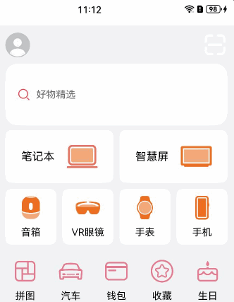

# 组件堆叠

### 介绍

本示例介绍运用Stack组件以构建多层次堆叠的视觉效果。通过绑定Scroll组件的onScroll滚动事件回调函数，精准捕获滚动动作的发生。当滚动时，实时地调节组件的透明度、高度等属性，从而成功实现了嵌套滚动效果、透明度动态变化以及平滑的组件切换。

### 效果图预览



**使用说明**

1. 加载完成后显示整个界面，超过一屏可以上下滑动可见堆叠效果。

### 实现思路

1. 在向上滑动过程中观察到头部组件是处于层级底部，而其他组件覆盖在其上方，为此，选择[Stack组件](src/main/ets/view/ComponentStack.ets)来获取堆叠效果。
```javascript
Stack({ alignContent: Alignment.Top }) {
  Scroll(this.scroller) {
    ...
  }
}
```
2. 在顶部的可滚动区域，通过使用[Scroll组件](src/main/ets/view/ComponentStack.ets)来获取堆叠效果。
```javascript
Scroll(this.scroller) {
  Column() {
    ...
  }
}
```
3. 实现滚动过程中动态调整文本框高度的功能时，运用Scroll组件滚动事件[回调函数onScroll](src/main/ets/view/ComponentStack.ets)在滚动时修改文本框的高度及组件的透明度。
```javascript   
.onScroll(() => {
  let yOffset: number = this.scroller2.currentOffset().yOffset;
  this.Height2 = this.Height2_raw - yOffset * 0.5;
  // 根据yOffset的偏移量来设置IconList2的透明度，当偏移量大于等于IconList2原始高度就是透明的。
  if (1 - yOffset / this.IconList2_raw >= 0) {
    this.Opacity2 = 1 - yOffset / this.IconList2_raw; // IconList2的透明度
  } else {
    this.Opacity2 = 0;
  }
  // 巧妙利用IconList2的透明度的值Opacity2来设置IconList2的缩放。
  this.ratio = this.Opacity2;
  // 根据yOffset的偏移量来设置IconList1的透明度和IconList3的间距，当偏移量大于等于IconList1原始高度就是透明的同时IconList3的间距也是最小的。
  if (1 - yOffset / this.IconList1_raw > 0) {
    this.isChange = false;
    this.Opacity = 1 - yOffset / this.IconList1_raw; // IconList1的透明度
    this.marginSpace = this.maxMarginSpace; // IconList3默认间距
  } else {
    this.isChange = true;
    this.Opacity = (yOffset - this.IconList1_raw) / this.maxMarginSpace; // IconList1的透明度
    this.marginSpace = this.IconList3_raw - yOffset > this.minMarginSpace ?
    (this.IconList3_raw - yOffset) : this.minMarginSpace; // IconList3的间距
  }
})
```
4. 存在多层嵌套滚动的情况时，应该先滚动父组件，再滚动自身。只需要在内层的Scroll组件的[属性nestedScroll](src/main/ets/view/ComponentStack.ets)设置向前向后两个方向上的嵌套滚动模式，实现与父组件的滚动联动。
```javascript  
Scroll(this.scroller2){
  ...
}
.width('100%')
.scrollBar(BarState.Off)
.nestedScroll({
  scrollForward: NestedScrollMode.PARENT_FIRST, // 可滚动组件往末尾端滚动时的嵌套滚动选项,父组件先滚动，父组件滚动到边缘以后自身滚动。
  scrollBackward: NestedScrollMode.SELF_FIRST // 可滚动组件往起始端滚动时的嵌套滚动选项,自身先滚动，自身滚动到边缘以后父组件滚动。
})
```
5. 在商品列表区域，采用[瀑布流（WaterFlow）容器](src/main/ets/view/ProductList.ets)进行布局，将商品信息动态分布并分成两列呈现，每列商品自上而下排列。
```javascript   
WaterFlow() {
  LazyForEach(this.productData, (item: ProductDataModel) => {
    FlowItem() {
      ...
  }, (item: ProductDataModel) => item.id.toString())
}
.nestedScroll({
  scrollForward: NestedScrollMode.PARENT_FIRST,
  scrollBackward: NestedScrollMode.SELF_FIRST
})
.columnsTemplate("1fr 1fr")
}
```

### 高性能知识点

本示例使用了LazyForEach进行数据懒加载，[WaterFlow布局](src/main/ets/view/ProductList.ets)时会根据可视区域按需创建FlowItem组件，并在FlowItem滑出可视区域外时销毁以降低内存占用。
本例中Scroll组件绑定onScroll滚动事件回调，onScroll属于频繁回调，在回调中需要尽量减少耗时和冗余操作，例如减少不必要的日志打印。

### 工程结构&模块类型

```
componentstack                                   // har类型
|---mock
|   |---IconMock.ets                             // 本地数据源 
|---model
|   |---DataSource.ets                           // 列表数据模型
|   |---IconModel.ets                            // 数据类型定义 
|---view
|   |---ComponentStack.ets                       // 组件堆叠主页面 
|   |---IconView.ets                             // 按钮快捷入口自定义组件 
|   |---ProductList.ets                          // 商品列表自定义组件
```

### 模块依赖

本实例依赖common模块来实现[资源](../../common/utils/src/main/resources/base/element)的调用。 还需要依赖[EntryAbility.ets模块](../../product/entry/src/main/ets/entryability/EntryAbility.ets)。

### 参考资料

[WaterFlow](https://developer.huawei.com/consumer/cn/doc/harmonyos-references-V4/ts-container-waterflow-0000001815767844-V4?catalogVersion=V4)

[Stack](https://developer.huawei.com/consumer/cn/doc/harmonyos-references-V4/ts-container-stack-0000001815767840-V4?catalogVersion=V4)

[Z序控制](https://developer.huawei.com/consumer/cn/doc/harmonyos-references-V4/ts-universal-attributes-z-order-0000001862687545-V4?catalogVersion=V4)

[组件可见区域变化事件](https://developer.huawei.com/consumer/cn/doc/harmonyos-references-V4/ts-universal-component-visible-area-change-event-0000001815767708-V4?catalogVersion=V4)