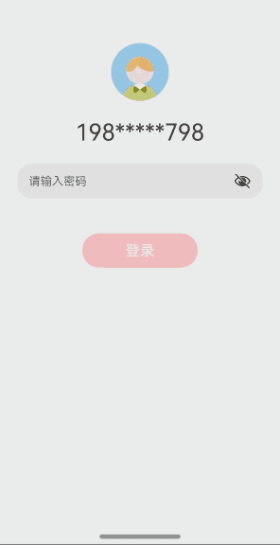

# 自定义安全键盘案例

### 介绍

金融类应用在密码输入时，一般会使用自定义安全键盘。本示例介绍如何使用TextInput组件实现自定义安全键盘场景，主要包括TextInput.customKeyboard绑定自定义键盘、自定义键盘布局和状态更新等知识点。

### 效果图预览



### 实现思路

#### 1. 使用TextInput的[customKeyboard](https://developer.huawei.com/consumer/cn/doc/harmonyos-references/ts-basic-components-textinput-0000001774121266)的属性方法来设置自定义键盘

当设置自定义键盘时，输入框激活后不会打开系统输入法，而是加载应用指定的自定义组件，针对系统键盘的enterKeyType属性设置将无效。自定义键盘采用覆盖原始界面的方式呈现，不会对应用原始界面产生压缩或者上提。默认在输入控件失去焦点时，关闭自定义键盘，开发者也可以通过[TextInputController](https://developer.huawei.com/consumer/cn/doc/harmonyos-references/ts-basic-components-textinput-0000001774121266#ZH-CN_TOPIC_0000001774121266__textinputcontroller8).[stopEditing](https://developer.huawei.com/consumer/cn/doc/harmonyos-references/ts-basic-components-textinput-0000001774121266#ZH-CN_TOPIC_0000001774121266__stopediting10)方法控制键盘关闭。

#### 2. 自定义键盘布局

键盘枚举类型：

- 键盘类型分为数字键盘，大写、小写键盘，特殊字符键盘
- 键盘按键类型分为输入操作INPUT、删除操作DELETE、切换数字键盘操作NUMERIC、切换大小写键盘CAPSLOCK、切换数字键盘SPECIAL共五种类型

```typescript
/**
 * 键盘类型枚举
 */
export enum EKeyboardType {
  NUMERIC,    //数字键盘
  UPPERCASE,  // 大写字母键盘
  LOWERCASE,  // 小写字母键盘
  SPECIAL,    // 特殊字符键盘
}

/**
 * 键盘按键类型枚举
 */
export enum EKeyType {
  INPUT,   // 输入类型，输入具体的值
  DELETE,  // 删除一个输入字符
  NUMERIC, // 切换数字键盘
  CAPSLOCK, // 切换大小写键盘
  SPECIAL, //  切换特殊字符键盘
}

```

在真实业务场景下，自定义安全键盘数据包括值、UI属性、位置等都通过数据请求来下发，键盘按键数据接口定义如下：

```typescript

/**
 * 键盘按键数据接口
 */
export interface IKeyAttribute {
  label: string | Resource;
  value?: string;
  type?: EKeyType;
  fontSize?: number;
  fontColor?: string | Color;
  backgroundColor?: string | Color;
  position?: [number, number, number, number];
}
```

自定义键盘布局：分为标题栏和键盘两部分，键盘使用Grid布局，每个按键GridItem的值、UI属性和位置都通过数据请求下发，不需要额外计算。

数字键盘为4*3的网格布局，但是大小写键盘和特殊字符键盘的布局为不规则布局，如果设置为4 * 10的网格，有的按键占用1 * 1.5，但是GridItem属性不支持占用非整数列。本文将该场景下将网格拆分为更小的单元，为4 * 20网格布局，每个字母按键占1 * 2，删除按键则占1 * 3,空格则占1 * 10，这样就保证每个按键都要占用整数单元。

```typescript
Column() {
  this.titleBar();

  Grid() {
    ForEach(this.items, (item: IKeyAttribute) => {
      GridItem() {
        this.myGridItem(item)
      }
      .width('100%')
      .height(this.itemHeight)
      .rowStart(item?.position?.[0])
      .columnEnd(item?.position?.[1])
      .columnStart(item?.position?.[2])
      .columnEnd(item?.position?.[3])
      .backgroundColor(item.backgroundColor)
      .borderRadius($r("app.integer.key_border_radius"))
      .onClick(() => {
            ....
      })
    }, (item: IKeyAttribute, index: number) => JSON.stringify(item) + index)
  }
  .margin({ bottom: $r("app.integer.key_board_marin_bottom") })
  .columnsTemplate(this.curKeyboardType === EKeyboardType.NUMERIC ? "1fr 1fr 1fr" :
    "1fr 1fr 1fr 1fr 1fr 1fr 1fr 1fr 1fr 1fr 1fr 1fr 1fr 1fr 1fr 1fr 1fr 1fr 1fr 1fr")
  .rowsTemplate("1fr 1fr 1fr 1fr") // Grid高度均分成4份
  .rowsGap(this.rowSpace) // 设置行间距
  .columnsGap(this.columnSpace) // 设置列间距
  .width('100%')
  .height(this.itemHeight * this.rowCount + this.rowSpace * (this.rowCount - 1))
}
.width('100%')
.padding({ left: this.columnSpace, right: this.columnSpace })
.backgroundColor(Color.Black)
}
```

#### 3. 状态更新

主要是子组件自定义键盘的按键事件如何传递到父组件，可以在父组件定义好键盘按键事件响应函数onKeyboardEvent，传递给子组件，然后子组件按键时调用父组件传递过来的onKeyboardEvent即可。需要注意的是，在子组件中，必须定义inputValue且使用@Link装饰器，这样能保证子组件调用时onKeyboardEvent时inputValue不为空，父子组件数据双向更新。

```typescript
@Component
export struct CustomSafeKeyboardView {
  @State inputValue: string = '';
  @State items: IKeyAttribute[] = numericKeyData;
  @State curKeyboardType: EKeyboardType = EKeyboardType.NUMERIC;
  controller: TextInputController = new TextInputController();

  /**
   * 键盘按键事件响应函数
   * @param item
   */
  onKeyboardEvent(item: IKeyAttribute) {
    switch (item.type) {
      // 输入类型，更新输入内容
      case EKeyType.INPUT:
        this.inputValue += item.value;
        break;
      // 删除一个已输入的末尾字符
      case EKeyType.DELETE:
        this.inputValue = this.inputValue.slice(0, -1);
        break;
      // 切换数字字符键盘
      case EKeyType.NUMERIC:
        if (this.curKeyboardType !== EKeyboardType.NUMERIC) {
          this.curKeyboardType = EKeyboardType.NUMERIC;
          this.items = numericKeyData;
        }
        break;
      // 切换大小写
      case EKeyType.CAPSLOCK:
        if (this.curKeyboardType === EKeyboardType.LOWERCASE) {
          // 切换大写字母键盘
          this.curKeyboardType = EKeyboardType.UPPERCASE;
          this.items = upperCaseKeyData;
        } else {
          // 切换小写字母键盘
          this.curKeyboardType = EKeyboardType.LOWERCASE;
          this.items = lowerCaseKeyData;
        }
        break;
      // 切换特殊字符键盘
      case EKeyType.SPECIAL:
        if (this.curKeyboardType !== EKeyboardType.SPECIAL) {
          this.curKeyboardType = EKeyboardType.SPECIAL;
          this.items = specialKeyData;
        }
        break;
      default:
        console.info(`Sorry, we are out of input type.`);
    }
  }

  /**
   * 自定义键盘组件Builder
   */
  @Builder
  customKeyboardBuilder() {
    CustomKeyboard({
      items: this.items,
      inputValue: this.inputValue,
      curKeyboardType: this.curKeyboardType,
      onKeyboardEvent: this.onKeyboardEvent,
      controller: this.controller
    })
  }

  build() {
    Column() {
      Row()
        .height($r("app.integer.row_height"))

      Image($r("app.media.avatar"))
        .width($r("app.integer.avatar_weight"))
        .height($r("app.integer.avatar_height"))
        .objectFit(ImageFit.Fill)

      Text($r("app.string.account_name"))
        .fontSize($r("app.integer.text_font_size"))
        .margin({ top: $r("app.integer.common_margin_padding") })

      TextInput({
        text: this.inputValue,
        placeholder: $r("app.string.placeholder"),
        controller: this.controller
      })// 绑定自定义键盘
        .type(InputType.Password)
        .customKeyboard(this.customKeyboardBuilder())// 绑定自定义安全键盘
        .height($r("app.integer.text_input_height"))
        .border(null)
        .margin({ top: $r("app.integer.common_margin_padding") })

      Button($r("app.string.login_button_label"))
        .type(ButtonType.Capsule)
        .fontSize($r("app.integer.login_button_font_size"))
        .width($r("app.integer.login_button_width"))
        .height($r("app.integer.login_button_height"))
        .margin({ top: $r("app.integer.login_button_margin") })
        .backgroundColor(Color.Pink)
        .onClick(() => {
          this.controller.stopEditing();
        })

    }
    .width($r("app.string.one_hundred_percent"))
    .height($r("app.string.one_hundred_percent"))
    .padding($r("app.integer.common_margin_padding"))
  }
}
```

### 高性能知识点

**不涉及**

### 工程结构&模块类型

   ```
   customsafekeyboard              // har类型
   |---components                  // 自定义组件
   |   ---CustomKeyboard.ets  
   |---model                       // 模型层
   |   ---Constants                // 定义常量数据
   |---CustomSafeKeyboardView.ets  // 主页面
   ```

### 模块依赖
1. 依赖common模块来实现[日志](../../common/utils/src/main/ets/log/Logger.ets)的打印
2. 依赖[路由模块](../routermodule)，供entry模块实现路由导航

### 参考资料

[TextInput](https://developer.huawei.com/consumer/cn/doc/harmonyos-references/ts-basic-components-textinput-0000001774121266#ZH-CN_TOPIC_0000001774121266__属性)


