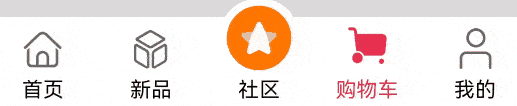

# 自定义TabBar

### 介绍

本示例主要介绍了TabBar中间页面如何实现有一圈圆弧外轮廓以及TabBar页签被点击之后会改变图标显示，并有一小段动画效果。

### 效果图预览



**使用说明**：

1. 依次点击tabBar页面，除了社区图标之外，其它图标往上移动一小段距离。

### 实现思路

**场景1：TabBar中间页面实现有一圈圆弧外轮廓**

将Image组件外层包裹一层容器组件，通过设置borderRadius以及margin的top值实现圆弧外轮廓效果。
这里borderRadius的值设置为容器组件宽度的一半，margin的top值根据开发者的ux效果设置合适的值即可。
具体代码可参考[TabView.ets](./src/main/ets/view/TabView.ets)

```
Column() {
   Image(this.selectedIndex === this.tabBarIndex ? TABINFO[this.tabBarIndex].selectedIcon : TABINFO[this.tabBarIndex].defaultIcon)
     .size({ width: $r('app.integer.community_image_size'), height: $r('app.integer.community_image_size') })
}
.width($r('app.integer.community_image_container_size'))
.height($r('app.integer.community_image_container_size'))
// TODO：知识点：通过设置borderRadius以及margin的top值实现圆弧外轮廓效果。
.borderRadius(this.tabBarIndex === COMMUNITY_TAB_BAR_INDEX ? $r('app.integer.community_image_container_border_radius_size') : $r('app.integer.common_size_0'))
.margin({ top: this.tabBarIndex === COMMUNITY_TAB_BAR_INDEX ? -15 : $r('app.integer.common_size_0') })
.backgroundColor(Color.White)
.justifyContent(FlexAlign.Center)
  
```
**场景2：TabBar页签点击之后会改变图标显示，并有一小段动画效果**

改变图标显示功能可以先声明一个变量selectedIndex，此变量代表被选定的tabBar下标，点击的时候将当前tabBar的下标值进行赋值。
通过当前被选中的tabBar下标值和tabBar自己的下标值进行判断来达到点击之后改变图标显示的效果。
动画效果可以将Image添加一个offset属性和[animation属性](https://developer.harmonyos.com/cn/docs/documentation/doc-references-V3/ts-animatorproperty-0000001478181445-V3)，
offset属性可以控制组件的横向和纵向偏移量； animation在组件的某些通用 属性变化时，可以通过属性动画animation实现过
渡效果。 点击TabBar页签，改变offset的属性值，自动触发animation属性动画。
具体代码可参考[TabView.ets](./src/main/ets/view/TabView.ets)

```
Column() {
   // 通过被选中的tabBar下标值和tabBar的默认下标值来改变图片显示
   Image(this.selectedIndex === this.tabBarIndex ? TABINFO[this.tabBarIndex].selectedIcon : TABINFO[this.tabBarIndex].defaultIcon)
     .size(this.selectedIndex === HOME_TAB_BAR_INDEX && this.selectedIndex === this.tabBarIndex ?
        { width: $r('app.integer.community_image_size'), height: $r('app.integer.community_image_size') } :
        { width: $r('app.integer.tab_bar_image_size'), height: $r('app.integer.tab_bar_image_size') })
     // TODO：知识点：通过offset控制图片的纵向偏移。
     .offset({ y: (this.selectedIndex === this.tabBarIndex && this.selectedIndex !== COMMUNITY_TAB_BAR_INDEX) ?
                   this.iconOffset : $r('app.integer.common_size_0') })
      // TODO：知识点：组件的某些通用属性变化时，可以通过属性动画animation实现过渡效果。本示例的动画效果是tabBar的图片向上偏移一小段距离
      .animation({
         duration: 400,
         curve: Curve.Linear,
         iterations: 1,
         playMode: PlayMode.Normal
      })
}
.width(this.selectedIndex === HOME_TAB_BAR_INDEX && this.selectedIndex === this.tabBarIndex ?
$r('app.integer.community_image_size') : $r('app.integer.tab_bar_image_container_size'))
.height(this.selectedIndex === HOME_TAB_BAR_INDEX && this.selectedIndex === this.tabBarIndex ?
$r('app.integer.community_image_size') : $r('app.integer.tab_bar_image_container_size'))
.justifyContent(FlexAlign.Center)
```
### 高性能知识点

不涉及。

### 工程结构&模块类型

```
customtabbar                                    // har类型
|---model
|   |---DataType.ets                            // 模型层-Tabbar数据类型
|   |---TabBarData.ets                          // 数据模型层-TabBar数据
|---view
|   |---TabView.ets                             // 视图层-自定义TabBar页面
```
### 模块依赖

不涉及。

### 参考资料
[属性动画(animation)](https://developer.harmonyos.com/cn/docs/documentation/doc-references-V3/ts-animatorproperty-0000001478181445-V3)

[Tabs组件](https://developer.harmonyos.com/cn/docs/documentation/doc-references/ts-container-tabs-0000001281001258)


