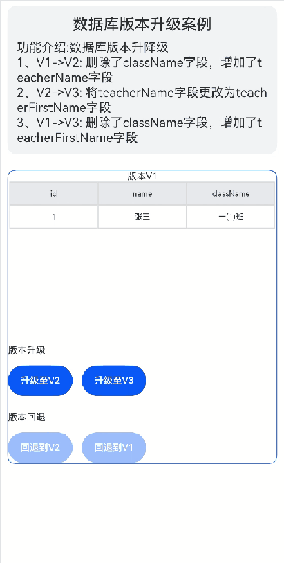

# 数据库版本升级案例

### 介绍

本示例介绍使用关系型数据库的接口来进行数据库升降级场景实现

### 效果预览图



**使用说明**
1. 加载完成后有版本升级以及版本恢复两种按钮
2. 点击版本升级下的”升级至V2“按钮，则数据库版本会从V1升级至V2，且在表格处显示V1和V2版本表格字段对比。
3. 点击版本升级下的”升级至V3“按钮，若当前是V1版本，则会执行V1升级至V3的逻辑，且在表格处显示V1和V3版本表格字段对比。
4. 版本恢复下的按钮会在升级至V1以上版本时可点击，如步骤二中升级至V2版本后，则”恢复到V1“按钮可点击，点击后数据库版本回退至V1版本

### 实现思路
**数据库版本升级有两种方案**

方案一：直接升级，需要实现各版本到目标版本的实现逻辑，优点在于性能好，缺点是逻辑复杂且较难维护。

方案二：一步一步升级到最新版本，只需要实现紧邻版本的升级逻辑，优点在于逻辑简单，便于维护，缺点在于比方案一性能差。

在本示例中两种方案都有体现，其中从V1->V2->V3用的方案二，从V1->V3使用的方案一，具体实现步骤如下：
1. 使用临时表方案，在升级时将旧表重命名为临时表，并创建一张与旧表未重命名前的名字相同的新表，分批次取出临时表中数据进行转换存入新表中，数据迁移完毕后删除临时表。源码参考[DataService.ets](src/main/ets/service/DataService.ets)。

```typescript
// 开启事务
dbUtils.beginTransaction();
// 获取当前数据库版本
const oldVersion: number = dbUtils.getStoreVersion();
// 将旧表改为临时表
await dbUtils.updateTableName(Constants.STUDENT_TABLE, Constants.STUDENT_TABLE + oldVersion);
// 创建新表
const newTableColumnTypeMap: string[][] = CommonUtils.getTableColumnTypeMapByVersion(targetVersion);
await dbUtils.createTable(Constants.STUDENT_TABLE, newTableColumnTypeMap);
dbUtils.commit();
// 自定义迁移逻辑
let lastId: number = -1;
let flag: boolean = false;
await this.migrate(lastId, oldVersion, targetVersion, flag);
// 删除旧表
await dbUtils.dropTable(Constants.STUDENT_TABLE + oldVersion, targetVersion);
```

2. 为方便扩展迭代，在父类中定义整体逻辑，子类只需继承父类，重写字段转换逻辑即可。源码参考[DataService.ets](src/main/ets/service/DataService.ets)。

```typescript
  /**
 * TODO： 知识点： 新老版本字段转换逻辑（版本升级只需要实现这个方法即可）
 * @param resultSet 查询结果集
 * @param targetVersion 目标版本
 * @returns 目标版本格式数据
 */
abstract transform(resultSet: relationalStore.ResultSet, targetVersion: number): ValuesBucket;
```

3. 根据数据库当前版本和需升级至版本，选择对应的升级逻辑。源码参考[DatabaseUpgrade.ets](src/main/ets/view/DatabaseUpgrade.ets)。

```typescript
switch (currentVersion) {
  case Constants.V1:
    await this.v1DataService.onUpgrade(version);
    break;
  case Constants.V2:
    await this.v2DataService.onUpgrade(version);
    break;
  default:
    throw new Error('The database version to which you need to upgrade is incorrect');
}
```
### 高性能知识点

**不涉及**

### 工程结构&模块类型

   ```
   databaseupgrade                                        // har类型
   |---components
   |   |---CustomFormComponents.ets                       // 自定义表格组件          
   |---constants                                          
   |   |---Constants.ets                                  // 常量类
   |---service
   |   |---DataService.ets                                // 业务层-版本升级逻辑
   |---utils                                          
   |   |---CommonUtils.ets                                // 工具类
   |   |---DBUtils.ets                                    // 数据库操作封装
   |---view                                          
   |   |---DatabaseUpgrade.ets                            // 视图层-数据库版本升级案例交互界面
   ```

### 模块依赖

1、[路由模块](../routermodule/src/main/ets/router/DynamicsRouter.ets)

2、[公共特性模块](../../common/utils/src/main/ets/component/FunctionDescription.ets)

### 参考资料

[关系型数据库](https://developer.harmonyos.com/cn/docs/documentation/doc-references-V2/js-apis-data-rdb-0000001580026282-V2)

[数据库备份与修复](https://developer.harmonyos.com/cn/docs/documentation/doc-guides-V2/data-backup-and-restore-0000001630305913-V2)

[通过关系型数据库实现数据持久化](https://developer.harmonyos.com/cn/docs/documentation/doc-guides-V2/data-persistence-by-rdb-store-0000001630305909-V2)
