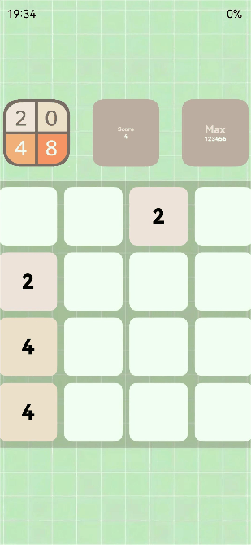

# 适配挖孔屏案例

### 介绍

本示例介绍使用屏幕属性[getDefaultDisplaySync、getCutoutInfo](https://developer.huawei.com/consumer/cn/doc/harmonyos-references-V2/js-apis-display-0000001427585076-V2)接口实现适配挖孔屏。该场景多用于沉浸式场景下。

### 效果图预览



**使用说明**

1. 加载完成后顶部状态栏时间和电量显示位置规避了不可用区域。

### 实现思路

1. 通过setWindowLayoutFullScreen、setWindowSystemBarEnable将窗口设置为全屏，并且隐藏顶部状态栏。源码参考[DiggingHoleScreen.ets](./src/main/ets/components/mainpage/DiggingHoleScreen.ets)
```ts
// 获取窗口实例
window.getLastWindow(this.context, (err, data) => {
  if (err) {
    logger.error('DiggingHoleScreen', 'getLastWindow failed. error is:', JSON.stringify(err));
    return;
  }
  // 设置窗口为全屏显示状态
  data.setWindowLayoutFullScreen(true);
  // 设置顶部状态栏为隐藏状态
  data.setWindowSystemBarEnable(['navigation']);
  });
  ```
2. 通过getDefaultDisplaySync、getCutoutInfo获取窗口display对象和不可用区域的边界、宽高。源码参考[DiggingHoleScreen.ets](./src/main/ets/components/mainpage/DiggingHoleScreen.ets)
```ts
this.displayClass = display.getDefaultDisplaySync();
this.displayClass.getCutoutInfo((err, data) => {
  if (err) {
    logger.error('DiggingHoleScreen', 'getCutoutInfo failed. error is:', JSON.stringify(err));
    return;
  }
  this.boundingRect = data.boundingRects;
  this.topTextMargin = this.getBoundingRectPosition();
  });
  ```
3. 使用获取到的信息进行计算偏移量实现对不可用区域的适配。源码参考[DiggingHoleScreen.ets](./src/main/ets/components/mainpage/DiggingHoleScreen.ets)
```ts
getBoundingRectPosition(): TextMargin {
  if (this.boundingRect !== null && this.displayClass !== null && this.boundingRect[0] !== undefined) {
    // 不可用区域右侧到屏幕右边界的距离：屏幕宽度减去左侧宽度和不可用区域宽度
    let boundingRectRight: number = this.displayClass.width - (this.boundingRect[0].left + this.boundingRect[0].width);
    // 不可用区域左侧到屏幕左边界的距离：getCutoutInfo接口可以直接获取
    let boundingRectLeft: number = this.boundingRect[0].left;
    // 部分设备不可用区域在中间时存在左右距离会有10像素以内的差距，获取到的左右距离差值绝对值小于10都按照不可用区域位于中间处理
    if (Math.abs(boundingRectLeft - boundingRectRight) <= 10) {
      return { left: 0, right: 0 };
    }
    if (boundingRectLeft > boundingRectRight) {
      // 不可用区域在右边
      return { left: 0, right: this.displayClass.width - boundingRectLeft };
    } else if (boundingRectLeft < boundingRectRight) {
      // 不可用区域在左边
      return { left: this.boundingRect[0].left + this.boundingRect[0].width, right: 0 };
    }
  }
  return { left: 0, right: 0 };
}
  ```

#### 高性能知识点

**不涉及**

### 工程结构&模块类型

   ```
   functionalscenes                                // har类型(默认使用har类型，如果使用hsp类型请说明原因)
   |---mainpage
   |   |---DigginHoleScreen.ets                    // 挖孔屏适配页面
   ```

### 模块依赖

1. [路由模块](../routermodule)：供entry模块实现路由导航
2. [utils模块](../../common/utils)：功能介绍

### 参考资料

[@ohos.display (屏幕属性)](https://developer.huawei.com/consumer/cn/doc/harmonyos-references-V2/js-apis-display-0000001427585076-V2)