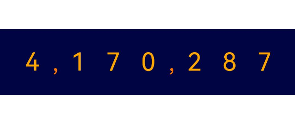

# 数字滚动动效实现

### 介绍

本示例主要介绍了数字滚动动效的实现方案。 该方案多用于数字刷新，例如页面刷新抢票数量等场景。

### 效果图预览


**使用说明**：

1. 下拉页面刷新，数字进行刷新。

## 实现思路
1. 通过双重ForEach循环分别横向、纵向渲染数字。

```javascript
Row() {
  ForEach(this.currentData, (item: number, index: number) => { // 横向渲染数字
    Column() {
      Column() {
        ForEach(this.dataItem, (subItem: number) => { // 纵向渲染数字
          Text(subItem.toString()) // 数字文本
        })
      }
      .translate({ x: 0, y: this.scrollYList[index] }) // 每个数字Y轴位移
    }
    .height(STYLE_CONFIG.ITEM_HEIGHT)
  })
}
```


如下图所示：


2. 通过`Math.random()`生成随机数，并更新到`currentData`数组中。

```javascript
let tempArr: number[] = [];
for (let i = 0; i < DATA_CONFIG.NUMBER_LEN; i++) {
  tempArr.push(Math.floor(Math.random() * 10)); // 向数组添加随机数
}
this.currentData = tempArr; // 更新当前数据
```
3. 使用显示动画[animateTo](https://developer.huawei.com/consumer/cn/doc/harmonyos-references/ts-explicit-animation-0000001774121350)，对`currentData`数组中的每个数字执行不同的滚动动效。

```javascript
this.currentData.forEach((item: number, index: number) => {
  animateTo({
    // 每个数字与上一次数字对比，数字差值越大，执行动画时长越长。
    duration: Math.abs(item - this.preData[index]) * DATA_CONFIG.DURATION_TIME,
    curve: Curve.LinearOutSlowIn, // 减速曲线
    onFinish: () => {
      this.preData = this.currentData; // 动画执行结束后，更新上一次数据值
      this.isRefresh = false; // 刷新完毕
    }
  },
    () => {
      this.scrollYList[index] = -item * STYLE_CONFIG.ITEM_HEIGHT; // 更新每个数字Y轴偏移量
    })
})
```

   如下图所示：

   

   4. 设置数字所在容器属性`.clip(true)`，将多余的数字裁剪。
   
      


### 高性能知识点

无

### 工程结构&模块类型

   ```
   digitalscrollanimation                                // har
   |---pages
   |   |---DigitalScrollDetail.ets                       // 数字滚动组件 
   |   |---DigitalScrollExample.ets                      // 功能页面 
   |---model
   |   |---ConstData.ets                                 // 常量数据 
   ```

### 模块依赖
当前场景依赖以下模块
1. [动态路由模块](../routermodule/src/main/ets/router/DynamicsRouter.ets)，主要用于注册模块路由。
### 参考资料
[animateTo](https://developer.huawei.com/consumer/cn/doc/harmonyos-references/ts-explicit-animation-0000001774121350)