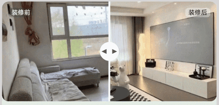

# 左右拖动切换图片效果案例

### 介绍

本示例使用滑动手势监听，实时调整左右两侧内容显示区域大小和效果。通过绑定gesture事件中的PanGesture平移手势，实时获取拖动距离。当拖动时，实时地调节左右两个Image组件的宽度，从而成功实现左右拖动切换图片效果的功能。

### 效果图预览



### 使用说明

1. 点击中间按钮进行左右拖动切换图片。

### 实现思路

本例涉及的关键特性和实现方案如下：

1. 创建三个Stack组件，用来展示装修前后对比图，第一个和第三个Stack分别存放装修前的图片和装修后的图片，zIndex设置为1。第二个Stack存放按钮的图片，zIndex设置为2，这样按钮的图片就会覆盖在两张装修图片之上。
   源码参考[DragToSwitchPicturesView.ets](./src/main/ets/components/view/DragToSwitchPicturesView.ets)。

```ts
Row() {
  Stack() {...}
  .zIndex(CONFIGURATION.ZINDEX1)
  .width(this.leftImageWidth) // z序设为1，为了使按钮图片浮在装修图片上。

  Stack() {...}
  .width($r('app.integer.drag_button_stack_width'))
  .zIndex(CONFIGURATION.ZINDEX2) // z序设为2，为了使按钮图片浮在装修图片上。

  Stack() {...}
  .zIndex(CONFIGURATION.ZINDEX1) // z序设为1，为了使按钮图片浮在装修图片上。
  .width(this.rightImageWidth)
}
.justifyContent(FlexAlign.Center)
.width($r('app.string.full_size'))
```

2. 将Image组件放在Row容器里，将Row容器的宽度设置为状态变量，再利用clip属性对于Row容器进行裁剪。
   源码参考[DragToSwitchPicturesView.ets](./src/main/ets/components/view/DragToSwitchPicturesView.ets)。

```ts
Row() {
  Image($r('app.media.before_decoration'))
    .width($r('app.integer.decoration_width'))// Image的width固定，Row的宽度变化，通过裁剪实现布局效果。
    .height($r('app.integer.decoration_height'))
    .draggable(false) // 设置Image不能拖动，不然长按Image会被拖动。
  }
  .width(this.leftImageWidth) // 将左侧Row的width设置为leftImageWidth，这样左侧Row的width随leftImageWidth的变化而变化。
  .clip(true) // clip属性设置为true，裁剪超出Row宽度的图片。
  .zIndex(CONFIGURATION.ZINDEX1) // z序设为1，为了使水印浮在装修图片上。
  .borderRadius({
    topLeft: $r('app.integer.borderradius'),
    bottomLeft: $r('app.integer.borderradius')
  }) // 将Row的左上角和左下角弧度设为10实现效果。
```

3. 右边的Image组件与左边同样的操作，但是新增了一个direction属性，使元素从右至左进行布局，为的是让Row从左侧开始裁剪。
   源码参考[DragToSwitchPicturesView.ets](./src/main/ets/components/view/DragToSwitchPicturesView.ets)。

```ts
Row() {
 Image($r('app.media.after_decoration'))
   .width($r('app.integer.decoration_width'))
   .height($r('app.integer.decoration_height'))
   .draggable(false)
}
.width(this.rightImageWidth)
.clip(true)
.zIndex(CONFIGURATION.ZINDEX1) // z序设为1，为了使水印浮在装修图片上。
// TODO: 知识点：左边Row使用clip时从右边开始裁剪，加了Direction.Rtl后，元素从右到左布局，右边Row使用clip时从左边开始裁剪，这是实现滑动改变视图内容大小的关键。
.direction(Direction.Rtl)
.borderRadius({
 topRight: $r('app.integer.borderradius'),
 bottomRight: $r('app.integer.borderradius')
}) // 将Row的右上角和右下角弧度设为10实现效果。
```

4. 中间的Image组件通过手势事件中的滑动手势对Image组件滑动进行监听，对左右Image组件的宽度进行计算从而重新布局渲染。
   源码参考[DragToSwitchPicturesView.ets](./src/main/ets/components/view/DragToSwitchPicturesView.ets)。

```ts
Image($r('app.media.drag_button'))
  .width($r('app.integer.drag_button_image_width'))
  .height($r('app.integer.decoration_height'))
  .draggable(false)
  .gesture( // TODO: 知识点：拖动手势事件设置一个手指，滑动的最小距离设置为1vp，实现滑动时按钮跟手动效。
    PanGesture({ fingers: CONFIGURATION.PANGESTURE_FINGERS, distance: CONFIGURATION.PANGESTURE_DISTANCE })
      .onActionStart(() => {
        this.dragRefOffset = CONFIGURATION.INIT_VALUE; // 每次拖动开始时将图标拖动的距离初始化。
      })
      // TODO: 性能知识点: 该函数是系统高频回调函数，避免在函数中进行冗余或耗时操作，例如应该减少或避免在函数打印日志，会有较大的性能损耗。
      .onActionUpdate((event: GestureEvent) => {
        // 通过监听GestureEvent事件，实时监听图标拖动距离
        this.dragRefOffset = event.offsetX;
        this.leftImageWidth = this.imageWidth + this.dragRefOffset;
        this.rightImageWidth = CONFIGURATION.IMAGE_FULL_SIZE - this.leftImageWidth;
        if (this.leftImageWidth >= CONFIGURATION.LEFT_IMAGE_RIGHT_LIMIT_SIZE) { // 当leftImageWidth大于等于310vp时，设置左右Image为固定值，实现停止滑动效果。
          this.leftImageWidth = CONFIGURATION.LEFT_IMAGE_RIGHT_LIMIT_SIZE;
          this.rightImageWidth = CONFIGURATION.RIGHT_IMAGE_RIGHT_LIMIT_SIZE;
        } else if (this.leftImageWidth <= CONFIGURATION.LEFT_IMAGE_LEFT_LIMIT_SIZE) { // 当leftImageWidth小于等于30vp时，设置左右Image为固定值，实现停止滑动效果。
          this.leftImageWidth = CONFIGURATION.LEFT_IMAGE_LEFT_LIMIT_SIZE;
          this.rightImageWidth = CONFIGURATION.RIGHT_IMAGE_LEFT_LIMIT_SIZE;
        }
      })
      .onActionEnd((event: GestureEvent) => {
        if (this.leftImageWidth <= CONFIGURATION.LEFT_IMAGE_LEFT_LIMIT_SIZE) {
          this.leftImageWidth = CONFIGURATION.LEFT_IMAGE_LEFT_LIMIT_SIZE;
          this.rightImageWidth = CONFIGURATION.RIGHT_IMAGE_LEFT_LIMIT_SIZE;
          this.imageWidth = CONFIGURATION.LEFT_IMAGE_LEFT_LIMIT_SIZE;
        } else if (this.leftImageWidth >= CONFIGURATION.LEFT_IMAGE_RIGHT_LIMIT_SIZE) {
          this.leftImageWidth = CONFIGURATION.LEFT_IMAGE_RIGHT_LIMIT_SIZE;
          this.rightImageWidth = CONFIGURATION.RIGHT_IMAGE_RIGHT_LIMIT_SIZE;
          this.imageWidth = CONFIGURATION.LEFT_IMAGE_RIGHT_LIMIT_SIZE;
        } else {
          this.leftImageWidth = this.imageWidth + this.dragRefOffset; // 滑动结束时leftImageWidth等于左边原有Width+拖动距离。
          this.rightImageWidth = CONFIGURATION.IMAGE_FULL_SIZE - this.leftImageWidth; // 滑动结束时rightImageWidth等于340-leftImageWidth。
          this.imageWidth = this.leftImageWidth; // 滑动结束时ImageWidth等于leftImageWidth。
        }
      })
  )
```

### 工程结构&模块类型

```
   dragtoswitchpictures                             // har包
   |---common
   |   |---Constants.ets                            // 常量类
   |---data
   |   |---DragToSwitchPicturesData.ets             // 生成模拟数据
   |---datasource
   |   |---BasicDataSource.ets                      // Basic数据控制器
   |   |---DragToSwitchPicturesDataSource.ets       // 左右拖动切换图片数据控制器
   |---mainpage
   |   |---DragToSwitchPictures.ets                 // 主页面
   |---model
   |   |---DragToSwitchPicturesModule.ets           // 左右拖动切换图片数据模型
   |---view
   |   |---BottomTabsView.ets                       // 底部Tabs视图
   |   |---DragToSwitchPicturesView.ets             // 左右拖动切换图片视图
   |   |---DesignCattleView.ets                     // AI设计视图
   |   |---SearchMapView.ets                        // 搜索和地图视图
   |   |---SwiperContentView.ets                    // Swiper和每日房价视图
   |   |---TabsWaterFlowView.ets                    // 瀑布流嵌套Tabs视图
```

### 模块依赖

[**routermodule**](../routermodule)

### 高性能知识点

本例使用了onActionUpdate函数。该函数是系统高频回调函数，避免在函数中进行冗余或耗时操作，例如应该减少或避免在函数打印日志，会有较大的性能损耗。

### 参考资料

[swiper](https://developer.huawei.com/consumer/cn/doc/harmonyos-references/ts-container-swiper-0000001774121298)

[LazyForEach：数据懒加载](https://developer.huawei.com/consumer/cn/doc/harmonyos-guides/arkts-rendering-control-lazyforeach-0000001820879609)

[Tabs](https://developer.huawei.com/consumer/cn/doc/harmonyos-references-V2/ts-container-tabs-0000001478181433-V2)

[WaterFlow](https://developer.huawei.com/consumer/cn/doc/harmonyos-references/ts-container-waterflow-0000001774280974)

[ZIndex](https://developer.huawei.com/consumer/cn/doc/harmonyos-references/ts-universal-attributes-z-order-0000001820880821)

[PanGesture](https://developer.huawei.com/consumer/cn/doc/harmonyos-references-V2/ts-basic-gestures-pangesture-0000001427744804-V2)

[clip](https://developer.huawei.com/consumer/cn/doc/harmonyos-references/ts-universal-attributes-sharp-clipping-0000001821000801)

[direction](https://developer.huawei.com/consumer/cn/doc/harmonyos-references/ts-universal-attributes-location-0000001774121170#ZH-CN_TOPIC_0000001774121170__direction)
