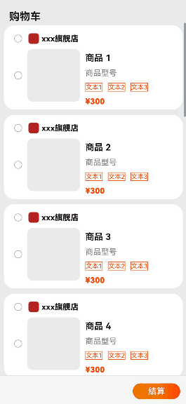

# 跨文件样式复用和组件复用

### 介绍

本示例主要介绍了跨文件样式复用和组件复用的场景。在应用开发中，我们通常需要使用相同功能和样式的ArkUI组件，例如购物页面中会使用相同样式的Button按钮、Text显示文字，我们常用的方法是抽取公共样式或者封装成一个自定义组件到公共组件库中以减少冗余代码。

### 效果图预览

 

**使用说明**：

1. 点击购物车页面的list列表跳转商品详情页。
2. 两个页面的button组件、text组件、Image等组件复用相同的样式。
3. 购物车页面使用了自定义封装的Image+Text的图文复合组件。

### 实现思路

#### 一、跨文件样式复用

   适用场景：当需要向外提供单一组件的样式定制效果时，推荐使用这种方案。使用方在调用接口时，编码量相对方式二更少，仅需几行即可完成调用，使用便捷。

1. 提供方创建AttributeModifier接口的实现类。

   ```javascript
   // attributeModifier.ets
   
   /*
     自定义class实现Text的AttributeModifier接口
   */
   export class CommodityText implements AttributeModifier<TextAttribute> {
     textType: TextType = TextType.TYPE_ONE;
     textSize: number = 15;
   
     constructor( textType: TextType, textSize: number) {
       this.textType = textType;
       this.textSize = textSize;
     }
   
     applyNormalAttribute(instance: TextAttribute): void {
       if (this.textType === TextType.TYPE_ONE) {
         instance.fontSize(this.textSize);
         instance.fontColor($r('app.color.orange'));
         instance.fontWeight(FontWeight.Bolder);
         instance.width($r('app.string.max_size'));
       } else if (this.textType === TextType.TYPE_TWO) {
         instance.fontSize(this.textSize);
         instance.fontWeight(FontWeight.Bold);
         instance.fontColor($r('sys.color.ohos_id_counter_title_font_color'));
         instance.width($r('app.string.max_size'));
       } else if (this.textType === TextType.TYPE_Three) {
         instance.fontColor(Color.Gray);
         instance.fontSize(this.textSize);
         instance.fontWeight(FontWeight.Normal);
         instance.width($r('app.string.max_size'));
       } else if (this.textType === TextType.TYPE_FOUR) {
         instance.fontSize(this.textSize);
         instance.fontColor($r('app.color.orange'));
         instance.textAlign(TextAlign.Center);
         instance.border({ width: $r('app.float.float_1'), color: $r('app.color.orange'), style: BorderStyle.Solid });
         instance.margin({ right: $r('app.float.float_10') });
       }
     }
   }
   /*
     枚举文本类型
   */
   export enum TextType {
     TYPE_ONE,
     TYPE_TWO,
     TYPE_Three,
     TYPE_FOUR
   }
   ```

2. 使用方创建提供方的AttributeModifier实现类实例，并作为系统组件attributeModifier属性方法的参数传入。

   ```javascript
   // ShoppingCart.ets
   import { CommodityText } from '../common/attributeModifier';
   
   @Component
   export struct Details {
     // 使用方创建提供方的AttributeModifier实现类实例
     @State textOne: CommodityText = new CommodityText(TextType.TYPE_ONE, 15);
     ...    
     build(){
       ...
       Text($r('app.string.store_name'))
         // TODO：知识点：将入参的AttributeModifier类实例与系统组件绑定
         .attributeModifier(this.textOne)
         .fontColor($r('sys.color.ohos_id_counter_title_font_color'))
   	...
     }
   }
   
   // Details.ets
   import { CommodityText } from '../common/attributeModifier';
   
   @Component
   export struct Details {
     // 使用方创建提供方的AttributeModifier实现类实例
     @State textOne: MyTextModifier = new MyTextModifier(TextType.TYPE_ONE, 30);
     ...    
     build(){
       ...
       Text($r('app.string.commodity_price'))
         // 动态设置组件样式
   	  .attributeModifier(this.textOne)
   	  .width($r('app.float.float_100'))
   	...
     }
   }
   ```

#### 二、跨文件组件复用

​	适用场景：适用于多个原生组件结合的场景，如Image+Text等复合自定义组件。

1. 提供方在公共组件库中创建公用的自定义组件，该组件支持外部传入attributeModifier属性。

   ```javascript
   //CommonText.ets
   
   /**
    * 自定义封装图文组件
    */
   @Component
   export struct ImageText {
     @State item: string | Resource = $r('app.string.text');
     @State textOneContent: string | Resource = $r('app.string.text');
     @State textTwoContent: string | Resource = $r('app.string.text');
     @State textThreeContent: string | Resource = $r('app.string.text');
     @State imageSrc: PixelMap | ResourceStr | DrawableDescriptor = $r('app.media.icon');
     // TODO：知识点：接受外部传入的AttributeModifier类实例,可以只定制部分组件，选择性传入参数。
     @State textOne: AttributeModifier<TextAttribute> = new TextModifier();
     @State textTwo: AttributeModifier<TextAttribute> = new TextModifier();
     @State textThree: AttributeModifier<TextAttribute> = new TextModifier();
     @State imageModifier: AttributeModifier<ImageAttribute> = new ImageModifier();
     @State checkboxModifier: AttributeModifier<CheckboxAttribute> = new CheckboxModifier();
   
     build() {
       Row() {
         Row() {
           Checkbox()
             .attributeModifier(this.checkboxModifier)
   
           // TODO：知识点：AttributeModifier不支持入参为CustomBuilder或Lamda表达式的属性，且不支持事件和手势。image只能单独通过入参传递使用。
           Image(this.imageSrc)
             .attributeModifier(this.imageModifier)
         }
   
         .margin({ right: $r('app.float.float_10'), bottom: $r('app.float.float_15') })
   
         Column({ space: COLUMN_SPACE }) {
           // TODO：知识点：将入参的AttributeModifier类实例与系统组件绑定
           Text(this.item)
             .attributeModifier(this.textTwo)
   
           Text(this.textThreeContent)
             .attributeModifier(this.textThree)
   
           CommonText({ textFour: new TextModifier() })
   
           Text(this.textOneContent)
             .attributeModifier(this.textOne)
             .fontColor($r('app.color.orange'))
         }
       }
       .padding({ top: $r('app.float.float_5') })
       .width($r('app.string.max_size'))
       .height($r('app.string.max_size'))
     }
   }
   
   /*
     自定义class实现image的AttributeModifier接口，用于初始化
   */
   class ImageModifier implements AttributeModifier<ImageAttribute> {
     applyNormalAttribute(instance: ImageAttribute): void {
       instance.width($r('app.float.float_100'));
       instance.height($r('app.float.float_100'));
     }
   }
   
   /*
     自定义class实现text的AttributeModifier接口，用于初始化
   */
   class TextModifier implements AttributeModifier<TextAttribute> {
     applyNormalAttribute(instance: TextAttribute): void {
       instance.fontSize($r('app.float.float_12'));
       instance.fontColor($r('app.color.orange'));
       instance.textAlign(TextAlign.Center);
       instance.border({ width: $r('app.float.float_1'), color: $r('app.color.orange'), style: BorderStyle.Solid });
       instance.margin({ right: $r('app.float.float_10') });
     }
   }
   
   /*
     自定义class实现checkbox的AttributeModifier接口，用于初始化
   */
   class CheckboxModifier implements AttributeModifier<CheckboxAttribute> {
     applyNormalAttribute(instance: CheckboxAttribute): void {
       instance.width($r('app.float.float_15'));
       instance.height($r('app.float.float_15'));
     }
   }
   ```

   

2. 使用方分别实现Image组件和Text组件的AttributeModifier接口实现类。

   ```javascript
   /*
     自定义class实现Image组件的AttributeModifier接口
   */
   export class ImageModifier implements AttributeModifier<ImageAttribute> {
     width: Length | Resource = 0;
     height: Length | Resource = 0;
   
     constructor(width: Length | Resource, height: Length | Resource) {
       this.width = width;
       this.height = height;
     }
   
     applyNormalAttribute(instance: ImageAttribute): void {
       instance.width(this.width);
       instance.height(this.height);
       instance.borderRadius($r('app.float.float_10'));
     }
   }
   
   /*
     自定义class实现Text的AttributeModifier接口
   */
   export class CommodityText implements AttributeModifier<TextAttribute> {
     ...
   }
   ```

   

3. 使用方创建Image组件和Text组件的AttributeModifier接口实现类实例，并作为提供方自定义组件CustomImageText的入参传入。

   ```javascript
   @Component
   export struct ShoppingCart {
     // TODO：知识点：使用方创建Image组件和Text组件的AttributeModifier接口实现类实例
     @State textOne: CommodityText = new CommodityText(TextType.TYPE_ONE, 15);
     @State textTwo: CommodityText = new CommodityText(TextType.TYPE_TWO, 17);
     @State textThree: CommodityText = new CommodityText(TextType.TYPE_Three, 15);
     @State imageModifier: ImageModifier = new ImageModifier(100, 100);
     @State checkboxModifier: CheckboxModifier = new CheckboxModifier();
   
     build() {
       ...
       // AttributeModifier实例作为提供方自定义组件ImageText的入参传入。
       ImageText({
         item: item,
         textOne: this.textOne,
         textTwo: this.textTwo,
         textThree: this.textThree,
         imageModifier: this.imageModifier,
         imageSrc: $r('app.media.icon'),
         checkboxModifier: this.checkboxModifier,
         textOneContent: $r('app.string.commodity_price'),
         textTwoContent: $r('app.string.commodity_name'),
         textThreeContent: $r('app.string.commodity_model')
         })
       ... 
     }
   }
   ```

   

### 高性能知识点

本示例使用了动态属性设置和自定义封装公共组件，实现了跨文件样式和组件复用，减少了工程很多冗余的代码。

### 工程结构&模块类型

   ```
   dynamicattributes
   |---common
   |   |---AttributeModifier.ets               // 自定义AttributeModifier接口
   |   |---CommonText.ets                      // 自定义组件封装
   |   |---LazyForEach.ets                     // 懒加载
   |---pages
   |   |---ShoppingCart.ets                    // 页面一：购物车
   |   |---Details.ets                         // 页面二：详情页
   ```

### 模块依赖

本示例依赖[路由管理模块](../../feature/routermodule)。

### 参考资料

[动态属性设置](https://developer.huawei.com/consumer/cn/doc/harmonyos-references/ts-universal-attributes-attribute-modifier-0000001774280870#ZH-CN_TOPIC_0000001774280870__attributemodifier)

[ArkUI组件封装及复用场景介绍](https://developer.huawei.com/consumer/cn/doc/harmonyos-guides/ui-component-encapsulation-and-reuse-0000001814743802)