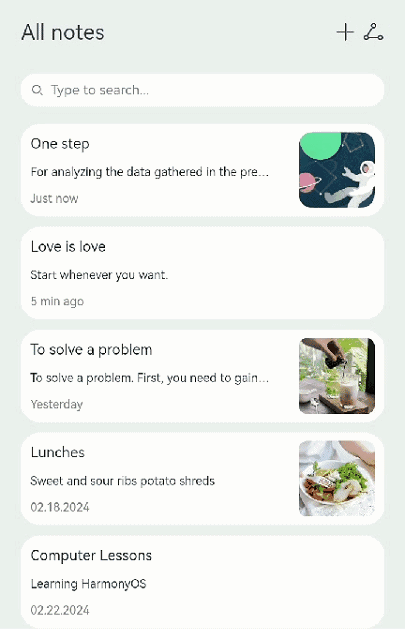

# 标题下拉缩放案例

### 介绍

本文以备忘录应用为示例，介绍如何在实现标题展开时继续下拉的动效。

### 效果图预览

 

**使用说明**：

1. 进入页面，起初标题并没有展开，与增加/分享的菜单在同一行。
2. 进行第一次下拉操作，此时标题展开至目标位置，并显示笔记数目信息，与菜单不在同一行。
3. 继续下拉，达到阈值距离后，标题与菜单都下拉一段距离，并放大；松手后回弹至第一次下拉后的状态。
4. 向上滑动，标题折叠，回到初始时的状态。

### 实现思路

1. 标题是否展开，通过状态变量isExpanded控制，展开后原先标题置空，将展开后标题设置为可见。源码参考[TitleExpansion.ets](./src/main/ets/page/TitleExpansion.ets)。

   ```ts
   Column() {
     Row() {
       Text(!this.isExpanded ? $r('app.string.memo_title') : '') // 展开前的标题
         .fontSize($r('app.string.init_title_font_size'))
       ......
     }
     .width($r('app.string.layout_100_percent'))
     .padding($r('app.string.layout_25'))
     .margin({ top: $r('app.string.layout_10') })
     .alignItems(VerticalAlign.Center)
     .translate(this.getMenuTranslateOptions())
     .animation({ duration: this.duration, curve: Curve.FastOutLinearIn })
   
     if (this.isExpanded) { // 展开后的标题
       Column() {
         Text($r('app.string.memo_title'))
           .fontSize($r('app.string.expanded_title_font_size'))
         Text($r('app.string.memo_counts'))
           .fontSize($r('app.string.memo_counts_font_size'))
           .fontColor(Color.Grey)
       }
       .width($r('app.string.layout_100_percent'))
       .padding({ left: $r('app.string.layout_25') })
       .margin({ top: $r('app.string.layout_10') })
       .alignItems(HorizontalAlign.Start)
       .translate(this.getTitleTranslateOptions())
       .scale(this.getTitleScaleOptions())
       .animation({ duration: this.duration, curve: Curve.FastOutLinearIn })
       .transition({ type: TransitionType.Insert, translate: { y: Constants.TRANSLATE_Y } })
     }
   }
   ```

2. 内容高度变化，通过状态变量heightValue控制，标题展开时设置为较小值，以提供标题展开后的空间。源码参考[TitleExpansion.ets](./src/main/ets/page/TitleExpansion.ets)。

   ```ts
   Column() {
     List({ space: Constants.SEARCH_MEMO_SPACE }) {
       ListItem() {
         Search({ placeholder: $r('app.string.search_placeholder') })
           .width($r('app.string.layout_100_percent'))
           .height($r('app.string.layout_40'))
           .backgroundColor(Color.White)
       }
   
       LazyForEach(this.memoData, (item: MemoInfo) => { 
         ListItem() {
           MemoItem({ memoItem: item })
         }
       }, (item: MemoInfo) => JSON.stringify(item))
     }
     .scrollBar(BarState.Off)
     .margin({ left: $r('app.string.layout_10'), right: $r('app.string.layout_10') })
     .width($r('app.string.layout_90_percent'))
   }
   .width($r('app.string.layout_100_percent'))
   .height(this.heightValue) // 通过状态变量heightValue控制内容高度变化
   .animation({ duration: this.duration, curve: Curve.FastOutLinearIn })
   .onTouch((event: TouchEvent) => this.handleTouchEvent(event))
   ```

3. 状态变量更新都在onTouch时间的响应函数handleTouchEvent中处理，根据手指滑动类型TouchType分为三种情况处理：

      * TouchType.Down，即手指下按时：记录按下时的坐标downY，并更新状态变量isMoving为开始滑动、duration为初始动画时长
      * TouchType.Move，即手指滑动时：根据滑动方向的不同，更新滑动距离offsetY、内容高度heightValue、标题是否展开等状态变量
      * TouchType.Up、TouchType.Cancel，即滑动结束时：更新状态变量isMoving为停止滑动、duration为回弹动画时长

   源码参考[TitleExpansion.ets](./src/main/ets/page/TitleExpansion.ets)。

   ```ts
   handleTouchEvent(event: TouchEvent): void {
     switch (event.type) {
       // 手指下按时
       case TouchType.Down:
         this.downY = event.touches[0].y;
         this.lastMoveY = event.touches[0].y;
         this.isMoving = true;
         this.duration = Constants.ANIMATE_DURATION_DRAG; // 重置动画持续时间
         break;
   
       // 手指滑动时
       case TouchType.Move:
         const delta = event.touches[0].y - this.lastMoveY;
         this.offsetY = event.touches[0].y - this.downY;
         if (delta < 0) { // TODO：知识点：手势为上滑时
           this.heightValue = $r('app.string.memo_area_height_before');
           this.isExpanded = false;
         }
         if (delta > 0) { // TODO：知识点：手势为下滑时
           // 性能知识点：手指滑动的时，直接使用animateTo，会创建大量的animateTo对象，可以通过节流器优化性能
           this.animateToThrottle(() => {
             this.heightValue = $r('app.string.memo_area_height_after');
             this.isExpanded = true;
           }, 1000);
         }
         this.lastMoveY = event.touches[0].y;
         break;
   
       // 滑动结束时
       case TouchType.Up:
       case TouchType.Cancel:
         this.isMoving = false;
         this.duration = Constants.ANIMATE_DURATION_BACK; // 控制回弹动画时间
         break;
     }
   }
   ```

4. 响应状态变量的动画，通过为标题和菜单绑定属性动画animation实现，标题和菜单的tranlate和scale参数在下拉过程中会更新， 并通过isContinuePullDown判断触发与否。源码参考[TitleExpansion.ets](./src/main/ets/page/TitleExpansion.ets)。

   ```ts
   /**
    * 获取标题展开时，图标继续下拉的Translate参数
    */
   getMenuTranslateOptions(): TranslateOptions {
     return this.isContinuePullDown() ? {
       y: Math.min(this.offsetY - Constants.CONTENT_DOWN_Y_THRESHOLD, Constants.MENU_DOWN_Y_MAX_VALUE)
     } : { y: Constants.INIT_COORDINATE };
   }
   
   /**
    * 获取标题展开时，标题继续下拉的Translate参数
    */
   getTitleTranslateOptions(): TranslateOptions {
     return this.isContinuePullDown() ? {
       y: Math.min(this.offsetY - Constants.CONTENT_DOWN_Y_THRESHOLD, Constants.TITLE_DOWN_Y_MAX_VALUE)
     } : { y: Constants.INIT_COORDINATE };
   }
   
   /**
    * 获取标题展开时，标题缩放的Scale参数
    */
   getTitleScaleOptions(): ScaleOptions {
     return this.isContinuePullDown() ? {
       x: Constants.TITLE_SCALE_MAX_VALUE,
       y: Constants.TITLE_SCALE_MAX_VALUE,
       centerX: Constants.INIT_COORDINATE,
       centerY: Constants.INIT_COORDINATE
     } : {
       x: Constants.TITLE_SCALE_DEFAULT_VALUE,
       y: Constants.TITLE_SCALE_DEFAULT_VALUE,
       centerX: Constants.INIT_COORDINATE,
       centerY: Constants.INIT_COORDINATE
     };
   }
   
   /**
    * 判断是否达到触发继续下拉动效的条件
    */
   isContinuePullDown(): boolean {
     return this.isMoving && this.isExpanded && this.offsetY >= Constants.CONTENT_DOWN_Y_THRESHOLD;
   }
   ```

### 高性能知识点

本示例使用了[LazyForEach](https://developer.huawei.com/consumer/cn/doc/harmonyos-guides/arkts-rendering-control-lazyforeach-0000001820879609)进行数据懒加载以及[显式动画animateTo](https://developer.huawei.com/consumer/cn/doc/harmonyos-guides/arkts-attribute-animation-apis-0000001820879805)实现文本偏移。

### 工程结构&模块类型

```
marquee                                         // har类型
|---model
|   |---Constants.ets                           // 数据模型层-常量
|   |---DataSource.ets                          // 数据模型层-懒加载数据源
|   |---MemoInfo.ets                        // 数据模型层-数据类型
|   |---MockData.ets                            // 数据模型层-模拟数据
|---view
|   |---MemoItem.ets                            // 视图层-笔记视图
|---page
|   |---TitleExpansion.ets                      // 页面层-方案主页面
```

### 模块依赖

[@ohos/routermodule(动态路由)](../../feature/routermodule)

### 参考资料

[显式动画animateTo](https://developer.huawei.com/consumer/cn/doc/harmonyos-guides/arkts-attribute-animation-apis-0000001820879805)

[数据懒加载LazyForEach](https://developer.huawei.com/consumer/cn/doc/harmonyos-guides/arkts-rendering-control-lazyforeach-0000001820879609)