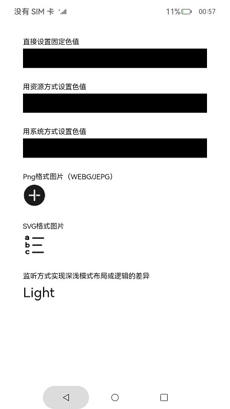

# 深色模式适配

### 介绍

在开发应用以适应深色模式时，绝大多数情况需要用资源限定词目录机制来实现全局的适配效果。对应用内的颜色、图片及布局资源进行细致而全面的调整与优化。具体来说，在不同场景中，我们需要关注并更新如常见UI组件（如按钮、文本框等）的背景颜色（backgroundColor）、字体颜色（fontColor）、填充颜色（fillColor）等相关属性值，确保其在深色背景下依然具有良好的视觉识别度和用户体验。

而少数具有特殊需求或动态切换逻辑的场景，则可以借助于系统提供的AbilityStage.onConfigurationUpdate接口来实时响应配置变更，处理深色模式下的个性化适配问题，确保无论环境如何变化，应用界面都能保持一致且舒适的视觉呈现。
### 效果图预览

**实现思路**

1. 当UI组件的颜色属性被设置为固定颜色值时，其在深色模式和浅色模式下的显示颜色将保持不变。 
2. 为了实现深色模式下的颜色适配，可以在resources目录下新建'dark/element'的子目录，并在此目录中创建color.json文件。为深色模式下的各个UI组件指定相应的颜色值，务必确保与浅色模式下同名颜色资源名称一致，以确保系统能够正确识别并切换。 
3. 若UI组件的颜色属性引用的是系统提供的具有层级参数的颜色资源，则当设备在深色模式和浅色模式间切换时，这些颜色会自动调整至对应模式下的预设色值。 
4. 对于PNG、WEBP或JPEG格式的图片资源，若需支持深色模式，应在resources目录下新增一个'dark/media'子目录，将深色模式下对应的图片放入此目录，并确保图片文件名与浅色模式下的图片相同，以便系统根据当前模式加载合适的图片资源。 
5. 在存在深浅两种模式下布局结构或逻辑处理有所差异的情况时，开发者应当利用AbilityStage.onConfigurationUpdate监听接口来实时感知系统主题的变化，并据此做出相应的布局调整或逻辑处理，从而确保应用能够在不同模式下呈现出理想的界面效果及功能体验。

**使用说明**：

1. 返回主页，进入系统设置切换深浅颜色模式，再点击深色模式适配进入切换后的颜色模式试图。应用启动并加载至首页时，用户点击深色模式适配按钮后，系统将根据当前设备的颜色模式展示相应的视图效果。 
2. 用户在返回主页后，再进入系统设置界面调整颜色模式（切换为深色或浅色模式），完成切换后再次点击首页的深色模式适配按钮，应用程序响应更改后的颜色模式对应的视图界面。