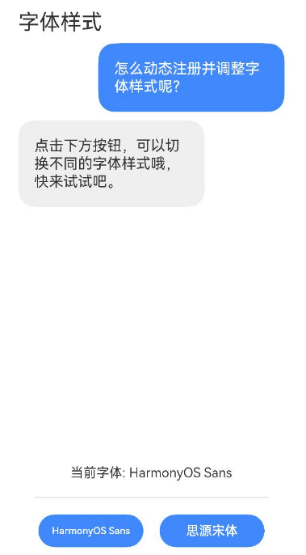

# 动态注册字体案例

### 介绍

本示例介绍利用[上传下载](https://developer.huawei.com/consumer/cn/doc/harmonyos-references/js-apis-request-0000001774281338)
模块和[注册自定义字体](https://developer.huawei.com/consumer/cn/doc/harmonyos-references/js-apis-font-0000001821000745)模块实现从网络上下载字体并注册应用字体的功能，该场景多用于由特殊字体要求的场景。

### 效果图预览




**使用说明**

1. 进入本案例页面后，可点击下方按钮切换字体。
2. 目前仅提供了思源宋体的注册，第一次进入页面点击思源宋体，后台会下载字体文件到沙箱内，然后动态注册并应用到页面对话框。
3. 后续进入页面时，因沙箱中已经存在字体文件，点击按钮将会直接切换。

### 实现思路

本例的实现主要是调用下载接口下载字体文件并且注册到字体库，实现字体动态注册的功能。

本例中代码详情可参考[FontDynamicRegistration.ets](src/main/ets/components/FontDynamicRegistration.ets)

1.在点击思源宋体按钮时，将会先检查沙箱中是否存在对应文件，若存在对应字体文件，则直接注册切换字体；若不存在对应字体文件，执行后续下载操作。
```typescript
let res = fs.accessSync(filePath);
if (res) {
  //字体注册
  font.registerFont({
    familyName: $r('app.string.font_SourceHanSerif'),
    familySrc: DOWNLOADHEADER + filePath
  })
  this.targetFont = SOURCEHANSERIF;
  return;
}
```

2.若沙箱内没有对应的字体，则会启动下载任务，将字体文件下载到沙箱内并注册应用。

- 下载时监听progress状态对下载进度条及状态变量赋值。
- 监听complete状态对状态变量赋值、提示下载完成及注册字体等操作。
- 监听fail状态对下载失败的情况进行处理（即使删除文件，防止影响后续下载）。
```typescript
try {
  // TODO ：知识点：下载网络文件
  request.downloadFile(getContext(), {
    url: URL,
    filePath: filePath
  }, (err, downloadTask) => {
    if (err) {
      logger.error('Failed to request the download. Cause: ' + JSON.stringify(err));
      return;
    }
    // 监听下载进度，赋值到状态变量
    downloadTask.on('progress', (receivedSize, totalSize) => {
      this.progressFlag = true;
      this.downloadNow = receivedSize;
      this.downloadTotal = totalSize;
      logger.info("Download receivedSize:" + receivedSize + " totalSize:" + totalSize);
    });

    // 监听下载完成事件
    downloadTask.on('complete', () => {
      this.progressFlag = false;
      this.downloadButtonText = SOURCE_HAN_SERIF;
      this.downloadButtonEnabled = true;
      try {
        promptAction.showToast({
          message: $r('app.string.toast_message'),
          duration: TOAST_DURATION
        });
      } catch (error) {
        const message = (error as BusinessError).message;
        const code = (error as BusinessError).code;
        logger.error(`showToast args error code is ${code}, message is ${message}`);
      }
      downloadTask.off('progress');
      downloadTask.off('fail');
      font.registerFont({
        familyName: $r('app.string.font_SourceHanSerif'),
        familySrc: DOWNLOAD_HEADER + filePath
      })
      this.targetFont = SOURCE_HAN_SERIF;
    })

    // 监听下载失败事件
    downloadTask.on('fail', (err: number) => {
      logger.info("DownloadTask failed");
      let res = fs.accessSync(filePath);
      if (res) {
        fs.unlink(filePath);
        downloadTask.off('fail');
      }
    })
  });
} catch (err) {
  logger.info("Download failed with error message: " + err.message + ", error code: " + err.code);
}
```

### 高性能知识点

不涉及

### 工程结构&模块类型

```
fontdynamicregistration                             // har类型
|---src/main/ets/components
|   |---FontDynamicRegistration.ets                 // 动态切换字体页面及具体逻辑
```

### 模块依赖

[路由管理模块](../../feature/routermodule)

[utils](../../common/utils)

### 参考资料

[上传下载](https://developer.huawei.com/consumer/cn/doc/harmonyos-references/js-apis-request-0000001774281338)

[注册自定义字体](https://developer.huawei.com/consumer/cn/doc/harmonyos-references/js-apis-font-0000001821000745)

[应用文件访问](https://developer.huawei.com/consumer/cn/doc/harmonyos-guides/app-file-access-0000001821000037)

[弹窗](https://developer.huawei.com/consumer/cn/doc/harmonyos-references/js-apis-promptaction-0000001821000749)

[progress](https://developer.huawei.com/consumer/cn/doc/harmonyos-references/ts-basic-components-progress-0000001820880889)