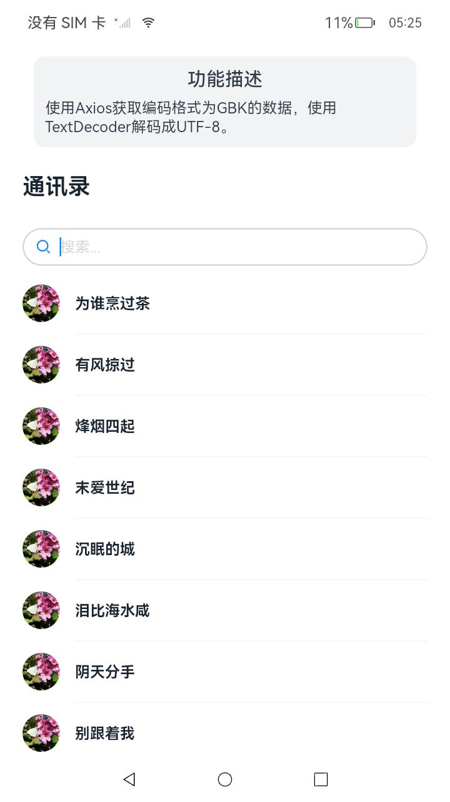

# Axios获取解析网络数据

### 介绍

本示例介绍使用第三方库的Axios获取GBK格式的网络数据时，通过[util](https://developer.huawei.com/consumer/cn/doc/harmonyos-references-V2/js-apis-util-0000001428062016-V2)实现GBK转换UTF-8格式。该场景多用于需要转换编码格式的应用。

### 效果图预览



**使用说明**

直接进入页面就可获取GBK格式的用户名信息并进行解码操作。

### 实现思路

1. 使用第三方库Axios获取网络数据，并将获取数据类型设置为ARRAY_BUFFER。源码参考[FriendsBook.ets](./src/main/ets/pages/FriendsBook.ets)
    ```typescript
    axios<string, AxiosResponse<string>, null>({
      method: "get",
      url: URL,
      responseType: 'ARRAY_BUFFER'
    })
    ```
2. 使用util.TextDecoder方法进行解码操作。源码参考[FriendsBook.ets](./src/main/ets/pages/FriendsBook.ets)
    ```typescript
    let textDecoder = util.TextDecoder.create('gbk', { ignoreBOM: true });
    let result = new Uint8Array(res.data);
    let resultString = textDecoder.decodeWithStream(result, { stream: false });
    ```
3. 将解码后的数据通过LazyForEach循环显示在列表中。源码参考[FriendsBook.ets](./src/main/ets/pages/FriendsBook.ets)
    ```typescript
    LazyForEach(this.friendsListData, (msg: FriendData) => {
      ListItem() {
        ...
      }
    })
    ```

### 工程结构&模块类型
   ```
   gbktranscoding                                  // har类型
   |---pages
   |---|---FriendsBook.ets                         // 视图层-场景列表页面
   ```

### 模块依赖

[@ohos/axios](https://gitee.com/openharmony-sig/axios)

### 参考资料

[Axios网络请求库](https://ohpm.openharmony.cn/#/cn/detail/@ohos%2Faxios)