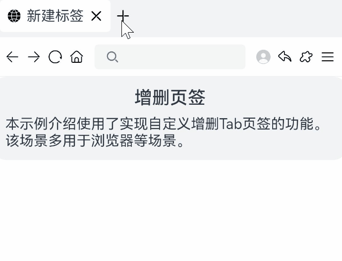

# Tab组件实现增删Tab标签

### 介绍

本示例介绍使用了[Tab组件](https://developer.huawei.com/consumer/cn/doc/harmonyos-references/ts-container-tabs-0000001821000917)实现自定义增删Tab页签的功能。该场景多用于浏览器等场景。

### 效果图预览



**使用说明**：

1. 点击新增按钮，新增Tab页面。
2. 点击删除按钮，删除Tab页面。

## 实现思路

1. 设置Tab组件的barHeight为0，隐藏组件自带的TabBar。

   ```javascript
   Tabs() {
     ...
   }
   .barHeight(0) // 隐藏tab组件自带的tabbar
   ```

2. 使用@Link修饰符，将自定义TabBar组件和Tab组件通过focusIndex和tabArray进行双向绑定。

   ```javascript
   //TabSheetComponent.ets
   @Component
   struct TabSheetComponent {
     @Link tabArray: Array<number>
     @Link focusIndex: number
   
     build() {
       ...
     }
   }
       
   //HandleTabs.ets
   @Component
   struct HandleTabs {
     @State tabArray: Array<number> = [0]; // 控制页签渲染的数组
     @State focusIndex: number = 0; // Tabs组件当前显示的页签下标
   
     build() {
       ...
   
       TabSheetComponent({ tabArray: $tabArray, focusIndex: $focusIndex })
       Tabs({ index: this.focusIndex }) {
         ForEach(this.tabArray,()=>{
           ...
         })
       }
   
       ...
     }
   }
   ```

   

3. 在自定义TabBar中修改focusIndex和tabArray的值时，Tab组件根据数据变化进行对应UI变更

   ```javascript
   //TabSheetComponent.ets
   Image('add') // 新增页签
     .onClick(() => {
       this.tabArray.push(item)
     })
   
   ...
   
   Image('close') // 关闭指定索引页签
     .onClick(() => {
       this.tabArray.splice(index, 1)
     })
   
   ...
   
   this.focusIndex = index; // 跳转到指定索引值
   ```

   

### 高性能知识点

本示例使用了ForEach进行数据懒加载，ForEach第三个入参keyGenerator唯一时，动态修改ForEach时，可降低渲染开销。

### 工程结构&模块类型

   ```
   handletabs                                      // har包
   |---model
   |   |---constantsData.ets                       // 定义常量数据
   |---pages                        
   |   |---HandleTabs.ets                          // 增删tab页签功能实现页面
   |   |---MenuBar.ets                             // 工具栏
   |   |---TabSheetComponent.ets                   // 自定义TabBar组件
   ```

### 模块依赖

当前场景依赖common模块的FunctionDescription组件，主要用于功能场景文本介绍。详细可参考[FunctionDescription](../../common/utils/src/main/ets/component/FunctionDescription.ets)文件。


### 参考资料

[ForEach使用说明](https://developer.huawei.com/consumer/cn/doc/harmonyos-guides/arkts-rendering-control-foreach-0000001820999585)

[Tabs组件使用说明](https://developer.huawei.com/consumer/cn/doc/harmonyos-references/ts-container-tabs-0000001821000917)
