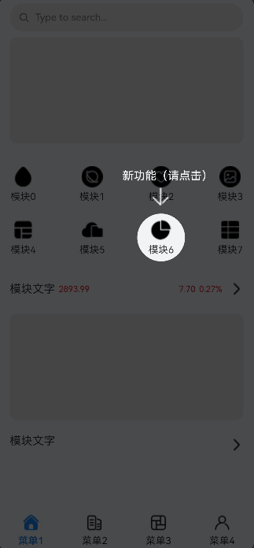

# 应用新功能引导实现案例

### 介绍

本文介绍如何使用**high_light_guide**三方库完成应用新版本功能导航。通过高亮区域与蒙版背景的明暗度对比，让用户快速锁定重点功能，了解版本变更和业务入口。

### 效果图预览



**使用说明**

1. 点击页面上对应按钮或空白区域进入下一个提示，直至提示完成。

### 实现思路

1. 在需要使用的页面引入high_light_guide库中的引导页组件。

   ```typescript
   // 引入引导页组件
   import { HighLightGuideBuilder, HighLightGuideComponent, Controller, GuidePage, HighLightShape, RectF } from '@ohos/high_light_guide';
   ```

2. 初始化引导页构建类，通过addHighLight绑定对应id组件的高光。此案例设定3个addGuidePage引导页配置，每个配置里添加引导页组件。

   ```typescript
   // 初始化引导页构建类
   aboutToAppear() {
     this.builder = new HighLightGuideBuilder()
       .alwaysShow(true)
       .addGuidePage(GuidePage.newInstance()// 设定第一处提示
         .setEverywhereCancelable(true)// 允许点击任意处关闭
         .addHighLightWithOptions('test', HighLightShape.CIRCLE, options)// 为id为test的组件绑定特定形状高光
         .setHighLightIndicator(this.firstIndicator.bind(this))
         .setEnterAnimation(this.enterAnimatorParam)
         .setExitAnimation(this.exitAnimatorParam))
       .addGuidePage(GuidePage.newInstance()// 设定第二处提示
         .setHighLightIndicator(this.secondIndicator)
         .setEnterAnimation(this.enterAnimatorParam)
         .setExitAnimation(this.exitAnimatorParam))
       .addGuidePage(GuidePage.newInstance()// 设定第三处提示
         .setEverywhereCancelable(false)
         .setHighLightIndicator(this.thirdIndicator));
   }
   ```

3. 设定各setHighLightIndicator里的引导层布局组件

   ```typescript
   @Builder
   private firstIndicator() {
     ... // 引导层内容
   }
   ```
   
4. 计算id为test组件处于页面中的位置，为引导说明组件做位置控制。

   使用@Provide装饰器和@Consume装饰器：与后代组件双向同步，将基础页面布局中id为test组件的坐标传递给引导页。

   ```
   @Provide PosX: number = 0;
   @Provide PosY: number = 0;
   @State firstIndicatorHeight: number = 0;
   
   @Builder
   private firstIndicator() {
     ... // 引导层内容：提示文字等
   }
   .onAreaChange((oldValue: Area, newValue: Area) => {
     this.firstIndicatorHeight = Number(newValue.height);// 获取此引导组件的高度
   })
   // 此案例x坐标为id为test组件宽度的一半
   // y坐标为id为test组件相对于屏幕顶部的距离与自身高度的差值
   .position({ x: this.PosX, y: this.PosY - this.firstIndicatorHeight })
   ```

   ```
   @Consume PosX: number;
   @Consume PosY: number;
   
   GridItem() {
     ...
   }
   .onAreaChange((oldValue: Area, newValue: Area) => {
     this.PosX = Number(newValue.width) / RADIUS;// 此案例需获取此组件宽度的一半，作为演示
     this.PosY = Number(newValue.globalPosition.y);
   })
   ```

5. 添加引导页布局，通过HighLightGuideComponent的onReady回调参数controller控制引导层初始化显示。

   ```typescript
   build() {
     Stack() {
       ...
       // 添加引导页布局
       HighLightGuideComponent({
         highLightContainer: this.HighLightComponent, // 引导页覆盖时的内容布局插槽
         currentHLIndicator: null, // 引导页的引导层插槽
         builder: this.builder, // 引导页的通用配置构建类
         onReady: (controller: Controller) => { // 引导页准备好的回调，获取引导页控制器
           this.controller = controller;
           this.controller.show();
         }
       })
       ...
     }
   }
   ```

6. 自定义Builder，设定底层页面基础布局。

   ```
   @Builder
   private HighLightComponent() {
     Column() {
       ... // 布局内容
     }
     .alignItems(HorizontalAlign.Start)
     .width('100%')
     .height('100%');
   }
   ```

7. 通过controller控制引导层跳转和销毁。  

   ```typescript
   this.controller.showPage(1);// 跳转第二个引导页
   this.controller.showPage(2);// 跳转第三个引导页
   this.controller.remove();   // 移除引导层
   ```

### 高性能知识点

**不涉及**

### 工程结构&模块类型

   ```
   highlightguide                               // har类型
   |---src\main\ets\pages
   |   |---Index.ets                            // 功能引导页面
   ```

### 模块依赖

[动态路由模块](../../feature/routermodule/src/main/ets/router/DynamicsRouter.ets)实现页面动态加载
[high_light_guide三方库](https://gitee.com/openharmony-sig/ohos_highlightguide/tree/master#high_light_guide)

### 参考资料

[high_light_guide三方库](https://gitee.com/openharmony-sig/ohos_highlightguide/tree/master#high_light_guide)