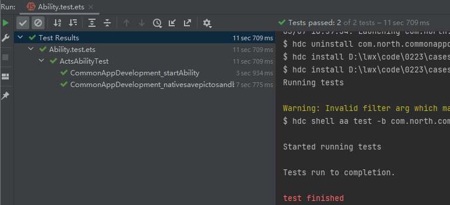
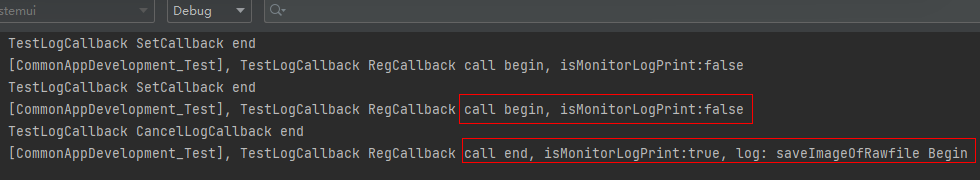

# 监听HiLog日志实现测试用例验证

### 介绍

日常中在进行测试用例验证时，会出现部分场景无法通过判断UI的变化来确认用例是否正常运行，我们可以通过监听日志的方式来巧妙的实现这种场景。本示例通过监听hilog日志的回调，判断指定日志是否打印，来确定测试用例的执行结果是成功还是失败。由于ArkTS没有注册日志回调的接口，示例通过Native来注册日志回调，并在Native的自定义日志处理函数中过滤用户传入的日志内容后回调ArkTS端的回调函数。

### 效果图预览

| 验证场景                                  | 测试结果                                                          |日志打印|
|---------------------------------------|---------------------------------------------------------------|--------------------------------|
|  |  ||


**使用说明**：

1. 在product工程的ohosTest中启动Ability.test.ets来验证开启日志回调、关闭日志回调两个测试用例是否成功。

## 实现思路

1. 在Native中实现注册日志回调函数。

   ```cpp
   static napi_value SetLogCallback(napi_env env, napi_callback_info info) {
       size_t argc = 2;
       napi_value args[2] = {nullptr};
       napi_get_cb_info(env, info, &argc, args, nullptr, nullptr);
       // 解析要过滤的日志
       size_t logSize;
       napi_get_value_string_utf8(env, args[0], logToFilter, MAX_LOG_LEN, &logSize);
   
       // 解析ArkTS端的回调函数
       napi_valuetype valueType = napi_undefined;
       napi_typeof(env, args[1], &valueType);
       if(valueType != napi_function) {
           OH_LOG_Print(LOG_APP, LOG_ERROR, GLOBAL_RESMGR, TAG, "SetLogCallback fail，param[2] is not a function！");
           return nullptr;
       }
       // 创建ArkTS端回调函数的引用
       napi_create_reference(env, args[1], 1, &callbackRef);
       g_env = env;
       // 注册日志回调接口
       OH_LOG_SetCallback(HiLogCallbackFilter);
       OH_LOG_Print(LOG_APP, LOG_INFO, GLOBAL_RESMGR, TAG, "TestLogCallback SetCallback end");
       return nullptr;
   }
   ```

2. 在Native中实现自定义日志处理函数。

   ```cpp
   static void HiLogCallbackFilter(const LogType type, const LogLevel level, const unsigned int domain, const char *tag,
                    const char *msg) {
    std::string strMsg(msg, strlen(msg) + 1);    
    // TODO: 知识点： 过滤要查找的日志
    size_t foundIndex = strMsg.find(logToFilter);
    if(foundIndex != -1) {
        // ArkTS回调函数
        napi_value callback = nullptr;
        napi_get_reference_value(g_env, callbackRef, &callback);
        // 返回日志内容
        napi_value hilogArg;
        napi_create_string_utf8(g_env, msg, NAPI_AUTO_LENGTH, &hilogArg);
        napi_value ret;
        // TODO: 知识点： 调用ArkTS端传入的回调函数
        napi_call_function(g_env, nullptr, callback, 1, &hilogArg, &ret);
    }
    return;
   }
   ```

3. 在Native中实现关闭日志回调功能。

   ```cpp
   static napi_value CancelLogCallback(napi_env env, napi_callback_info info) {
       // 关闭日志回调
       OH_LOG_SetCallback(nullptr);
       OH_LOG_Print(LOG_APP, LOG_INFO, GLOBAL_RESMGR, TAG, "TestLogCallback CancelLogCallBack end");
       // 删除回调函数引用
       napi_delete_reference(env, callbackRef);
       return nullptr;
   }
   ```

4. 将以上Native的日志回调功能封装成ts接口HiLogMonitorManagement。

   ```typescript
   import testNapi from 'liblogcallback.so';   
   export class HiLogMonitorManagement {

     // TODO: 知识点： 注册日志回调函数
     registerCallback(strLog: string, callBack : Function) : void {
       testNapi.setLogCallback(strLog, callBack);
     }
   
     // TODO: 知识点： 关闭日志回调
     cancelCallback() : void {
       testNapi.cancelLogCallback();
     }
   }
   ```
   
6. 在product工程中实现测试用例编写。

   ```typescript
   //  ..\product\entry\src\ohosTest\ets\test\Ability.test.ets
    /**
     * 打开应用，应用启动后注册日志回调
     */
    it(BUNDLE + '_startAbility', 0, async (done: Function) => {
      logger.info(TAG, BUNDLE + '_startAbility start')
      let want: Want = {
        bundleName: 'com.north.commonappdevelopment',
        abilityName: 'EntryAbility'
      };
      delegator.startAbility(want, (err) => {
        logger.info(TAG, 'StartAbility get err ' + JSON.stringify(err));
        expect(err).assertNull();
      })
      logger.info(TAG, BUNDLE + '_startAbility end');
      let driver: Driver = Driver.create();
      await driver.delayMs(3000);
      done();
    })
   
    /**
     * 注册日志回调，验证保存Rawfile图片到沙箱功能是否运行
     */
    it('CommonAppDevelopment_nativesavepictosandbox_001', 1, async (done: Function) => {
      logger.info(TAG, `${BUNDLE}_nativesavepictosandbox_001 begin`);
      let driver: Driver = Driver.create();
      await driver.delayMs(1000);
      // 进入tab的native页签
      let nativeBtn: Component = await driver.findComponent(ON.text('Native'));
      await driver.delayMs(500);
      await nativeBtn.click();
      await driver.delayMs(500);

      // 点击进入native保存图片到沙箱场景首页
      await driver.swipe(0, 800, 0, 100, 600);
      let sandboxBtn: Component = await driver.findComponent(ON.text('native保存图片到沙箱'));
      await driver.delayMs(500);
      await sandboxBtn.click();
      await driver.delayMs(500);

      // TODO: 知识点： 注册日志回调, 侦听保存Rawfile图片到沙箱功能
      const logMonitor : string = "saveImageOfRawfile Be2gin";  // 要监听的日志内容
      let isMonitorLogPrint : Boolean = false;                 // 监听的日志内容是否打印
      let logCallback : string = "";                           // 回调返回的日志内容
      const hiLogMonitor: HiLogMonitorManagement = new HiLogMonitorManagement();
      hiLogMonitor.registerCallback(logMonitor, ((strLog: string) => {
        // 判断返回的日志内容是否包含侦听的日志内容
        logCallback = strLog;
        if (logCallback.indexOf(logMonitor) !== -1) {
          isMonitorLogPrint = true;
        } else {
          isMonitorLogPrint = false;
        }
      }));
      isMonitorLogPrint = false;
      // 点击保存Rawfile图片到沙箱
      let rawFileBtn: Component = await driver.findComponent(ON.text('保存Rawfile图片'));
      logger.info(TAG, 'TestLogCallback registerCallback call begin, isMonitorLogPrint:' + isMonitorLogPrint.toString());
      await rawFileBtn.click();
      await driver.delayMs(100);
      // 验证注册日志回调后，isMonitorLogPrint 为 true
      expect(isMonitorLogPrint).assertEqual(true);
      // 验证完后关闭侦听
      hiLogMonitor.cancelCallback();
      logger.info(TAG, 'TestLogCallback registerCallback call end, isMonitorLogPrint:' + isMonitorLogPrint.toString() + ', log: ' + logCallback);

      // 退出到首页面
      await driver.delayMs(500);
      await driver.pressBack();
      logger.info(TAG, `${BUNDLE}_nativesavepictosandbox_001 end`);
      done();
    })
   ```
   
### 高性能知识点

**不涉及**

### 工程结构&模块类型

   ```
   hilogmonitormanagement                // har类型
   |---src\main\ets\model\
   |   |---logCallBack.ets               // ArkTS层- ts接口
   |---src\main\cpp\
   |   |---logcallback.cpp               // native层-日志回调业务逻辑   
   
   ..\product\entry\src\ohosTest         // 测试用例工程
   |---ets\test\
   |   |---Ability.test.ets              // 测试用例
   ```

### 模块依赖

**不涉及**

### 参考资料

[日志回调注册函数](https://gitee.com/openharmony/docs/blob/master/zh-cn/application-dev/dfx/hilog-guidelines-ndk.md)
