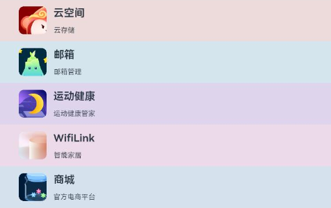
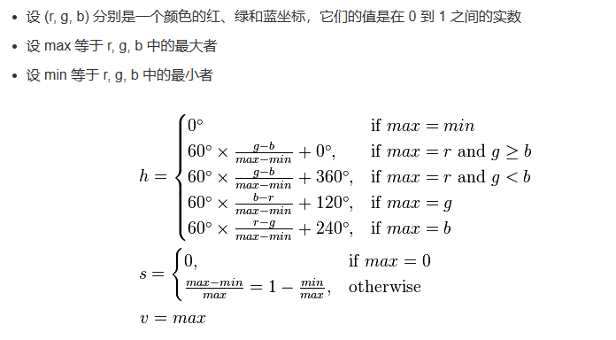
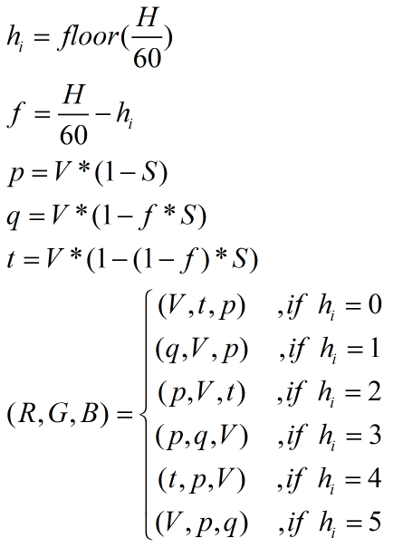

# 根据icon自适应背景颜色

### 介绍

本示例将介绍如何根据图片设置自适应的背景色。

### 效果图预览



**使用说明**

1. 转换图片为PixelMap，取出所有像素值
2. 遍历所有像素值，查找到出现次数最多的像素，即为图片的主要颜色
3. 适当修改图片的主要颜色，作为自适应的背景色

### 实现思路

**实现步骤**

1. 解码图片，转换为PixelMap对象，便于提取像素值
2. 提取所有像素值，转换为整数，放入数组中
3. 遍历数组，将所有像素值放入一个Map中，key为像素值，value为个数
4. 遍历Map，找出出现次数最多的像素值
5. 将整数格式的像素值转换为RGB格式，再转换为HSV格式，参考hue(色调)修改saturation(饱和度)和value(明度)
6. 将HSV格式转换为RGB格式，就得到了背景色

**具体实现**

1. 将图片转换为PixelMap

    ```typescript
    ...
    let pixelMap: image.PixelMap = await image2PixelMap(item.icon);
    ...
    export async function image2PixelMap(icon: string): Promise<image.PixelMap> {
      let rawFileDescriptor: resourceManager.RawFileDescriptor = resourceMgs.getRawFdSync(icon);
      let imageSource: image.ImageSource = image.createImageSource(rawFileDescriptor);
      let pixelMap: image.PixelMap = await imageSource.createPixelMap({
        editable: false,
        desiredPixelFormat: image.PixelMapFormat.BGRA_8888,
        desiredSize: { width: 40, height: 40 }
      })
      return pixelMap;
    }
    ```
   
2. 遍历PixelMap中的所有像素，放到一个数组中

    ```typescript
    ...
    let allPixels: number[] = await traverseAllPixel(pixelMap);
    ...
    export async function traverseAllPixel(pixelMap: image.PixelMap): Promise<number[]> {
      const pixelArrayBuffer: ArrayBuffer = new ArrayBuffer(40 * 40 * 4);
      await pixelMap.readPixelsToBuffer(pixelArrayBuffer);
      const allPixels: number[] = [];
      const unit8Pixels: Uint8Array = new Uint8Array(pixelArrayBuffer);
      for (let i = 0; i < unit8Pixels.length; i += 4) {
        const rgb: ColorRgb = {
          red: unit8Pixels[i+2],
          green: unit8Pixels[i+1],
          blue: unit8Pixels[i],
          alpha:unit8Pixels[i+3]
      }
      if (rgb.red === 0 && rgb.green === 0 && rgb.blue === 0 && rgb.alpha === 0) {
        continue;
      }
      allPixels.push(ColorUtils.rgbToNumber(rgb));
      }
      return allPixels;
    }
    ```
   
3. 遍历数组，找到出现次数最多的像素

    ```typescript
    ...
    let maxPixel: number = findMaxPixel(allPixels);
    ...
    export function findMaxPixel(allPixels: number[]): number {
      let map: Map<number, number> = new Map();
      allPixels.forEach((pixel: number) => {
        if (map.has(pixel)) {
          map.set(pixel, map.get(pixel)! + 1);
        } else {
          map.set(pixel, 1);
        }
      })
      let maxPixel: number = 0;
      let maxTimes: number = 0;
      map.forEach((value: number, key: number) => {
        if (value >= maxTimes) {
          maxTimes = value;
          maxPixel = key;
        }
      })
      return maxPixel;
    }
    ```
   
4. 将出现次数最多的像素值转换为RGB颜色格式

    ```typescript
    ...
    let rgb: ColorRgb = ColorUtils.numberToRgb(maxPixel);
    ...
    public static numberToRgb(color: number): ColorRgb {
      return {
        red: (color & 0xFF0000) >> 16,
        green: (color & 0xFF00) >> 8,
        blue: (color & 0xFF),
        alpha:(color & 0xFF000000)>>24
      }
    }
    ```

5. 将RGB颜色格式转换为HSV格式，转换公式如图所示。

    ```typescript
    ...
    let hsv: ColorHsv = ColorUtils.rgb2hsv(rgb);
    ...
    public static rgb2hsv(color: ColorRgb): ColorHsv {
      const red: number = color.red / MAX_RGB_VALUE;
      const green: number = color.green / MAX_RGB_VALUE;
      const blue: number = color.blue / MAX_RGB_VALUE;

      const max: number = Math.max(red, green, blue);
      const min: number = Math.min(red, green, blue);
      const delta: number = max - min;

      let hue: number = 0;
      let saturation: number = 0;
      let value: number = 0;
      if (max === min) {
        hue = 0;
      } else if (max === red) {
        hue = (green >= blue ? ((green - blue) / delta) * 60 : ((green - blue) / delta) * 60 + 360);
      } else if (max === green) {
        hue = (((blue - red) / delta) + 2) * 60;
      } else if (max === blue) {
        hue = (((red - green) / delta) + 4) * 60;
      }
      saturation = (max === 0 ? 0 : delta / max);
      value = max;

      return {
        hue: hue,
        saturation: saturation,
        value: value,
        alpha:color.alpha
      }
    }
    ```

6. 修改HSV格式中的S和V值，使背景色和图标颜色有明显区分

    ```typescript
    ...
    modifySVValue(hsv);
    ...
    export function modifySVValue(color: ColorHsv): void {
      if (color.hue > 20 && color.hue <= 60) {
        color.saturation = 0.12;
        color.value = 0.93;
      } else if (color.hue > 60 && color.hue <= 190) {
        color.saturation = 0.08;
        color.value = 0.91;
      } else if (color.hue > 190 && color.hue <= 270) {
        color.saturation = 0.1;
        color.value = 0.93;
      } else {
        color.saturation = 0.08;
        color.value = 0.93;
      }
    }
    ```
   
7. 将HSV格式转换为RGB格式，转换公式如图所示。

    ```typescript
    ...
    rgb = ColorUtils.hsv2rgb(hsv);
    ...
    public static hsv2rgb(color: ColorHsv): ColorRgb {
      const h60: number = color.hue / 60;
      const h60f: number = Math.floor(h60);
      const hi: number = h60f % 6;
      const f: number = h60 - h60f;
      const p: number = color.value * (1 - color.saturation);
      const q: number = color.value * (1 - f * color.saturation);
      const t: number = color.value * (1 - (1 - f) * color.saturation);

      let red: number = 0.0;
      let green: number = 0.0;
      let blue: number = 0.0;
      if (hi === 0) {
        red = color.value;
        green = t;
        blue = p;
      } else if (hi === 1) {
        red = q;
        green = color.value;
        blue = p;
      } else if (hi === 2) {
        red = p;
        green = color.value;
        blue = t;
      } else if (hi === 3) {
        red = p;
        green = q;
        blue = color.value;
      } else if (hi === 4) {
        red = t;
        green = p;
        blue = color.value;
      } else if (hi === 5) {
        red = color.value;
        green = p;
        blue = q;
      }
      return {
        red: Math.floor(red * MAX_RGB_VALUE),
        green: Math.floor(green * MAX_RGB_VALUE),
        blue: Math.floor(blue * MAX_RGB_VALUE),
        alpha:color.alpha
      }
    }
    ```

8. 将rgb转换为数字，放入AppInfo对象中

    ```typescript
    ...
    item.backgroundColor = ColorUtils.rgbToNumber(rgb);
    ...
    public static rgbToNumber(color: ColorRgb): number {
      return ((0xFF << 24) | (color.red << 16) | (color.green << 8) | color.blue);
    }
    ```
    
9. 通过组件的backgroundColor属性设置背景色

    ```typescript
    Row() {
    ...
    }
    .backgroundColor(this.item.backgroundColor === '' ? Color.White : this.item.backgroundColor)
    ```

### 高性能知识点

1. 解码图片时，分辨率设为40*40，既可以加快计算背景颜色的速度，又可以保证准确性
2. 提取像素时，由于鸿蒙中的颜色是用{red,green,blue,alpha}来表示，直接放入数组或者Map中会影响计算出现次数最多的像素的速度，所以需要使用rgbToNumber方法转换为整数

### 工程结构&模块类型

   ```
   iconmaincolor                                   // har类型
   |---mainpage
   |   |---MainPage.ets                            // 视图层，主要页面
   |---utils
   |   |---ColorUtils.ets                          // 颜色处理工具类
   |   |---ImageUtils.ets                          // 图片处理工具类
   ```

### 模块依赖

[**routermodule**](../../feature/routermodule)

### 参考资料

[**Image组件**](https://developer.harmonyos.com/cn/docs/documentation/doc-references-V2/ts-basic-components-image-0000001580026342-V2)