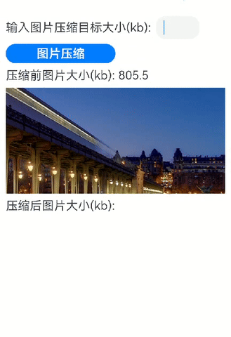

# 图片压缩方案

### 介绍

图片压缩在应用开发中是一个非常常见的需求，特别是在处理用户上传图片时，需要上传指定大小以内的图片。目前图片压缩支持jpeg、webp、png格式。本例中以jpeg图片为例介绍如何通过packing和scale实现图片压缩到目标大小以内。

### 效果图预览

 

**使用说明**

1. 进入页面，输入图片压缩目标大小，点击“图片压缩”按钮查看压缩后的图片。效果图中输入图片压缩目标大小为5kb，实际压缩大小小于等于5kb,不一定准确为5kb。

### 实现思路
1. 获取图片。从资源管理器获取要压缩的图片，创建ImageSource实例，设置解码参数DecodingOptions，使用createPixelMap获取PixelMap图片对象。源码参考[ImageCompression.ets](./src/main/ets/view/ImageCompression.ets)。

   ```typescript
   // 获取resourceManager资源管理器
   const resourceMgr: resourceManager.ResourceManager = this.context.resourceManager;
   // 获取资源管理器后，再调用resourceMgr.getRawFileContent()获取资源文件的ArrayBuffer。
   resourceMgr.getRawFileContent('beforeCompression.jpeg').then((fileData: Uint8Array) => {
     // 获取图片的ArrayBuffer
     const buffer = fileData.buffer.slice(0);
     // 创建ImageSource实例
     const imageSource: image.ImageSource = image.createImageSource(buffer);
     // 设置解码参数DecodingOptions，解码获取PixelMap图片对象。
     let decodingOptions: image.DecodingOptions = {
       editable: true, // 是否可编辑。当取值为false时，图片不可二次编辑，如crop等操作将失败。
       desiredPixelFormat: 3, // 解码的像素格式。3表示RGBA_8888。
     }
     // 创建pixelMap
     imageSource.createPixelMap(decodingOptions).then((originalPixelMap: image.PixelMap) => {
       // 压缩图片
       compressedImage(originalPixelMap, this.maxCompressedImageSize).then((showImage: CompressedImageInfo) => {
         // 获取压缩后的图片信息
         this.compressedImageSrc = fileUri.getUriFromPath(showImage.imageUri);
         this.compressedByteLength = showImage.imageByteLength;
         this.afterCompressionSize = (this.compressedByteLength / BYTE_CONVERSION).toFixed(1);
       })
     }).catch((err: BusinessError) => {
       logger.error(TAG, `Failed to create PixelMap with error message: ${err.message}, error code: ${err.code}`);
     });
   }).catch((err: BusinessError) => {
     logger.error(TAG, `Failed to get RawFileContent with error message: ${err.message}, error code: ${err.code}`);
   });
   ```
2. 图片压缩。先判断设置图片质量参数quality为0时，packing能压缩到的图片最小字节大小是否满足指定的图片压缩大小。如果满足，则使用packing方式二分查找最接近指定图片压缩目标大小的quality来压缩图片。如果不满足，则使用scale对图片先进行缩放，采用while循环每次递减0.4倍缩放图片，再用packing（图片质量参数quality设置0）获取压缩图片大小，最终查找到最接近指定图片压缩目标大小的缩放倍数的图片压缩数据。源码参考[ImageCompression.ets](./src/main/ets/view/ImageCompression.ets)。

   ```typescript
   // 创建图像编码ImagePacker对象
   let imagePackerApi = image.createImagePacker();
   // 定义图片质量参数
   let imageQuality = 0;
   // 设置编码输出流和编码参数。图片质量参数quality范围0-100。
   let packOpts: image.PackingOption = { format: "image/jpeg", quality: imageQuality };
   // 通过PixelMap进行编码。compressedImageData为打包获取到的图片文件流。
   let compressedImageData: ArrayBuffer = await imagePackerApi.packing(sourcePixelMap, packOpts);
   // 压缩目标图像字节长度
   let maxCompressedImageByte = maxCompressedImageSize * BYTE_CONVERSION;
   if (maxCompressedImageByte > compressedImageData.byteLength) {
     // 使用packing二分压缩获取图片文件流
     compressedImageData = await packingImage(compressedImageData, sourcePixelMap, imageQuality, maxCompressedImageByte);
   } else {
     // 使用scale对图片先进行缩放，采用while循环每次递减0.4倍缩放图片，再用packing（图片质量参数quality设置0）获取压缩图片大小，最终查找到最接近指定图片压缩目标大小的缩放倍数的图片压缩数据。
     let imageScale = 1; // 定义图片宽高的缩放倍数，1表示原比例。
     let reduceScale = 0.4; // 图片缩小倍数
     // 判断压缩后的图片大小是否大于指定图片的压缩目标大小，如果大于，继续降低缩放倍数压缩。
     while (compressedImageData.byteLength > maxCompressedImageByte) {
       if (imageScale > 0) {
         // 性能知识点: 由于scale会直接修改图片PixelMap数据，所以不适用二分查找scale缩放倍数。这里采用循环递减0.4倍缩放图片，来查找确定最适
         // 合的缩放倍数。如果对图片压缩质量要求不高，建议调高每次递减的缩放倍数reduceScale，减少循环，提升scale压缩性能。
         imageScale = imageScale - reduceScale; // 每次缩放倍数减0.4
         // 使用scale对图片进行缩放
         await sourcePixelMap.scale(imageScale, imageScale);
         // packing压缩
         compressedImageData = await packing(sourcePixelMap, imageQuality);
       } else {
         // imageScale缩放小于等于0时，没有意义，结束压缩。这里不考虑图片缩放倍数小于reduceScale的情况。
         break;
       }
     }
   }
   ```
3. 保存图片。获取最终图片压缩数据compressedImageData，保存图片。源码参考[ImageCompression.ets](./src/main/ets/view/ImageCompression.ets)。

   ```typescript
   let context: Context = getContext();
   // 定义要保存的压缩图片uri。afterCompressiona.jpeg表示压缩后的图片。
   let compressedImageUri: string = context.filesDir + '/' + 'afterCompressiona.jpeg';
   try {
     let res = fs.accessSync(compressedImageUri);
     if (res) {
       // 如果图片afterCompressiona.jpeg已存在，则删除
       fs.unlinkSync(compressedImageUri);
     }
   } catch (err) {
     logger.error(TAG, `AccessSync failed with error message: ${err.message}, error code: ${err.code}`);
   }
   // 压缩图片数据写入文件
   let file: fs.File = fs.openSync(compressedImageUri, fs.OpenMode.READ_WRITE | fs.OpenMode.CREATE);
   fs.writeSync(file.fd, compressedImageData);
   fs.closeSync(file);
   // 获取压缩图片信息
   let compressedImageInfo: CompressedImageInfo = new CompressedImageInfo();
   compressedImageInfo.imageUri = compressedImageUri;
   compressedImageInfo.imageByteLength = compressedImageData.byteLength;
   ```
### 高性能知识点

本示例packing方式压缩图片时，使用二分查找最接近指定图片压缩目标大小的图片质量quality来压缩图片，提升查找性能。

### 工程结构&模块类型

   ```
   imagecompression                               // har类型
   |---view
   |   |---ImageCompression.ets                   // 视图层-图片压缩页面
   ```

### 模块依赖

本示例依赖common模块来实现[日志](../../common/utils/src/main/ets/log/Logger.ets)的打印、[动态路由模块](../../feature/routermodule/src/main/ets/router/DynamicsRouter.ets)来实现页面的动态加载。

### 参考资料

1. [图片编码](https://developer.huawei.com/consumer/cn/doc/harmonyos-guides-V1/image-encoding-0000001630145941-V1)
2. [packing](https://developer.huawei.com/consumer/cn/doc/harmonyos-references-V1/js-apis-image-0000001630146161-V1#ZH-CN_TOPIC_0000001666548128__packing)
3. [scale](https://developer.huawei.com/consumer/cn/doc/harmonyos-references-V1/js-apis-image-0000001630146161-V1#ZH-CN_TOPIC_0000001666548128__scale9-1)