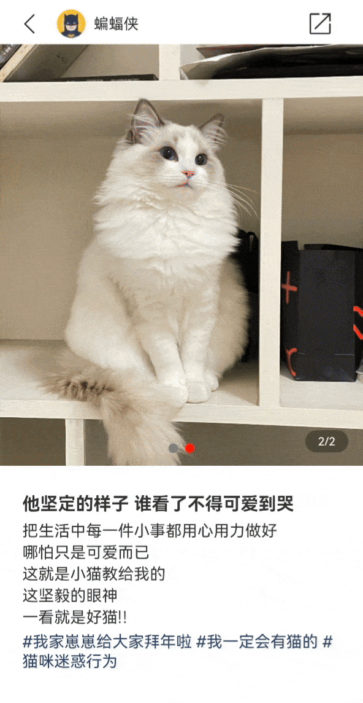

# 图片拖拽AI抠图案例

### 介绍

本示例介绍图片AI抠图案例的使用：通过[Image.enableAnalyzer(true)](https://developer.huawei.com/consumer/cn/doc/harmonyos-references/ts-basic-components-image-0000001821000853#ZH-CN_TOPIC_0000001821000853)实现长按图片抠图并拖拽/复制到其他应用中。

### 效果图预览



**使用说明**
1. 选中需要AI抠图的图片。
2. 长按需要被抠图的元素并拖拽。
3. 元素被AI抠图成功并可以拖拽。

### 实现思路
#### 场景：通过Image.enableAnalyzer()实现图片AI抠图

- Image.enableAnalyzer()可以设置组件支持AI分析，设置为true时，组件可进行AI分析。

- 支持分析的图像要求是静态非矢量图，即svg、gif等图像类型不支持分析，仅支持传入PixelMap进行分析，目前仅支持RGBA_8888类型，[源码参考](src/main/ets/view/ImageView.ets)，
因此需要定义图片转成PixelMap且为RGBA_8888类型方法：

```typescript
// 使图片转成PixelMap且为RGBA_8888类型
private async getPixmapFromMedia(resource: Resource) { 
  let unit8Array = await getContext(this)?.resourceManager?.getMediaContent({
    bundleName: resource.bundleName,
    moduleName: resource.moduleName,
    id: resource.id
  })
  let imageSource = image.createImageSource(unit8Array.buffer.slice(0, unit8Array.buffer.byteLength));
  let createPixelMap: image.PixelMap = await imageSource.createPixelMap({
    desiredPixelFormat: image.PixelMapFormat.RGBA_8888
  })
  await imageSource.release();
  return createPixelMap;
}
```
- 通过Image.enableAnalyzer(true)开启Image组件的AI分析能力，通过调用getPixmapFromMedia()方法，将传入的jpg图片类型转成支持AI抠图的PixelMap且为RGBA_8888类型，
  当用户长按拖拽图片中元素，即可实现AI抠图并拖拽/复制到其他应用中。
```typescript
build() {
  Swiper() {
    ForEach(this.imagePixelMapList, (item: image.PixelMap) => {
      /* 性能知识点：当数据量较大时，推荐使用懒加载加载数据。
       * 参考使用数据懒加载文章：
       * https://docs.openharmony.cn/pages/v4.0/zh-cn/application-dev/performance/arkts-performance-improvement-recommendation.md/
       */
      Image(item)
        .enableAnalyzer(true) // 开启Image组件的AI分析能力，目前支持分析PixelMap且为RGBA_8888类型的图片
    })
  }
}
```


### 高性能知识点

不涉及

### 工程结构&模块类型

   ```
   imageenableanalyzer                             // har类型
   |---src/main/ets/view
   |   |---ImageView.ets                           // 视图层-主页 
   ```

### 模块依赖

[har包-common库中UX标准](../../common/utils/src/main/resources/base/element)  
[@ohos/routermodule(动态路由)](../../feature/routermodule)

### 参考资料

[Image.enableAnalyzer()参考文档](https://developer.huawei.com/consumer/cn/doc/harmonyos-references/ts-basic-components-image-0000001821000853#ZH-CN_TOPIC_0000001821000853)