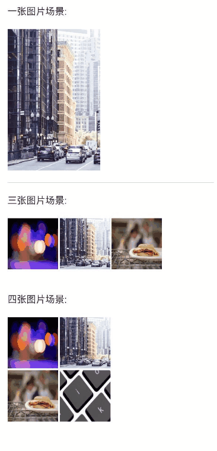

# 图片九宫格封装案例

### 介绍

本示例介绍使用([Flex](https://developer.huawei.com/consumer/cn/doc/harmonyos-guides/arkts-layout-development-flex-layout-0000001774120126))
组件实现图片在不同个数情况下的布局效果(默认布局和自定义布局)。该场景多用于社交类应用。

### 效果图预览



**使用说明**

1. 默认布局情况下，传入图片资源imageSource（类型为Resource[]），图片会按照个数进行相应的布局。
2. 自定义布局情况下，传入图片资源imageSource（类型为Resource[]）和自定义列数col（类型为number）。
3. 通过指定flexWidth（类型为string）参数，可调整整个图片布局的宽度。
4. 通过指定modifier（类型需继承AttributeModifier<ImageAttribute>
   ）参数，可以指定image的相关参数，modifier具体使用参考[动态属性设置](https://developer.huawei.com/consumer/cn/doc/harmonyos-references/ts-universal-attributes-attribute-modifier-0000001774280870)。

默认布局策略：

- 1张图片时，图片显示效果的长宽比保持不变。
- 2-3，5-9张图片时，图片按九宫格的形式布局，图片裁切为正方形，且图片大小一致.
- 4张图片时，图片按四宫格布局（两行两列），图片大小同九宫格。

### 实现思路

本例中代码详情可参考[ImageGridLayout.ets](src/main/ets/components/mainpage/ImageGridLayout.ets)
和[MultiGrid.ets](src/main/ets/components/mainpage/MultiGrid.ets)

1.在自定义组件创建的回调里根据传入的col值决定布局方式，若参数col<=0为默认布局，若参数col>0为自定义布局（图片布局的列数=col），
此部分逻辑会根据传入参数的不同走不同的逻辑。

```typescript
aboutToAppear(){
  this.arraySize = this.imageSource.length
  // 未传入col值时所走的逻辑，此时图片按默认方式布局
  if (this.col <= COLUMNS_0) {
    this.arraySize = Math.min(this.imageSource.length, IMAGE_SET_SIZE_9)
    this.row = Math.ceil(this.arraySize / COLUMNS_3)

    // 不同数量的图片对应不同的参数、布局
    if (this.arraySize === IMAGE_SET_SIZE_1) {
      this.col = COLUMNS_1
      this.imageAspectRatio = IMAGE_ASPECT_RATIO_0
      this.imageFit = ImageFit.Contain
      this.imageWidth = '60%'
    }
    else if (this.arraySize === IMAGE_SET_SIZE_4) {
      this.col = COLUMNS_2
      this.flexWidth = '50%'
      this.imageWidth = `calc((100% - ${this.imageSpacing}vp ) / 2)`
    }
    else {
      this.col = COLUMNS_3
      this.imageWidth = `calc((100% - ${this.imageSpacing * COLUMNS_2}vp ) / 3)`
    }
  }
  // 传入col值时所走的逻辑，此时图片传入的col值进行布局
  else {
    this.row = Math.ceil(this.arraySize / this.col)
    this.imageWidth = `calc((100% - ${this.imageSpacing * (this.col - 1)}vp ) / ${this.col})`
  }

}
```

2.布局主要是利用Flex的自适应能力及控制参数的变化来达到想要的布局效果。

```typescript
build(){
  Flex({ wrap: FlexWrap.Wrap, justifyContent: FlexAlign.Start }){
    ForEach(this.imageSource.slice(0, this.arraySize), (item: string | Resource, idx: number) => {
      Image(item)
        .attributeModifier(this.modifier)
        .autoResize(true)
        .objectFit(this.imageFit)
        .aspectRatio(this.imageAspectRatio)
        .width(this.imageWidth)
        .margin(
          {
            bottom: (idx + 1) > ((this.row - 1) * this.col) ? 0 : this.imageSpacing,
            right: (idx + 1) % this.col === 0 ? 0 : this.imageSpacing
          }
        )
    })
  }
  .width(this.flexWidth)
}
```

3.为image组件指定特定的参数可实现AttributeModifier<ImageAttribute>的继承类，声明想要的属性并实现对应的方法。继承类及使用的代码如下

```typescript
// 图片属性的modifier类，便于用户扩展image相关的属性
class ImageModifier implements AttributeModifier<ImageAttribute> {
  private imageFit: ImageFit = ImageFit.Fill;
  private imageRenderMode: ImageRenderMode = ImageRenderMode.Original;

  constructor() {
  }

  applyNormalAttribute(instance: ImageAttribute): void {
    instance.objectFit(this.imageFit)
    instance.renderMode(this.imageRenderMode)
  }

  objectFit(fit: ImageFit): ImageModifier {
    this.imageFit = fit;
    return this;
  }

  renderMode(mode: ImageRenderMode): ImageModifier {
    this.imageRenderMode = mode;
    return this;
  }
}
···
private imageModifier: ImageModifier = new ImageModifier().objectFit(ImageFit.Fill)
  .renderMode(ImageRenderMode.Original)
···
MultiGrid({ imageSource: item, modifier: this.imageModifier })
```

### 高性能知识点

不涉及

### 工程结构&模块类型

```
imagegridlayout                             // har类型
|---src/main/ets/components/mainpage
|   |---ImageGridLayout.ets                 // 图片九宫格展示实现页面
|   |---MultiGrid.ets                       // 图片九宫格案例封装
```

### 模块依赖

[路由管理模块](../../feature/routermodule)

### 参考资料

[Flex](https://developer.huawei.com/consumer/cn/doc/harmonyos-guides/arkts-layout-development-flex-layout-0000001774120126)

[image](https://developer.huawei.com/consumer/cn/doc/harmonyos-references/ts-basic-components-image-0000001821000853)

[动态属性设置](https://developer.huawei.com/consumer/cn/doc/harmonyos-references/ts-universal-attributes-attribute-modifier-0000001774280870)