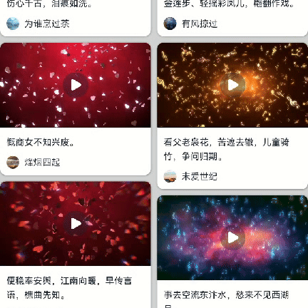

# 视频全屏切换案例

### 介绍

本示例介绍了[Video](https://gitee.com/openharmony/docs/blob/master/zh-cn/application-dev/reference/arkui-ts/ts-media-components-video.md)组件和[@ohos.window](https://gitee.com/openharmony/docs/blob/master/zh-cn/application-dev/reference/apis/js-apis-window.md)接口实现媒体全屏的功能。
该场景多用于首页瀑布流媒体播放等。

### 效果图预览



**使用说明**：

* 点击全屏按钮，横屏媒体窗口。
* 点击恢复窗口按钮，恢复媒体窗口。

## 实现步骤

1. 在Video组件内调用onFullscreenChange方法，实现媒体全屏效果。
    ```ts
    Video({
        src: $rawfile(this.moment.media),
        previewUri: $r(`app.media.${this.moment.mediaPreview}`)
      })
        .width($r('app.integer.friendMomentsPage_single_video_width'))
        .height($r('app.integer.friendMomentsPage_single_video_height'))
        .objectFit(ImageFit.Contain)
        .onFullscreenChange(() => {
          // 横竖屏切换
          this.windowChange(this.isFullscreen);
        })
   ```
2. 调用[@ohos.window](https://gitee.com/openharmony/docs/blob/master/zh-cn/application-dev/reference/apis/js-apis-window.md)的[getLastWindow](https://gitee.com/openharmony/docs/blob/master/zh-cn/application-dev/reference/apis/js-apis-window.md#windowgetlastwindow9)方法获取当前应用内最上层的子窗口，若无应用子窗口，则返回应用主窗口。
3. 利用获取到的窗口对象，调用[setWindowSystemBarEnable](https://gitee.com/openharmony/docs/blob/master/zh-cn/application-dev/reference/apis/js-apis-window.md#setwindowsystembarenable9)方法设置窗口是否显示导航栏和状态栏。
4. 调用窗口对象的[setPreferredOrientation](https://gitee.com/openharmony/docs/blob/master/zh-cn/application-dev/reference/apis/js-apis-window.md#setpreferredorientation9)方法设置窗口旋转方向以及是否应用重力感应。
    ```ts
    window.getLastWindow(getContext(), (err: BusinessError, data) => {
      const errCode = err.code;
      if (errCode) {
        return;
      }
      // 设置窗口是否显示导航栏和状态栏
      data.setWindowSystemBarEnable(WINDOW_SYSTEM_BAR);
      // 设置窗口旋转方向以及是否应用重力感应
      data.setPreferredOrientation(window.Orientation.PORTRAIT);
      })
    ```
### 高性能知识点

1. 本示例使用了[LazyForEach](https://docs.openharmony.cn/pages/v4.0/zh-cn/application-dev/performance/lazyforeach_optimization.md/) 进行数据懒加载优化,以降低内存占用和渲染开销。
2. 本示例使用了[@Reusable](https://docs.openharmony.cn/pages/v4.0/zh-cn/application-dev/performance/component-recycle.md/)复用组件优化，提升应用性能。

### 工程结构&模块类型

   ```
   mediafullscreen                                    // har
   |---model                                         
   |   |---MediaFullscreen.ets                        // 数据类型文件
   |---view
   |   |---MediaFullscreen.ets                        // 媒体全屏实现页面
   ```

### 模块依赖

**不涉及**

### 参考资料

[Video](https://gitee.com/openharmony/docs/blob/master/zh-cn/application-dev/reference/arkui-ts/ts-media-components-video.md)

[@ohos.window](https://gitee.com/openharmony/docs/blob/master/zh-cn/application-dev/reference/apis/js-apis-window.md)

[LazyForEach](https://docs.openharmony.cn/pages/v4.0/zh-cn/application-dev/performance/lazyforeach_optimization.md/)

[@Reusable](https://docs.openharmony.cn/pages/v4.0/zh-cn/application-dev/performance/component-recycle.md/)
