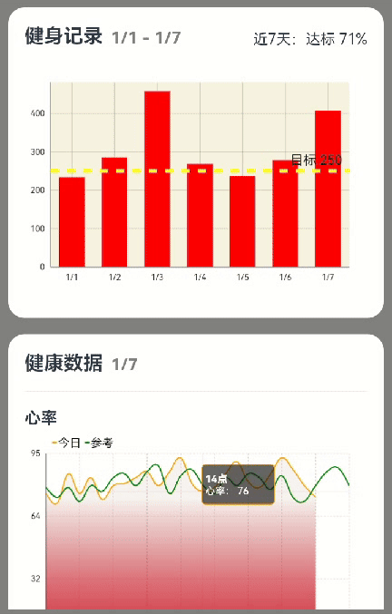

# MpChart案例

### 介绍

MpChart是一个包含各种类型图表的图表库，主要用于业务数据汇总，例如销售数据走势图，股价走势图等场景中使用，方便开发者快速实现图表UI，mpchart主要包括线形图、柱状图、饼状图、蜡烛图、气泡图、雷达图、瀑布图等自定义图表库。
本示例介绍了[MpChart](https://gitee.com/openharmony-sig/ohos-MPChart)图表组件的使用方法。
该组件多用于可视化等场景。

### 效果图预览



**使用说明**：

* 滑动屏幕，查看各图表组件。
* 点击曲线图内容，展示图表信息。

## 实现思路

1. 通过this.model = new BarChartModel()初始化图表配置构建类。

```ts
window.getLastWindow(getContext(), (err: BusinessError, data) => {
  const errCode = err.code;
  if (errCode) {
   return;
  }
  // 设置窗口是否显示导航栏和状态栏
  data.setWindowSystemBarEnable(WINDOW_SYSTEM_BAR);
  // 设置窗口旋转方向以及是否应用重力感应
  data.setPreferredOrientation(window.Orientation.PORTRAIT);
})
// 图表数据初始化
aboutToAppear() {
	// 初始化图表配置构建类
	this.model = new BarChartModel();
	...
}
```

2. 配置图表指定样式，为图表添加数据选择的监听器。

```ts
// 图表数据初始化
aboutToAppear() {
	// 为图表添加数据选择的监听器。
 	this.model.setOnChartValueSelectedListener(this.valueSelectedListener);
  ...
  // 配置图表指定样式：如启用绘制网格背景。
  this.model.setDrawGridBackground(false);
  ...
}
```

3. 通过this.model.setData(this.data)将数据与图表配置类绑定。

```ts
// 图表数据初始化
aboutToAppear() {
	...
	// 生成单一颜色数据
	this.data = this.getNormalData();
	// 将数据与图表配置类绑定
	this.model.setData(this.data);
	...
}
```

4. 通过BarChart({ model: this.model })为组件设置配置构建类。

```ts
build() {
	Column() {
		...
		// 为组件设置配置构建类。
		BarChart({ model: this.model })
		...
	}
}
```

### 高性能知识点

**不涉及**

### 工程结构&模块类型

   ```
   mpcharts                                     // har
   |---model                                         
   |   |---BasicDataSource.ets                  // 数据类型文件
   |---view
   |   |---BarCharts.ets                        // 柱状图组件
   |   |---Index.ets                            // 图表列表页面
   |   |---LineCharts.ets                       // 曲线图组件
   ```

### 模块依赖

[MpChart](https://gitee.com/openharmony-sig/ohos-MPChart)

### 参考资料

[MpChart](https://gitee.com/openharmony-sig/ohos-MPChart)
