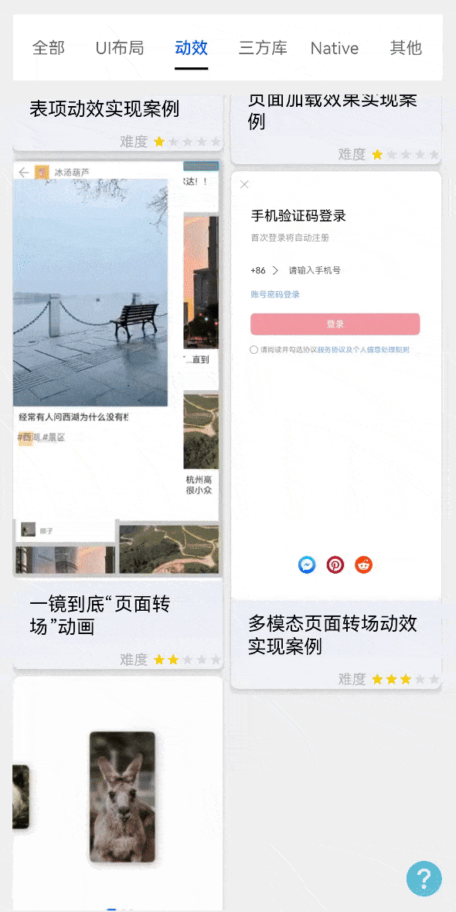

# 多模态页面转场动效实现案例

### 介绍

本示例介绍多模态页面转场动效实现：通过[半模态转场](https://developer.huawei.com/consumer/cn/doc/harmonyos-references/ts-universal-attributes-sheet-transition-0000001820880845)实现半模态登录界面，
通过配置NavDestinationMode类型为DIALOG，实现半模态的背景为透明，再与
[全屏模态](https://developer.huawei.com/consumer/cn/doc/harmonyos-references/ts-universal-attributes-modal-transition-0000001821000821)和组件转场结合实现多模态组合登录场景，其中手机验证码登录与账号密码登录都为组件，
通过TransitionEffect.move()实现组件间转场达到近似页面转场的效果。

### 效果图预览



**使用说明**

登录方式有两种，验证码登录和账号密码登录
1. 点击主页"多模态页面转场动效实现案例"，跳转半模态登录页面。
2. 在半模态窗口中选中同意协议键，并点击获取验证码按钮，跳转至手机验证码登录页面。
3. 通过点击手机验证码登录页面中的"账号密码登录"，向右切换跳转至账号密码登录页面。
4. 通过点击账号密码登录页面中的"手机验证码登录"，向左切换跳转至手机验证码登录页面。

### 实现思路
#### 场景：半模态转场至验证码登录，验证码登录和账户登录可以相互切换

登录方式有两种，验证码登录和账户，需要在一个全屏模态窗口CaptureLogin中切换，使用if进行条件渲染。

1、通过配置NavDestinationMode类型为[DIALOG](../../product/entry/src/main/ets/pages/EntryView.ets)，实现半模态的背景为透明的效果。
```typescript
import { RouterInfo } from '@ohos/dynamicsRouter/Index';
pageMap(name: string, param: ESObject) {
  NavDestination() {}
  // 按需将NavDestinationMode配置为DIALOG类型，此时背景默认透明
  .mode(name === RouterInfo.MULTI_MODAL_TRANSITION.moduleName + "/" + RouterInfo.MULTI_MODAL_TRANSITION.pageName ?
  NavDestinationMode.DIALOG : NavDestinationMode.STANDARD)
}
```
2、通过bindSheet属性为主页的button绑定半模态页面
```typescript
Text()
  /**
   * TODO: 知识点: 通过bindSheet属性为组件绑定半模态页面,由于半模态必须绑定组件，
   * 此处绑定无样式的Text组件作为开屏半模态展示。
   * isPresent：是否显示全屏模态页面
   */
  .bindSheet($$this.isPresent, this.halfModalLogin(), { // Text绑定半模态转场
    height: this.sheetHeight, // 半模态高度
    dragBar: this.showDragBar, // 是否显示控制条
    backgroundColor: $r('app.color.btn_bgc'),
    showClose: true, // 是否显示关闭图标
    shouldDismiss: ((sheetDismiss: SheetDismiss) => { // 半模态页面交互式关闭回调函数
      sheetDismiss.dismiss();
      this.pageStack.pop();
    })
})
```
3、在半模态页面中的验证码登录按钮绑定全屏模态转场，并将对应的全屏模态转场特效置空。
```typescript
@Builder
halfModalLogin() { // 半模态窗口页面
  Button("验证码登录")
    .bindContentCover(this.isPresentInLoginView,this.defaultLogin(),{ modalTransition: ModalTransition.NONE}) // 全屏模态转场
    .onClick(() => {
      if (this.isConfirmed) { // 判断是否同意协议
        // 半模态页面中跳转全屏模态登录页
        this.isPresentInLoginView = true;
      }
    })
}
```
4、通过点击第二步中的按钮跳转到全屏模态组件(CaptureLogin)，并通过isDefaultLogin控制两种登录组件的条件渲染：true(手机验证码登录),false(二维码登录)，同时通过TransitionEffect.move()实现组件间转场，
从而实现组件转场类似页面转场的效果。
```typescript

build() {
  Stack({ alignContent: Alignment.TopStart }) {
    if (this.isDefaultLogin) {
      CaptchaLogin() // 手机验证码登录
        .transition(TransitionEffect.move(TransitionEdge.START).animation({ duration: EffectDuration, curve: Curve.Linear })) // 从左边推出
    } else {
      AccountLogin() // 账号密码登录
        .transition(TransitionEffect.move(TransitionEdge.END).animation({ duration: EffectDuration, curve: Curve.Linear })) // 从右边推出
    }
  }
}
```

### 高性能知识点

[容器限制条件渲染组件的刷新范围](https://docs.openharmony.cn/pages/v4.0/zh-cn/application-dev/performance/proper-choice-between-if-and-visibility.md/#%E6%9D%A1%E4%BB%B6%E6%B8%B2%E6%9F%93%E5%92%8C%E5%AE%B9%E5%99%A8%E9%99%90%E5%88%B6)

### 工程结构&模块类型

   ```
   multimodaltransition                            // har类型
   |---src/main/ets/view
   |   |---HalfModalWindow.ets                     // 视图层-主页
   |---src/main/ets/model
   |   |---AccountLogin.ets                        // 模型层-账号密码登录页 
   |   |---CaptchaLogin.ets                        // 模型层-验证码登录页(全屏模态窗口) 
   ```

### 模块依赖

[har包-common库中UX标准](../../common/utils/src/main/resources/base/element)  
[@ohos/routermodule(动态路由)](../../feature/routermodule)

### 参考资料

[半模态转场](https://developer.huawei.com/consumer/cn/doc/harmonyos-references/ts-universal-attributes-sheet-transition-0000001820880845)  
[全屏模态](https://developer.huawei.com/consumer/cn/doc/harmonyos-references/ts-universal-attributes-modal-transition-0000001821000821)  
[NavDestinationMode](https://developer.huawei.com/consumer/cn/doc/harmonyos-references/ts-basic-components-navdestination-0000001774280918#ZH-CN_TOPIC_0000001774280918__navdestinationmode)
