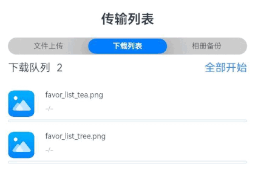

# 多文件下载监听案例

### 介绍

多文件下载监听在应用开发中是一个非常常见的需求。本示例将介绍如何使用request上传下载模块实现多文件下载监听，如监听每个文件下载任务的进度，任务暂停，下载完成等下载情况。每个应用最多支持创建10个未完成的任务，相关规格说明请参考[request.agent.create](https://developer.huawei.com/consumer/cn/doc/harmonyos-references/js-apis-request-0000001774281338#ZH-CN_TOPIC_0000001774281338__requestagentcreate10)。

### 效果图预览

 

**使用说明**

1. 连接网络。进入页面，点击“全部开始”，启动所有文件的下载任务。点击“全部暂停”，暂停所有文件下载任务。再次点击“全部开始”,可重新启动未完成的下载任务。下载完成的文件会保存在应用缓存路径下。如出现下载失败，一般是网络不稳定，点击“全部开始”即可重新下载。

### 实现思路
1. 配置下载参数。一个下载任务需要配置对应一套下载参数request.agent.Config。本例中使用downloadConfig方法简单配置了下载文件的url，实际业务中请按实际情况按需配置。源码参考[MultipleFilesDownload.ets](./src/main/ets/view/MultipleFilesDownload.ets)。

   ```typescript
   let config: request.agent.Config = {
     action: request.agent.Action.DOWNLOAD, // 配置任务选项，这里配置为下载任务
     url: downloadUrl, // 配置下载任务url
     overwrite: true, // 下载过程中路径已存在时的解决方案选择。true表示覆盖已存在的文件
     method: 'GET', // HTTP标准方法。下载时，使用GET或POST。
     saveas: './', // 这里'./'表示下载至应用当前缓存路径下。
     mode: request.agent.Mode.BACKGROUND, // 任务模式设置后台任务。
     gauge: true // 后台任务的过程进度通知策略，仅应用于后台任务。true表示发出每个进度已完成或失败的通知。
   };
   ```
2. 创建多个文件下载监听实例。单个文件下载监听只需要配置下载参数，创建下载任务，注册下载任务相关监听，启动下载任务即可实现。而要实现多文件下载监听，需要每个下载任务注册独立的下载监听回调。本例通过封装自定义组件FileDownloadItem，在每个FileDownloadItem中创建各自的下载任务和监听回调，从而实现多文件下载监听。源码参考[MultipleFilesDownload.ets](./src/main/ets/view/MultipleFilesDownload.ets)。

   ```typescript
   ForEach(this.downloadConfigArray, (item: request.agent.Config) => {
     ListItem() {
       // 创建文件下载监听实例
       FileDownloadItem({
         downloadConfig: item, // 文件下载配置
         isStartAllDownload: this.isStartAllDownload, // 是否全部开始下载
         downloadCount: this.downloadCount // 待下载任务数量
       })
     }
   }, (item: request.agent.Config) => JSON.stringify(item))
   ```
3. 创建下载任务，并注册下载任务相关监听。本例在每个FileDownloadItem中使用request.agent.create创建下载任务。然后在下载任务创建成功后，注册各自下载任务相关监听。本例中注册了下载任务完成回调，下载任务失败回调，下载进度更新回调，暂停任务回调，重新启动任务回调。源码参考[FileDownloadItem.ets](./src/main/ets/view/FileDownloadItem.ets)。

   ```typescript
   request.agent.create(context, this.downloadConfig).then((task: request.agent.Task) => {
     // 注册下载任务相关回调
     task.on('completed', this.completedCallback); // 下载任务完成回调
     task.on('failed', this.failedCallback); // 下载任务失败回调
     task.on('pause', this.pauseCallback); // 暂停任务回调
     task.on('resume', this.resumeCallback); // 重新启动任务回调
     task.on('progress', this.progressCallback); // 下载进度更新回调
   }).catch((err: BusinessError) => {
     logger.error(TAG, `Failed to task create with error message: ${err.message}, error code: ${err.code}`);
   });
   ```
4. 启动下载任务。本例在每个FileDownloadItem中使用task.start方法启动各自的下载任务。源码参考[FileDownloadItem.ets](./src/main/ets/view/FileDownloadItem.ets)。

   ```typescript
   task.start((err: BusinessError) => {
     if (err) {
       logger.error(TAG, `Failed to task start with error message: ${err.message}, error code: ${err.code}`);
       return;
     }
     this.downloadTask = task;
   })
   ```
### 高性能知识点

本示例中注册了progress下载进度更新监听，不建议在下载进度更新回调中加日志打印，以减少不必要的性能损耗。

### 工程结构&模块类型

   ```
   multiplefilesdownload                               // har类型
   |---view
   |   |---MultipleFilesDownload.ets                   // 视图层-文件下载页面
   |   |---FileDownloadItem.ets                        // 视图层-单个文件下载组件
   ```

### 模块依赖

本示例依赖common模块来实现[日志](../../common/utils/src/main/ets/log/Logger.ets)的打印、[动态路由模块](../../feature/routermodule/src/main/ets/router/DynamicsRouter.ets)来实现页面的动态加载。

### 参考资料

[上传下载](https://developer.huawei.com/consumer/cn/doc/harmonyos-references/js-apis-request-0000001774281338#ZH-CN_TOPIC_0000001774281338__task10)
