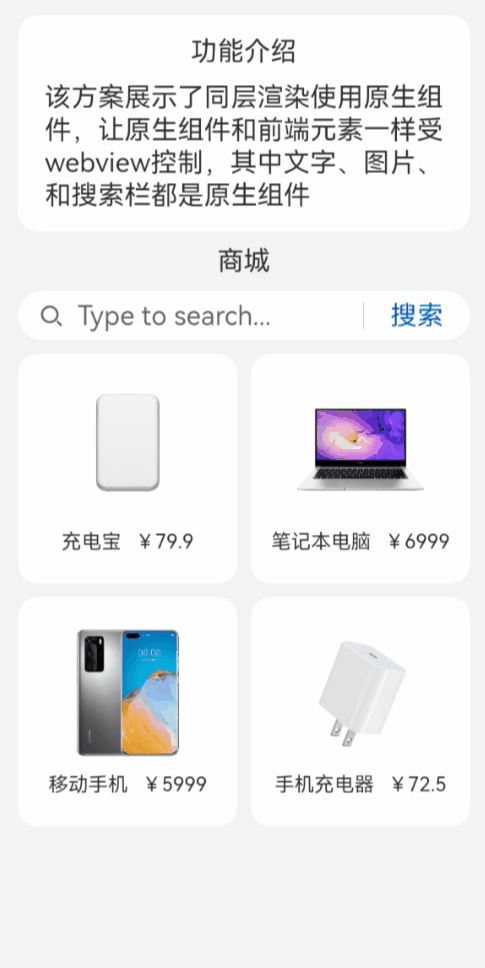

# ArkWeb同层渲染

### 介绍

该方案展示了ArkWeb[同层渲染](https://developer.huawei.com/consumer/cn/doc/harmonyos-faqs/faqs-arkweb-kit-0000001816292321#section8632329115714)：将系统原生组件直接渲染到前端H5页面上，原生组件不仅可以提供H5组件无法实现的一些功能，还能提升用户体验的流畅度

### 效果图预览



**使用说明**

1. 进入页面即可看到同层渲染效果，Text，search，image都是原生组件。

### 实现思路

1. 添加权限。
    ```ts
   "ohos.permission.INTERNET"
    ```
2. 创建控制器管理绑定的NodeContainer组件。
   ```ts
   class SearchNodeController extends NodeController {
     private rootNode: BuilderNode<[Params]> | undefined | null = null;
     private embedId : string = "";
     private surfaceId : string = "";
     private renderType :NodeRenderType = NodeRenderType.RENDER_componentTypeDISPLAY;
     private componentWidth : number = 0;
     private componentHeight : number = 0;
     private componentType : string = "";

     setRenderOption(params : NodeControllerParams): void {
       this.surfaceId = params.surfaceId;
       this.renderType = params.renderType;
       this.embedId = params.embedId;
       this.componentWidth = params.width;
       this.componentHeight = params.height;
       this.componentType = params.type;
     }
     /**
      * 在对应NodeContainer创建的时候调用、或者通过rebuild方法调用刷新
      */
     makeNode(uiContext: UIContext): FrameNode | null{
       this.rootNode = new BuilderNode(uiContext, { surfaceId: this.surfaceId, type: this.renderType});
       if (this.componentType === 'native/component') {
         this.rootNode.build(wrapBuilder(searchBuilder), { width : this.componentWidth, height : this.componentHeight});
       } else {
       }
       // 返回FrameNode节点
       return this.rootNode.getFrameNode();
     }
     /**
      * 设置BuilderNode节点
      */
     setBuilderNode(rootNode: BuilderNode<Params[]> | null): void{
       this.rootNode = rootNode;
     }
     /**
      * 获取BuilderNode节点
      */
     getBuilderNode(): BuilderNode<[Params]> | undefined | null{
       return this.rootNode;
     }
     /**
      * 更新BuilderNode节点
      */
     updateNode(arg: Object): void {
       this.rootNode?.update(arg);
     }
     /**
      * 获取EmbedId
      */
     getEmbedId() : string {
       return this.embedId;
     }
     /**
      * 将触摸事件派发到rootNode创建出的FrameNode上
      */
     postEvent(event: TouchEvent | undefined) : boolean {
       return this.rootNode?.postTouchEvent(event) as boolean;
     }
   }
   ```
3. 添加同层渲染的组件。
   ```ts
   @Component
   struct SearchComponent {
   @Prop params: Params;
   controller: SearchController = new SearchController();

   build() {
     Column() {
       Column({ space: MARGIN_VERTICAL }) {
         Text($r('app.string.headline')).fontSize($r('app.string.ohos_id_text_size_body1'))
         Text($r('app.string.illustrate')).fontSize($r('app.string.ohos_id_text_size_body1'))
       }
       // 原生Text组件
       Text($r('app.string.mall')).fontSize($r('app.string.ohos_id_text_size_body1'))
       // 原生Search组件
       Search({ placeholder: 'Type to search...', controller: this.controller })
         .searchButton(SEARCH_BUTTON)
       // 原生Grid组件，Grid中包含Image和Text
       Grid() {
         // 性能知识点：此处数据量确定且数量较少，使用了ForEach，在数据量多的情况下，推荐使用LazyForeEach
         ForEach(PRODUCT_DATA, (item: ProductDataModel, index: number) => {
           GridItem() {
             Column({ space: MARGIN_VERTICAL }) {
               Image(item.uri).width($r('app.integer.image_size'))
               Row({ space: MARGIN_VERTICAL }) {
                 Text(item.title).fontSize($r('app.string.ohos_id_text_size_body3'))
                 Text(item.price).fontSize($r('app.string.ohos_id_text_size_body3'))
               }
             }
           }
         })
       }
       .columnsTemplate('1fr 1fr') // 2列
       .rowsTemplate('1fr 1fr ') // 2行
       .rowsGap($r('app.string.ohos_id_elements_margin_vertical_m')) // 行间距
       .columnsGap($r('app.string.ohos_id_elements_margin_vertical_m')) // 列间距
      }
    }
   }
   ```
4. embed标签可以在H5页面中嵌入任何类型的内容，在H5界面上通过embed标签标识同层元素，应用侧会将原生组件渲染到H5页面embed标签所在位置。
   ```html
   <div>
       <div id="bodyId">
           <!-- 在H5界面上通过embed标签标识同层元素，在应用侧将原生组件渲染到H5页面embed标签所在位置-->
           <embed id="nativeSearch" type = "native/component" width="100%" height="100%" src="view"/>
       </div>
   </div>
   ```
5. 通过WebView的enableNativeEmbedMode()控制同层渲染开关，通过onNativeEmbedLifecycleChange获取embed标签的生命周期变化数据。
   ```ts
   build(){
     Column() {
       Stack() {
         // 性能知识点：此处componentId项确定且数量较少，使用了ForEach，在数据量多的情况下，推荐使用LazyForeEach
         ForEach(this.componentIdArr, (componentId: string) => {
           NodeContainer(this.nodeControllerMap.get(componentId));
         }, (embedId: string) => embedId)
         // web组件加载本地test.html页面
         Web({ src: $rawfile("view.html"), controller: this.browserTabController })
           .backgroundColor($r('app.color.ohos_id_color_sub_background'))
           // 不允许执行缩放
           .zoomAccess(false)
           // Todo: 知识点：通过enableNativeEmbedMode（）配置同层渲染开关
           .enableNativeEmbedMode(true)
           // Todo: 知识点：通过onNativeEmbedLifecycleChange获取embed标签的生命周期变化数据
           .onNativeEmbedLifecycleChange((embed) => {
             // 获取web侧embed元素的id
             const componentId = embed.info?.id?.toString() as string
             if (embed.status === NativeEmbedStatus.CREATE) {
               // 创建节点控制器，设置参数并rebuild
               let nodeController = new SearchNodeController();
               // 外接纹理与WebView同层渲染
               nodeController.setRenderOption({surfaceId : embed.surfaceId as string, type : embed.info?.type as string, renderType : NodeRenderType.RENDER_componentTypeTEXTURE, embedId : embed.embedId as string, width : px2vp(embed.info?.width), height : px2vp(embed.info?.height)});
               nodeController.rebuild();
               // 根据web传入的embed的id属性作为key，将nodeController存入map
               this.nodeControllerMap.set(componentId, nodeController);
               // 将web传入的embed的id属性存入@State状态数组变量中，用于动态创建nodeContainer节点容器，需要将push动作放在set之后
               this.componentIdArr.push(componentId);
             } else if (embed.status === NativeEmbedStatus.UPDATE) {
               let nodeController = this.nodeControllerMap.get(componentId);
               nodeController?.updateNode({text: 'update', width: px2vp(embed.info?.width), height: px2vp(embed.info?.height)} as ESObject);
               nodeController?.rebuild();
             } else {
               let nodeController = this.nodeControllerMap.get(componentId);
               nodeController?.setBuilderNode(null);
               nodeController?.rebuild();
             }
           })// 获取同层渲染组件触摸事件信息
           .onNativeEmbedGestureEvent((touch) => {
             this.componentIdArr.forEach((componentId: string) => {
               let nodeController = this.nodeControllerMap.get(componentId);
               if (nodeController?.getEmbedId() === touch.embedId) {
                 nodeController?.postEvent(touch.touchEvent);
               }
             })
           })
       }
     }
   }
   ```
6. h5侧通过id名获取embed标签信息,并通过embed标签添加同层渲染界面的touch监听事件；应用侧添加onNativeEmbedGestureEvent回调使得手指触摸到embed标签时能获取到触摸事件信息。
   ``` html
   let nativeEmbed = {
     // 通过id名获取embed标签
     nativeSearch : document.getElementById('nativeSearch'),
     // 事件
     events:{},
     // 初始化
     init:function(){
       let self = this;
       // 添加touch的监听事件
       self.nativeSearch.addEventListener('touchstart', self.events, false);
     }
   };
   nativeEmbed.init();
   ```
   ```ts
   Web({ src: $rawfile("view.html"), controller: this.browserTabController })
     // 获取同层渲染组件触摸事件信息
     .onNativeEmbedGestureEvent((touch) => {
       this.componentIdArr.forEach((componentId: string) => {
         let nodeController = this.nodeControllerMap.get(componentId);
         if (nodeController?.getEmbedId() === touch.embedId) {
           nodeController?.postEvent(touch.touchEvent);
         }
       })
     })
   ```
### 高性能知识点

ArkWeb同层渲染原生组件，原生组件不仅可以提供H5组件无法实现的一些功能，还能提升用户体验的流畅度；同层渲染节点上下树，实现节点复用，节省节点重复开销。

### 工程结构&模块类型

   ```
   nativeembed                            // har类型
   |---mock
   |   |---GoodsMock.ets                  // 数据源
   |---model
   |   |---GoodsModel.ets                 // 数据类
   |---view
   |   |---NativeEmbedView.ets            // 视图层
   ```

### 模块依赖

本实例依赖common模块来实现[资源](../../common/utils/src/main/resources/base/element)的调用。
依赖[动态路由模块](../../feature/routermodule/src/main/ets/router/DynamicsRouter.ets)来实现页面的动态加载。

### 参考资料

1. [Web](https://developer.huawei.com/consumer/cn/doc/harmonyos-references/ts-basic-components-web-0000001774281246)
2. [BuilderNode](https://developer.huawei.com/consumer/cn/doc/harmonyos-references/js-apis-arkui-buildernode-0000001820880777)
3. [NodeController](https://developer.huawei.com/consumer/cn/doc/harmonyos-references/js-apis-arkui-nodecontroller-0000001821000757)
4. [ArkWeb（方舟Web）](https://developer.huawei.com/consumer/cn/doc/harmonyos-faqs/faqs-arkweb-kit-0000001816292321#section8632329115714)