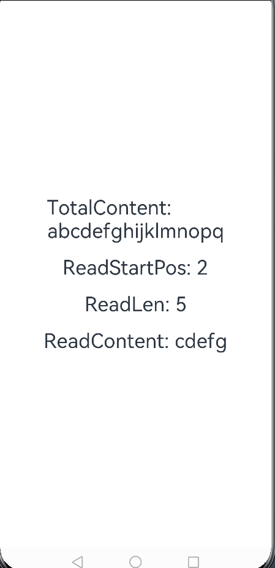

# 读Rawfile中部分内容

### 介绍

本示例主要介绍Native如何读取Rawfile中文本文件部分内容。如何在Native中加入hilog日志在该示例中也有涉及。

### 效果图预览

**场景**

rawfile路径下存在一个有内容的文本文件rawfile.txt。
界面启动时，按照指定的开始读取位置、需要读取的长度，通过Native侧暴露的getRawFileContent接口把读取到的内容显示在界面上。
具体代码可参考[MainPage.ets](./src/main/ets/components/mainpage/MainPage.ets)。

Native中加入hilog日志的实现主要步骤如下：

1. 在CMakeLists中通过target_link_libraries导入libhilog_ndk.z.so。

2. 在需要打印hilog日志的cpp文件开头引入头文件 #include "hilog/log.h"。

3. 在需要打印日志的地方通过OH_LOG_Print打印日志。日志级别有LOG_INFO、LOG_ERROR等。

Native读取Rawfile中文本文件部分内容主要步骤如下：

1. 在前端通过调用Native中的getRawFileContent接口读取文件部分内容。传入的参数为文件名、开始读取位置、读取文件长度。

2. 在Native的getRawFileContent接口中通过Rawfile的API接口以及pread函数读取Rawfile文件部分内容。

**使用说明**：

1. 直接进入页面即可显示默认读取内容
2. 输入读取位置、读取长度，点击开始读取按钮，即可读取指定部分内容
