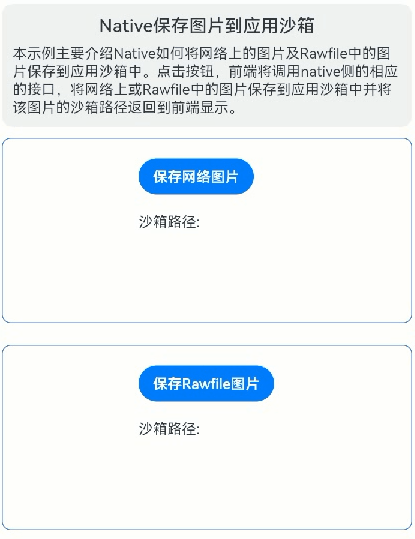

# Native保存图片到应用沙箱

### 介绍

本示例主要介绍Native如何将网络上的图片及Rawfile中的图片保存到应用沙箱中。

### 效果图预览



**使用说明**

1. rawfile路径下存有一张图片sandBoxTest.jpg。

2. 设备连接上网络。

3. 点击"保存Rawfile图片"，前端通过调用Native侧暴露的saveImageOfRawfileCallback接口将rawfile中的图片sandBoxTest.jpg保存到应用沙箱中并返回沙箱路径到前端进行显示；点击“保存网络图片”，前端通过调用Native侧暴露的saveImageOfInternetCallback接口将网络图片[https://gitee.com/harmonyos-cases/cases/raw/master/CommonAppDevelopment/feature/imagedepthcopy/src/main/resources/rawfile/depthCopy.png](https://gitee.com/harmonyos-cases/cases/raw/master/CommonAppDevelopment/feature/imagedepthcopy/src/main/resources/rawfile/depthCopy.png)保存到应用沙箱中并返回沙箱路径到前端进行显示。  
具体代码可参考[NativePictureToSandboxView.ets](./src/main/ets/view/NativePictureToSandboxView.ets)以及[native_picture_to_sandbox.cpp](./src/main/cpp/native_picture_to_sandbox.cpp)。

### 实现思路


#### Native保存网络图片到沙箱的实现主要步骤如下：
1. 参考[libcurl编译](https://gitee.com/openharmony-sig/tpc_c_cplusplus/blob/master/thirdparty/curl/docs/hap_integrate.md)，编译libcurl.so等相关库文件。当前编译后加载libcurl.so时，通过hilog日志发现依赖了libcurl.so libcurl.so.4 libnghttp2.so libnghttp2.so.14 libzstd.so几个so文件。  
   其中libcurl.so为开源的跨平台网络协议库，支持七层网络模型中应用层的各种协议；libnghttp2.so是一个HTTP/2和SPDY协议的实现，用于客户端，服务器，代理，和服务器推送应用；libzstd.so是一个实现了Zstandard算法的压缩库，常用于数据库、文件系统及网络传输等。

2. 将开源库libcurl相关的so文件以及封装了libcurl下载功能的libcurlDownload.so放入模块下的libs相应目录。

3. 在CMakeLists中导入相关库文件。

   ```c++   
   target_link_directories(nativesavepictosandbox PUBLIC ${CMAKE_CURRENT_SOURCE_DIR}/../../../libs/${OHOS_ARCH}/)
   target_link_libraries(nativesavepictosandbox PUBLIC libace_napi.z.so libcurlDownload.so libhilog_ndk.z.so librawfile.z.so)
   ```   
4. 在前端通过调用Native中的saveImageOfInternetCallback接口获取沙箱地址并将沙箱地址转换为url地址绑定到Image组件显示。传入的参数为网络图片地址、应用的文件路径、沙箱中的文件名。

   ```typescript
      Button($r('app.string.tbn_InternetPicture'))
        .onClick(() => {
            // TODO：知识点：通过Native暴露的接口saveImageOfInternetCallback接口获取下载的网络图片保存在沙箱中的路径
            testNapi.saveImageOfInternetCallback(this.internetPicUrl, this.fileDir, this.internetSandBoxFileName, ((result: string) => {
              if (result === undefined || result === '') {
                AlertDialog.show({
                  message: $r('app.string.internet_file_write_fail'),
                  alignment: DialogAlignment.Center
                });
                this.internetSandBoxPath = '';
              } else {
                this.internetSandBoxPath = fileUri.getUriFromPath(result);
                logger.info('[pic2sandbox]', `saveImageOfInternet sandboxPath is ` + result);
              }
            }))
          })
   ```
5. 在Native的saveImageOfInternetCallback接口中通过调用libcurlDownload.so的接口将网络图片写入沙箱。

   ```c++
    // TODO：知识点：使用dlopen动态加载so库，返回so库的句柄
    void *handler = dlopen(libCurlDownload, RTLD_LAZY);
    if (handler == nullptr) {
        // 抛出加载库失败的错误
        dlerror();
        return;
    }

    // 声明函数指针类型
    typedef std::string (*DownloadInternetFileFunc)(char *, char *);
    DownloadInternetFileFunc downloadInternetWrapper =
        reinterpret_cast<DownloadInternetFileFunc>(dlsym(handler, "DownloadInternetFileWrapper"));
    if (downloadInternetWrapper) {
        // TODO：知识点：调用so的downloadInternetWrapper函数保存网路图片到沙箱
        CallbackInternetContext *internetContext = (CallbackInternetContext *)data;
        if (internetContext == nullptr) {
            OH_LOG_Print(LOG_APP, LOG_ERROR, GLOBAL_RESMGR, TAG, "saveImageOfInternet internetContext is null");
            return;
        }
        // 图片沙箱完整路径
        std::string targetSandboxPath = internetContext->sandboxDir + internetContext->FileName;
        OH_LOG_Print(LOG_APP, LOG_INFO, GLOBAL_RESMGR, TAG, "saveImageOfInternet 保存沙箱文件：%{public}s",
                     targetSandboxPath.c_str());

        internetContext->result = downloadInternetWrapper((char *)internetContext->internetPicUrl.c_str(),
            (char *)targetSandboxPath.c_str());
        OH_LOG_Print(LOG_APP, LOG_INFO, GLOBAL_RESMGR, TAG, "saveImageOfInternet download finish");
        dlclose(handler);
    } else {
        OH_LOG_Print(LOG_APP, LOG_ERROR, GLOBAL_RESMGR, TAG, "saveImageOfInternet download function is null");
        dlclose(handler);
    }
   ```


#### Native保存Rawfile图片到沙箱的实现主要步骤如下：

1. 在前端通过调用Native中的saveImageOfRawfileCallback接口获取沙箱地址并将沙箱地址转换为url地址绑定到Image组件显示。传入的参数为js的资源对象、rawfile中的图片名、应用的文件路径。

   ```typescript
      Button($r('app.string.tbn_RawFilePicture'))
        .onClick(() => {
            // TODO：知识点：通过Native暴露的接口saveImageOfRawfileCallback接口获取rawfile中图片保存在沙箱中的路径
            testNapi.saveImageOfRawfileCallback(this.resMgr, this.rawfilePicPath, this.fileDir, ((result: string) => {
              if (result === undefined || result === '') {
                AlertDialog.show({
                  message: $r('app.string.rawfile_write_fail'),
                  alignment: DialogAlignment.Center
                });
                this.rawfileSandBoxPath = '';
              } else {
                this.rawfileSandBoxPath = fileUri.getUriFromPath(result);
                logger.info('[pic2sandbox]', `saveImageOfRawfile sandboxPath is ` + result);
              }
            }))
          })
   ```

2. 在Native的saveImageOfRawfileCallback接口中通过Rawfile的API接口以及文件流将图片资源写入沙箱。

   ```c++
    // 打开Rawfile文件。
    RawFile *rawFile = OH_ResourceManager_OpenRawFile(rawFileContext->resMgr,
        rawFileContext->rawFileName.c_str());
    if (rawFile == nullptr) {
        OH_LOG_Print(LOG_APP, LOG_ERROR, GLOBAL_RESMGR, TAG, "saveImageOfRawfile OpenRawFile fail!");
        // 释放资源
        OH_ResourceManager_ReleaseNativeResourceManager(rawFileContext->resMgr);
        return;
    }
    // 获取文件大小
    long imageDataSize = OH_ResourceManager_GetRawFileSize(rawFile);
    // 申请内存
    std::unique_ptr<char[]> imageData = std::make_unique<char[]>(imageDataSize);
    // TODO：知识点：通过Rawfile的API接口读取Rawfile文件
    long rawFileOffset = OH_ResourceManager_ReadRawFile(rawFile, imageData.get(), imageDataSize);
    // 保存目标网络图片的沙箱路径
    std::string targetSandboxPath = rawFileContext->sandboxDir + rawFileContext->rawFileName;
    // TODO：知识点：通过std::ofstream，将读取的数据写入沙箱文件
    std::ofstream outputFile(targetSandboxPath, std::ios::binary);
    if (!outputFile) {
        OH_LOG_Print(LOG_APP, LOG_ERROR, GLOBAL_RESMGR, TAG, "saveImageOfRawfile 创建沙箱目标文件失败");
        // 释放资源
        OH_ResourceManager_CloseRawFile(rawFile);
        OH_ResourceManager_ReleaseNativeResourceManager(rawFileContext->resMgr);
        return;
    }
    // 写文件
    outputFile.write(imageData.get(), imageDataSize);
   ```

### 高性能知识点

**不涉及**

### 工程结构&模块类型

   ```
   nativesavepictosandbox                               // har类型
   |---src\main\ets\view\
   |   |---NativePictureToSandboxView.ets               // 视图层-图片写入沙箱场景主页面
   |---src\main\cpp\
   |   |---native_picture_to_sandbox.cpp                // native层-图片写入沙箱业务逻辑
   |---src\main\cpp\curl                                // libcurl三方库头文件
   ```

### 模块依赖
1. 本实例依赖[开源库libcurl](https://github.com/curl/curl)。

### 参考资料    
[开源库libcurl](https://github.com/curl/curl)    
[libcurl编译](https://gitee.com/openharmony-sig/tpc_c_cplusplus/blob/master/thirdparty/curl/docs/hap_integrate.md)。
