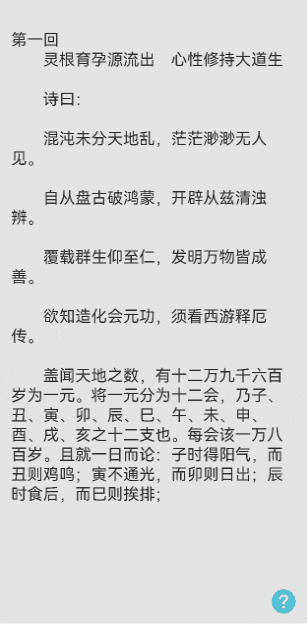

# 阅读翻页方式案例

### 介绍

本示例展示手机阅读时左右翻页，上下翻页，覆盖翻页的功能。

### 效果图预览



### 使用说明

1. 进入模块即是左右翻页模式。
2. 点击屏幕中间区域弹出上下菜单。
3. 点击设置按钮，弹出翻页方式切换按钮，点击可切换翻页方式。
4. 左右翻页方式可点击翻页，也可滑动翻页。上下翻页方式只可上下滑动翻页。覆盖翻页方式可点击翻页，也可滑动翻页。

### 实现思路

本例涉及的关键特性和实现方案如下：

1. 左右翻页方式通过`swiper`+`lazyforeach`+`cachecount`实现按需加载。
   源码参考<br>[LeftRightFlipPage.ets](./src/main/ets/view/LeftRightFlipPage.ets)。

```typescript
 Swiper(this.swiperController) { 
   /**
    * TODO: 高性能知识点: 使用了cachedCount设置预加载的Text的数量，只在LazyForEach中生效，设置该属性后会缓存cachedCount个Text，LazyForEach超出显示和缓存范围的Text会被释放。
    * 使用cachedCount参数的例子:https://developer.huawei.com/consumer/cn/doc/harmonyos-guides-V2/ui-ts-performance-improvement-recommendation-0000001477981001-V2
    */
   LazyForEach(this.data, (item: string) => {
      Text($r(item))
         .width($r('app.string.pageflip_full_size'))
         .fontSize($r('app.integer.flippage_text_fontsize'))
         .textAlign(TextAlign.Start)
         .align(Alignment.TopStart)
         .margin({
            top: $r('app.integer.flippage_margin_large'),
            right: $r('app.integer.flippage_margin_middle'),
            left: $r('app.integer.flippage_margin_middle'),
            bottom: $r('app.integer.flippage_margin_middle')
         })
   }, (item: string) => item)
 }
  // TODO:知识点:index设置当前在容器中显示的子组件的索引值。设置小于0或大于等于子组件数量时，按照默认值0处理。
 .index(this.currentPageNum - CONFIGURATION.PAGEFLIPPAGECOUNT)
 .width($r('app.string.pageflip_full_size'))
 .height($r('app.string.pageflip_full_size'))
 .indicator(false)
 .cachedCount(CONFIGURATION.PAGEFLIPCACHECOUNT)
 .itemSpace(CONFIGURATION.PAGEFLIPZERO)
 .loop(false)
 .curve(Curve.Linear)
 .backgroundColor($r('app.color.pageflip_swiper_backgroundcolor'))
 .effectMode(EdgeEffect.Fade)
 .duration(CONFIGURATION.PAGEFLIPTOASTDURATION)
 .onChange((index: number) => {
    this.currentPageNum = index + CONFIGURATION.PAGEFLIPPAGECOUNT; // 通过onChange监听当前处于第几页。
 })
```

2. 上下翻页方式通过`list`+`lazyforeach`+`cachecount`实现按需加载。
   源码参考<br>[UpDownFlipPage.ets](./src/main/ets/view/UpDownFlipPage.ets)。

```typescript
// TODO:知识点:initialIndex设置为负数或超过了当前List最后一个item的索引值时视为无效取值，无效取值按默认值0显示。
List({ initialIndex: this.currentPageNum - CONFIGURATION.PAGEFLIPPAGECOUNT }) {
   /**
    * TODO: 高性能知识点: 使用了cachedCount设置预加载的ListItem的数量，只在LazyForEach中生效，设置该属性后会缓存cachedCount个ListItem，LazyForEach超出显示和缓存范围的ListItem会被释放。
    * 使用cachedCount参数的例子:https://developer.huawei.com/consumer/cn/doc/harmonyos-guides-V2/ui-ts-performance-improvement-recommendation-0000001477981001-V2
    */
   LazyForEach(this.data, (item: string) => {
      ListItem() {
         Text($r(item))
            .fontSize($r('app.integer.flippage_text_fontsize'))
            .width($r('app.string.pageflip_full_size'))
      }
   }, (item: string) => item)
}
.width($r('app.string.pageflip_bottomview_row_text_width'))
.height($r('app.string.pageflip_full_size'))
.scrollBar(BarState.Off)
.cachedCount(CONFIGURATION.PAGEFLIPCACHECOUNT)
.onScrollIndex((firstIndex: number) => {
 this.currentPageNum = firstIndex + CONFIGURATION.PAGEFLIPPAGECOUNT;  // 通过onScrollIndex监听当前处于第几页。
})
```

3. 覆盖翻页方式通过三个`Stack`组件通过滑动+动画+改变组件内容实现效果。
   源码参考<br>[CoverFlipPage.ets](./src/main/ets/view/CoverFlipPage.ets)。

场景一：在`Stack`组件中布局三个`ReaderPage`，`midPage`位于中间
可以根据this.offsetX实时translate自己的位置。当this.offsetX<0时,translate的x为this.offsetX，midPage
向左移动，显现`rightPage`。当this.offsetX>0,translate的x为0，midPage不动，`leftPage`向右滑动。
最终滑动动画结束时this.offsetX都会被置为0，leftPage和midPage回归原位。
```typescript
Stack() {
   ReaderPage({ content: this.rightPageContent }); // 当midPage向左滑时，rightPage开始显现。
   ReaderPage({ content: this.midPageContent })
      /** TODO: 知识点：
       * 当this.offsetX<0时,translate的x为this.offsetX，midPage向左移动，显现rightPage。
       * 当this.offsetX>0,translate的x为CONFIGURATION.PAGEFLIPZERO，midPage不动，leftPage向右滑动。
       */
      .translate({
         x: this.offsetX >= CONFIGURATION.PAGEFLIPZERO ? CONFIGURATION.PAGEFLIPZERO : this.offsetX,
         y: CONFIGURATION.PAGEFLIPZERO,
         z: CONFIGURATION.PAGEFLIPZERO
      })
      .width(this.screenW);
   ReaderPage({ content: this.leftPageContent }) // TODO: 知识点：在midPage的左边，当向右滑时，跟随this.offsetX向右滑动。
      .translate({
         x: -this.screenW + this.offsetX
      });
}
```
场景二：将滑动翻页的动画和点击翻页的动画封装在一个闭包中，由`isClick`来判断是点击翻页还是滑动翻页，
由`isLeft`来判断点击翻页中是向左翻页还是向右翻页。确定翻页时将this.offsetX设置为this.screenW
或者-this.screenW。translate移动加上动画效果就会产生覆盖翻页的效果。
```typescript
private clickAnimateTo(isClick: boolean, isLeft?: boolean) {
   animateTo({
      duration: CONFIGURATION.PAGEFLIPTOASTDURATION,
      curve: Curve.EaseOut,
      onFinish: () => {
         /** TODO: 知识点：this.currentPageNum加一或者减一后修改组件的内容。
          * 右滑：1. 恢复页面原始状态 2. 修改组件的内容为 page1 = content1-1， page2 = content2-1，page3 = content3-1
          * 左滑：1. 恢复页面原始状态 2. 修改组件的内容为 page1 = content1+1， page2 = content2+1，page3 = content3+1
          */
         if (this.offsetX > CONFIGURATION.PAGEFLIPRIGHTFLIPOFFSETX && this.currentPageNum !== CONFIGURATION.PAGEFLIPPAGESTART) {
            this.currentPageNum -= CONFIGURATION.PAGEFLIPPAGECOUNT;
         } else if (this.offsetX < CONFIGURATION.PAGEFLIPLEFTFLIPOFFSETX && this.currentPageNum !== CONFIGURATION.PAGEFLIPPAGEEND) {
            this.currentPageNum += CONFIGURATION.PAGEFLIPPAGECOUNT;
         }
         this.offsetX = CONFIGURATION.PAGEFLIPZERO;
         this.simulatePageContent();
      }
   }, () => {
      if (isClick) { // 是否为点击翻页
         if (isLeft) {
            this.offsetX = this.screenW; // TODO: 知识点：右滑距离变为一个屏幕宽度，ReaderPage就会向右移动一个屏幕宽度，加上动画，形成了覆盖翻页的效果。
         } else {
            this.offsetX = -this.screenW; // TODO: 知识点：左滑距离变为一个屏幕宽度，ReaderPage就会向左移动一个屏幕宽度，加上动画，形成了覆盖翻页的效果。
         }
      } else { // 滑动翻页
         if (this.offsetX > CONFIGURATION.PAGEFLIPRIGHTFLIPOFFSETX && this.currentPageNum !== CONFIGURATION.PAGEFLIPPAGESTART) {
            this.offsetX = this.screenW;
         } else if (this.offsetX < CONFIGURATION.PAGEFLIPLEFTFLIPOFFSETX && this.currentPageNum !== CONFIGURATION.PAGEFLIPPAGEEND) {
            this.offsetX = -this.screenW;
         } else {
            this.offsetX = CONFIGURATION.PAGEFLIPZERO; // 当位于第一页和末尾页，移动距离设为0，无法翻页。
         }
      }
   });
}
```     
场景三：当动画结束时由于翻页会让`this.currentPageNum`加一或减一，根据相应的页数来加载三个`content`相应的内容。
```typescript
// 模拟书页内容,可以在此进行网络请求。
simulatePageContent() {
   this.leftPageContent = STRINGCONFIGURATION.PAGEFLIPRESOURCE + (this.currentPageNum - CONFIGURATION.PAGEFLIPPAGECOUNT).toString();
   this.midPageContent = STRINGCONFIGURATION.PAGEFLIPRESOURCE + (this.currentPageNum).toString();
   this.rightPageContent = STRINGCONFIGURATION.PAGEFLIPRESOURCE + (this.currentPageNum + CONFIGURATION.PAGEFLIPPAGECOUNT).toString();
}
```

### 工程结构&模块类型

```
   pageflip                                         // har包
   |---common
   |   |---Constants.ets                            // 常量 
   |---components
   |   |---mainpage                                 
   |       |---PageFlip.ets                         // 主页面
   |---datasource
   |   |---BasicDataSource.ets                      // Basic数据控制器
   |---view
   |   |---BottomView.ets                           // 底部菜单视图
   |   |---CoverFlipPage.ets                        // 覆盖翻页视图
   |   |---LeftRightFlipPage.ets                    // 左右翻页视图
   |   |---TopView.ets                              // 顶部菜单视图
   |   |---UpDownFlipPage.ets                       // 上下翻页视图
```

### 模块依赖

[**routermodule**](../routermodule)

### 高性能知识点

本例使用了onActionUpdate函数。该函数是系统高频回调函数，避免在函数中进行冗余或耗时操作，例如应该减少或避免在函数打印日志，会有较大的性能损耗。

本示例使用了LazyForEach进行数据懒加载，List布局时会根据可视区域按需创建ListItem组件，并在ListItem滑出可视区域外时销毁以降低内存占用。

本示例使用了cachedCount设置预加载的ListItem的数量，只在LazyForEach中生效，设置该属性后会缓存cachedCount个ListItem，LazyForEach超出显示和缓存范围的ListItem会被释放。

### 参考资料

[LazyForEach：数据懒加载](https://developer.huawei.com/consumer/cn/doc/harmonyos-guides/arkts-rendering-control-lazyforeach-0000001820879609)

[ZIndex](https://developer.huawei.com/consumer/cn/doc/harmonyos-references/ts-universal-attributes-z-order-0000001820880821)

[List](https://developer.huawei.com/consumer/cn/doc/harmonyos-references/ts-container-list-0000001774121286)

[Swiper](https://developer.huawei.com/consumer/cn/doc/harmonyos-references/ts-container-swiper-0000001774121298)

[@Link装饰器：父子双向同步](https://developer.huawei.com/consumer/cn/doc/harmonyos-guides/arkts-link-0000001820999565#ZH-CN_TOPIC_0000001820999565__%E7%AE%80%E5%8D%95%E7%B1%BB%E5%9E%8B%E5%92%8C%E7%B1%BB%E5%AF%B9%E8%B1%A1%E7%B1%BB%E5%9E%8B%E7%9A%84link)


