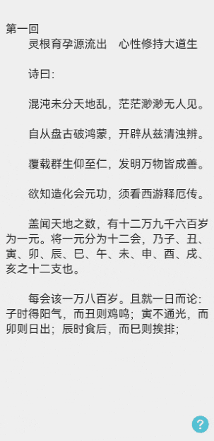

# 阅读翻页方式案例

### 介绍

本示例展示手机阅读时左右翻页，上下翻页，覆盖翻页的功能。

### 效果图预览



### 使用说明

1. 点击设置按钮选择相应翻页方式。

### 实现思路

本例涉及的关键特性和实现方案如下：

1. 通过@Link装饰器：父子双向同步知道底部视图点击的是什么翻页方式，在主页通过条件渲染相应的翻页组件。
   源码参考<br>[PageFlip.ets](./src/main/ets/components/mainpage/PageFlip.ets)。

```ts
    Stack() {
      if (this.buttonClickedName === this.leftRightFlipPageName) {
        LeftRightPlipPage({
          ...
        });
      } else if (this.buttonClickedName === this.upDownFlipPageName) {
        UpDownFlipPage({
          ...
        });
      } else {
        CoverFlipPage({
          ...
        });
      }
      Column() {
        TopView({ isMenuViewVisible: this.isMenuViewVisible })
          .zIndex(this.flipPage_zIndex)
        BottomView({
          ...
        })
          .zIndex(this.flipPage_zIndex)
      }
      .height($r('app.string.pageflip_full_size'))
      .justifyContent(FlexAlign.SpaceBetween)
      .onClick((event?: ClickEvent) => { // 弹出上下菜单视图时，由于Column中间无组件，点击事件会被下一层的LeftRightPlipPage或UpDownFlipPage或CoverFlipPage的点击事件取代。
        ...
      })
    }
```

2. 底部视图布局三个翻页方式按钮。
   源码参考<br>[BottomView.ets](./src/main/ets/view/BottomView.ets)。

```ts
      Flex({ justifyContent: FlexAlign.SpaceBetween }) {
        Button(this.leftRightPageFlipName, { type: ButtonType.Capsule })
          .backgroundColor($r('app.color.pageflip_button_backgroundcolor'))
          .fontColor(this.buttonClickedName === this.leftRightPageFlipName ? $r('app.color.pageflip_button_click_fontcolor') : $r('app.color.pageflip_button_fontcolor'))
          .margin({ left: $r('app.integer.flippage_margin_10') })
          .borderWidth(this.pageFlipBorderWidth)
          .onClick((event?: ClickEvent) => {
            if (this.buttonClickedName !== this.leftRightPageFlipName) {
              ...
            }
          })
        Button(this.upDownPageFlipName, { type: ButtonType.Capsule })
          .backgroundColor($r('app.color.pageflip_button_backgroundcolor'))
          .fontColor(this.buttonClickedName === this.upDownPageFlipName ? $r('app.color.pageflip_button_click_fontcolor') : $r('app.color.pageflip_button_fontcolor'))
          .borderWidth(this.pageFlipBorderWidth)
          .onClick((event?: ClickEvent) => {
            if (this.buttonClickedName !== this.upDownPageFlipName) {
              ...
            }
          })
        Button(this.coverPageFlipName, { type: ButtonType.Capsule })
          .backgroundColor($r('app.color.pageflip_button_backgroundcolor'))
          .fontColor(this.buttonClickedName === this.coverPageFlipName ? $r('app.color.pageflip_button_click_fontcolor') : $r('app.color.pageflip_button_fontcolor'))
          .borderWidth(this.pageFlipBorderWidth)
          .margin({ right: $r('app.integer.flippage_margin_10') })
          .onClick((event?: ClickEvent) => {
            if (this.buttonClickedName !== this.coverPageFlipName) {
              ...
            }
          })
      }
      .margin({ top: $r('app.integer.flippage_margin_10'), bottom: $r('app.integer.flippage_margin_10') })
      .visibility(this.isVisible ? Visibility.Visible : Visibility.None)
```

3. 左右翻页方式通过swiper+lazyforeach+cachecount实现按需加载。什么时候加载在BasicDataSource的getData方法中实现。
   源码参考<br>[DragToSwitchPicturesView.ets](./src/main/ets/components/view/DragToSwitchPicturesView.ets)<br>[BasicDataSource.ets](./src/main/ets/datasource/BasicDataSource.ets)。

```ts
    Column() {
      Swiper(this.swiperController) {
        /**
         * TODO: 高性能知识点: 使用了cachedCount设置预加载的Text的数量，只在LazyForEach中生效，设置该属性后会缓存cachedCount个Text，LazyForEach超出显示和缓存范围的Text会被释放。
         * 使用cachedCount参数的例子:https://developer.huawei.com/consumer/cn/doc/harmonyos-guides-V2/ui-ts-performance-improvement-recommendation-0000001477981001-V2
         */
        LazyForEach(this.data, (item: string) => {
          Text($r(item))
            .width($r('app.string.pageflip_full_size'))
            .fontSize($r('app.integer.flippage_text_fontsize'))
            .textAlign(TextAlign.Start)
            .align(Alignment.TopStart)
            .margin({
              top: $r('app.integer.flippage_margin_40'),
              right: $r('app.integer.flippage_margin_20'),
              left: $r('app.integer.flippage_margin_20'),
              bottom: $r('app.integer.flippage_margin_20')
            })
        }, (item: string) => item)
      }
      .index(this.currentPageNum - this.pageFlipPageCount)
      .width($r('app.string.pageflip_full_size'))
      .height($r('app.string.pageflip_full_size'))
      .indicator(false)
      .cachedCount(this.pageFlipCacheCount)
      .itemSpace(this.pageFlipZero)
      .loop(false)
      .curve(Curve.Linear)
      .backgroundColor($r('app.color.pageflip_swiper_backgroundcolor'))
      .effectMode(EdgeEffect.Fade)
      .duration(this.pageFlipToastDuration)
      .onChange((index: number) => {
        this.currentPageNum = index + this.pageFlipPageCount;  // 通过onChange监听当前处于第几页。
      })
    }
    .width($r('app.string.pageflip_full_size'))
    .height($r('app.string.pageflip_full_size'))
    .onClick((event?: ClickEvent) => {
      ...
    }) 
```

```ts
  public getData(index: number): string {
    // 当index等于this.totalCount() - 1时向后请求网络数据。cacheout等于3,此案例本地只有11条数据，最后几条数据需要另行处理。
    if (index === this.totalCount() - this.pageFlipOne && index < this.pageFlipEleven) {
      for (let i = index + this.pageFlipTwo; i <= index + this.pageFlipFive; i++) {
        this.elements.push(this.pageFlipContentResource + i.toString());
        this.listeners.forEach(listeners => listeners.onDataAdd(this.elements.length - this.pageFlipOne));
      }
    } else if (index === this.pageFlipEleven) {
      for (let i = index + this.pageFlipOne; i <= index + this.pageFlipThree; i++) {
        this.elements.push('app.string.pageflip_content' + i.toString());
        this.listeners.forEach(listeners => listeners.onDataAdd(this.elements.length - this.pageFlipOne));
      }
    }
    return this.elements[index];
  }
```

4. 上下翻页方式通过list+lazyforeach+cachecount实现按需加载。
   源码参考<br>[UpDownFlipPage.ets](./src/main/ets/view/UpDownFlipPage.ets)<br>[BasicDataSource.ets](./src/main/ets/datasource/BasicDataSource.ets)。

```ts
    Column() {
      List({ initialIndex: this.currentPageNum - this.pageFlipPageCount }) {
        /**
         * TODO: 高性能知识点: 使用了cachedCount设置预加载的ListItem的数量，只在LazyForEach中生效，设置该属性后会缓存cachedCount个ListItem，LazyForEach超出显示和缓存范围的ListItem会被释放。
         * 使用cachedCount参数的例子:https://developer.huawei.com/consumer/cn/doc/harmonyos-guides-V2/ui-ts-performance-improvement-recommendation-0000001477981001-V2
         */
        LazyForEach(this.data, (item: string) => {
          ListItem() {
            Text($r(item))
              .fontSize($r('app.integer.flippage_text_fontsize'))
              .width($r('app.string.pageflip_full_size'))
          }
        }, (item: string) => item)
      }
      .width($r('app.string.pageflip_lippage_90_size'))
      .height($r('app.string.pageflip_full_size'))
      .scrollBar(BarState.Off)
      .cachedCount(this.pageFlipCacheCount)
      .onScrollIndex((firstIndex: number, lastIndex: number, centerIndex: number) => {
        this.currentPageNum = firstIndex + this.pageFlipPageCount;  // 通过onScrollIndex监听当前处于第几页。
      })
    }
    .width($r('app.string.pageflip_full_size'))
    .backgroundColor($r('app.color.pageflip_swiper_backgroundcolor'))
    .onClick((event?: ClickEvent) => {
      ...
    })
```

```ts
  public getData(index: number): string {
    // 当index等于this.totalCount() - 1时向后请求网络数据。cacheout等于3,此案例本地只有11条数据，最后几条数据需要另行处理。
    if (index === this.totalCount() - this.pageFlipOne && index < this.pageFlipEleven) {
      for (let i = index + this.pageFlipTwo; i <= index + this.pageFlipFive; i++) {
        this.elements.push(this.pageFlipContentResource + i.toString());
        this.listeners.forEach(listeners => listeners.onDataAdd(this.elements.length - this.pageFlipOne));
      }
    } else if (index === this.pageFlipEleven) {
      for (let i = index + this.pageFlipOne; i <= index + this.pageFlipThree; i++) {
        this.elements.push('app.string.pageflip_content' + i.toString());
        this.listeners.forEach(listeners => listeners.onDataAdd(this.elements.length - this.pageFlipOne));
      }
    }
    return this.elements[index];
  }
```
5. 覆盖翻页方式通过三个Stack组件通过滑动+动画+改变组件内容实现效果。
   源码参考<br>[CoverFlipPage.ets](./src/main/ets/view/CoverFlipPage.ets)。

```ts
      /// 模拟书页内容,可以在此进行网络请求。
  simulatePageContent() {
    this.content1 = this.pageFlip_content_resource + (this.currentPageNum - this.pageFlip_page_count);
    this.content2 = this.pageFlip_content_resource + (this.currentPageNum);
    this.content3 = this.pageFlip_content_resource + (this.currentPageNum + this.pageFlip_page_count);
  }

  private clickAnimateTo(isClick: boolean, isLeft?: boolean) {
    animateTo({
      duration: this.pageFlip_toast_duration,
      curve: Curve.EaseOut,
      onFinish: () => {
        // 右滑：1. 恢复页面原始状态 2. 修改组件的内容为 page1 = content1-1， page2 = content2-1，page3 = content3-1
        // 左滑：1. 恢复页面原始状态 2. 修改组件的内容为 page1 = content1+1， page2 = content2+1，page3 = content3+1
        if (this.offsetX > this.pageFlip_right_flip_offsetX && this.currentPageNum !== this.pageFlip_page_start) {
          this.currentPageNum -= this.pageFlip_page_count;
        } else if (this.offsetX < this.pageFlip_left_flip_offsetX && this.currentPageNum !== this.pageFlip_page_end) {
          this.currentPageNum += this.pageFlip_page_count;
        }
        ...
        this.offsetX = this.pageFlip_zero;
        this.simulatePageContent();
      }
    }, () => {
      if (isClick) { // 是否为点击翻页
        if (isLeft) {
          this.offsetX = this.screenW; // 右滑距离变为一个屏幕宽度，ReaderPage就会向右移动一个屏幕宽度，加上动画，形成了覆盖翻页的效果。
        } else {
          this.offsetX = -this.screenW; // 左滑距离变为一个屏幕宽度，ReaderPage就会向左移动一个屏幕宽度，加上动画，形成了覆盖翻页的效果。
        }
      } else { // 滑动翻页
        if (this.offsetX > this.pageFlip_right_flip_offsetX && this.currentPageNum !== this.pageFlip_page_start) {
          this.offsetX = this.screenW;
        } else if (this.offsetX < this.pageFlip_left_flip_offsetX && this.currentPageNum !== this.pageFlip_page_end) {
          this.offsetX = -this.screenW;
        } else {
          this.offsetX = this.pageFlip_zero; // 当位于第一页和末尾页，移动距离设为0，无法翻页。
        }
      }
    });
  }

  build() {
    Stack() {
      ReaderPage({ content: this.content3 }); // 当page2向左滑时，page3开始显现。
      ReaderPage({ content: this.content2 }) // 当this.offsetX<0时,translate的x为this.offsetX，page2向左移动，显现page3。当this.offsetX>0,translate的x为this.pageFlip_zero，page2不动，page1向右滑动。
        .translate({
          x: this.offsetX >= this.pageFlip_zero ? this.pageFlip_zero : this.offsetX,
          y: this.pageFlip_zero,
          z: this.pageFlip_zero
        })
        .width(this.screenW);
      ReaderPage({ content: this.content1 }) // 在page2的左边，当向右滑时，跟随this.offsetX向右滑动。
        .translate({
          x: -this.screenW + this.offsetX
        });
    }
    .gesture(
      PanGesture(this.panOption)
        // TODO: 性能知识点: 该函数是系统高频回调函数，避免在函数中进行冗余或耗时操作，例如应该减少或避免在函数打印日志，会有较大的性能损耗。
        .onActionUpdate((event?: GestureEvent) => {
          if (!event) {
            return;
          }
          this.offsetX = event.offsetX;
          // offset > 0，右滑显示page1；offset < 0，左滑显示page3
        })
        .onActionEnd(() => {
          this.clickAnimateTo(false);
        })
    )
    .onClick((event?: ClickEvent) => {
      if (event) {
        if (event.x > this.screenW / this.pageFlip_three * this.pageFlip_two) { // 点击屏幕左侧1/3，页面向左翻页；点击中间区域，弹出菜单；点击屏幕右侧1/3，页面向右翻页。
          if (this.currentPageNum !== this.pageFlip_page_end) {
            this.clickAnimateTo(true, false);
          }
        } else if (event.x > this.screenW / this.pageFlip_three) {
          if (this.isMenuViewVisible) {
            this.isMenuViewVisible = false;
            this.isCommentVisible = false;
          } else {
            this.isMenuViewVisible = true;
            this.isCommentVisible = true;
          }
        } else {
          //向左翻页
          if (this.currentPageNum !== this.pageFlip_page_start) {
            this.clickAnimateTo(true, true);
          }
        }
      }
    })
  }
```

### 工程结构&模块类型

```
   pageflip                                         // har包
   |---components
   |   |---mainpage                                 
   |       |---PageFlip.ets                         // 主页面
   |---datasource
   |   |---BasicDataSource.ets                      // Basic数据控制器
   |---view
   |   |---BottomView.ets                           // 底部菜单视图
   |   |---CoverFlipPage.ets                        // 覆盖翻页视图
   |   |---LeftRightFlipPage.ets                    // 左右翻页视图
   |   |---TopView.ets                              // 顶部菜单视图
   |   |---UpDownFlipPage.ets                       // 上下翻页视图
```

### 模块依赖

[**routermodule**](../routermodule)

### 高性能知识点

本例使用了onActionUpdate函数。该函数是系统高频回调函数，避免在函数中进行冗余或耗时操作，例如应该减少或避免在函数打印日志，会有较大的性能损耗。

本示例使用了LazyForEach进行数据懒加载，List布局时会根据可视区域按需创建ListItem组件，并在ListItem滑出可视区域外时销毁以降低内存占用。

本示例使用了cachedCount设置预加载的ListItem的数量，只在LazyForEach中生效，设置该属性后会缓存cachedCount个ListItem，LazyForEach超出显示和缓存范围的ListItem会被释放。

### 参考资料

[LazyForEach：数据懒加载](https://developer.huawei.com/consumer/cn/doc/harmonyos-guides/arkts-rendering-control-lazyforeach-0000001820879609)

[ZIndex](https://developer.huawei.com/consumer/cn/doc/harmonyos-references/ts-universal-attributes-z-order-0000001820880821)

[List](https://developer.huawei.com/consumer/cn/doc/harmonyos-references/ts-container-list-0000001774121286)

[Swiper](https://developer.huawei.com/consumer/cn/doc/harmonyos-references/ts-container-swiper-0000001774121298)

[@Link装饰器：父子双向同步](https://developer.huawei.com/consumer/cn/doc/harmonyos-guides/arkts-link-0000001820999565#ZH-CN_TOPIC_0000001820999565__%E7%AE%80%E5%8D%95%E7%B1%BB%E5%9E%8B%E5%92%8C%E7%B1%BB%E5%AF%B9%E8%B1%A1%E7%B1%BB%E5%9E%8B%E7%9A%84link)


