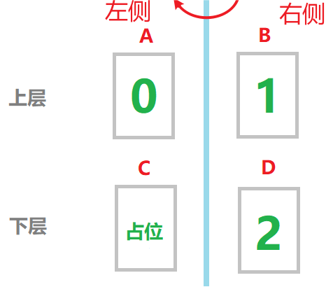

# 翻页动效案例

### 介绍

翻页动效是应用开发中常见的动效场景，常见的有书籍翻页，日历翻页等。本例将介绍如何通过ArkUI提供的显示动画接口[animateTo](https://developer.huawei.com/consumer/cn/doc/harmonyos-references-V2/ts-explicit-animation-0000001478341181-V2)实现翻页的效果。

### 效果图预览


**使用说明**

1. 本例通过setInterval函数每秒调用一次翻页动画，实现连续翻页效果。

### 实现思路



如图，左右两侧分别代表打开书籍的左右两面，上下两层用Stack组件堆叠放置。在上下两层，左右两侧，建立4个文本组件（下面用A、B、C、D代称）。当B沿旋转轴旋转180度覆盖在A上时，就体现为翻页效果。C用来占位，不需要做动作。一个翻页动作的完成包括以下几步：
1. B沿旋转轴旋转180度。这里B的旋转是动画效果。
2. B旋转时，D会在右侧显示出来，作为书籍的下一页，此时D承载的内容要变为下一页的内容。
3. B旋转到左侧后，A承载的内容变为B的内容。
4. 由于A和B互为镜像，所以A显示为B的内容后，需要以A的纵向中线为轴旋转180度。这里A的旋转是设置旋转角度值，是瞬时刷新反向显示的效果，不是动画。
5. B重新旋转到右边（即B重置回右侧位置），其承载的内容变为下一页的内容。
6. 连续重复上述动作即可实现连续翻页动效。

开发步骤：

1. 创建文本组件。动效中用到了4个文本组件，可以定义一个文本组件BookPage，然后对其进行重复调用。创建时为其添加rotate属性，用来控制组件旋转。由于各组件旋转的角度和旋转中心不同，需要父组件在调用时传入对应的参数，所以为对应变量添加@Prop装饰器，用来控制变量传递。源码参考[PageTurningAnimation.ets](https://gitee.com/harmonyos-cases/cases/blob/master/CommonAppDevelopment/feature/pageturninganimation/src/main/ets/view/PageTurningAnimation.ets)。

   ```typescript
   @Component
   struct BookPage {
     // 为变量添加@Prop装饰器，用于接收父组件的动态传参
     @Prop pageNum: number; // 页面编号
     @Prop rotateAngle: number; // 旋转角度
     @Prop positionX: string; // 旋转中心点参数x,表示水平方向上旋转起始位置
     @Prop positionY: string; // 旋转中心点参数y,表示垂直方向上旋转起始位置
   
     build() {
       // TODO: 知识点: 创建文本组件。创建时添加rotate属性，用来控制组件旋转。
       Text(`${this.pageNum}`)
         .fontSize($r('app.integer.common_font_size'))
         .fontColor(Color.White)
         .fontWeight(FontWeight.Bold)
         .textAlign(TextAlign.Center)
         .backgroundColor($r('app.color.common_color_dark_blue'))
         .width($r('app.string.common_text_width'))
         .height($r('app.string.common_text_height'))
         .borderRadius($r('app.integer.common_border_radius'))
         .rotate({ // 使用rotate属性控制旋转
           x: 0,
           y: 1, // 指定y轴作为旋转轴
           z: 0,
           angle: this.rotateAngle,
           centerX: this.positionX,
           centerY: this.positionY,
         })
     }
   }
   ```

2. 创建父组件框架。由于文本组件分为上下两层，所以在父组件中采用Stack组件进行层叠布局。同时使用Divider组件作为书籍两个页面间的分隔线。源码参考[PageTurningAnimation.ets](https://gitee.com/harmonyos-cases/cases/blob/master/CommonAppDevelopment/feature/pageturninganimation/src/main/ets/view/PageTurningAnimation.ets)。

   ```typescript
   ...
   Stack() {
     // 下层Row
     Row() {
       // Text组件C，用于占位不显示，在Text组件A的下层
       BookPage({
         pageNum: this.pageNumTextC,
         rotateAngle: this.originalAngle,
         positionX: this.leftX,
         positionY: this.leftY
       })
       // Text组件D，用于刷新下一个翻页的页面编号
       BookPage({
         pageNum: this.nextPageNumTextD,
         rotateAngle: this.originalAngle,
         positionX: this.leftX,
         positionY: this.leftY
       })
     }
   
     // 上层Row
     Row() {
       // Text组件A的页面编号，用于刷新翻页动画结束时的页面编号
       BookPage({
         pageNum: this.pageNumTextA,
         rotateAngle: this.rotateAngleTextA,
         positionX: this.centerX,
         positionY: this.centerY
       })
       // Text组件B的页面编号，用于显示翻页动画的页面编号
       BookPage({
         pageNum: this.animatePageNumTextB,
         rotateAngle: this.rotateAngleTextB,
         positionX: this.leftX,
         positionY: this.leftY
       })
     }
   
     // 添加两个页面间的分隔线
     Divider().strokeWidth(5).color(Color.White).height($r('app.string.divider_height')).vertical(true)
   }
   ...
   ```

3. 添加翻页动效。在父组件中定义对应的变量，并在调用子组件时分别传入子组件。自定义pageTurningAnimate函数，在其中使用animateTo方法添加动画效果，同时控制动画的时长，以及动画过程中各元素状态的改变。在aboutToAppear方法中，使用setInterval方法重复调用pageTurningAnimate函数，以实现连续翻页动效。源码参考[PageTurningAnimation.ets](https://gitee.com/harmonyos-cases/cases/blob/master/CommonAppDevelopment/feature/pageturninganimation/src/main/ets/view/PageTurningAnimation.ets)。

   ```typescript
   ...
   // 在UI显示前，传入各项变量的具体值
   aboutToAppear(): void {
     // 通过setInterval函数每秒调用一次动画效果，实现连续翻页
     setInterval(() => {
       this.pageTurningAnimate();
     }, 1000) // 函数调用周期要大于每次动画持续的时长
   }
   
   // 通过animateTo方法为组件添加动效，动效时长要小于setInterval函数调用周期
   private pageTurningAnimate() {
     // TODO: 知识点: 使用animateTo方法添加动画效果，同时控制动画的时长，以及动画过程中各元素状态的改变。
     animateTo(
       { duration: 700, onFinish: () => {
         // 动画结束时，Text组件A显示的页面编号和B显示的页面编号相等
         this.pageNumTextA = this.animatePageNumTextB;
         // 动画结束时，Text组件A以中心线为轴旋转180度，用于显示左侧翻页动画结束时的页面编号
         this.rotateAngleTextA = 180;
         // 动画结束时，Text组件B的旋转角度重置为0度
         this.rotateAngleTextB = 0;
         // 动画结束时，Text组件B显示的页面编号加1
         this.animatePageNumTextB = (this.animatePageNumTextB + 1) % 8;
       } },
       () => {
         // 动画开始，Text组件B的旋转角度设置为180度
         this.rotateAngleTextB = 180;
         //动画开始，Text组件D的页面编号加1，用于刷新显示下一个翻页的页面编号
         this.nextPageNumTextD = this.animatePageNumTextB + 1;
       })
   }
   ...
   ```

### 高性能知识点

**不涉及**

### 工程结构&模块类型

   ```
   pageturninganimation                           // har类型
   |---src\main\ets\view
   |   |---PageTurningAnimation.ets               // 视图层-翻页动效页面
   ```

### 模块依赖

**不涉及**

### 参考资料

[显式动画](https://developer.huawei.com/consumer/cn/doc/harmonyos-references-V2/ts-explicit-animation-0000001478341181-V2)