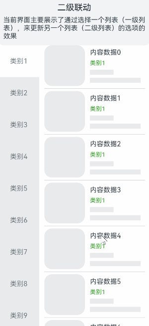

# 二级联动

### 介绍

本示例主要介绍了[List组件](https://developer.huawei.com/consumer/cn/doc/harmonyos-references/ts-container-list-0000001774121286)实现二级联动（Cascading List）的场景。 该场景多用于短视频中拍摄风格的选择、照片编辑时的场景的选择。

### 效果图预览



**使用说明**：

1. 滑动二级列表侧控件，一级列表随之滚动。
2. 点击一级列表，二级列表随之滚动。

## 实现思路
1. 构造懒加载数据源类型[MyDataSource](./src/main/ets/pages/DataType.ets)。
2. 一二级列表分别绑定不同的Scroller对象，一级列表(tagLists)绑定classifyScroller对象，二级列表绑定scroller对象。
```javascript
@Component
export struct SecondaryLinkExample {
  private classifyScroller: Scroller = new Scroller(); // 一级列表Scroller对象
  private scroller: Scroller = new Scroller(); // 二级列表Scroller对象

  build() {
    ...
    
    Row() {
      // 一级列表
      List({ scroller: this.classifyScroller, initialIndex: 0 }) {
        ...
      }
    }
  }
}
```
3. 通过循环，构造一二级列表数据。
```javascript
ForEach(this.tagLists, (item: string, index: number) => {
  ListItem() {
    ...
  }
})
```
4. 点击一级列表后，通过一级列表的索引获取二级列表的索引，调用scrollToIndex方法将一二级列表滚动到指定索引值。
```javascript
// 根据一级列表索引值获取二级列表索引值
findItemIndex(index: number): number {
    return this.records[index];
  }

build(){
  Column() {
    ...
  }.onClick(() => {	// 一级列表点击事件
    this.currentTagIndex = index;
    let itemIndex = this.findItemIndex(index);
    this.scroller.scrollToIndex(itemIndex, true);
  })
}
```
5. 滑动二级列表触发组件滚动事件后，获取到列表可视区域第一个item对应的索引值，通过二级列表索引获取一级列表索引，调用scrollToIndex方法将一级列表滚动到指定索引值。
```javascript
@State @Watch('onIndexChange') currentTagIndex: number = 0; // 一级列表焦点索引值
private isClickTagList: boolean = false; // 是否点击一级列表
private classifyScroller: Scroller = new Scroller(); // 一级列表Scroller对象

// 根据二级列表索引值获取对应一级列表索引
findClassIndex(index: number): number {
  ...
}

build() {
  List() {
    ...
  }.onScrollIndex((start: number) => {
    let currentClassIndex = this.findClassIndex(start);
    // 当前二级列表元素是否属于当前一级列表类
    if (currentClassIndex !== this.currentTagIndex && this.isClickTagList !== true) {
      this.currentTagIndex = currentClassIndex;
      this.classifyScroller.scrollToIndex(currentClassIndex, true); // 滚动到指定位置
    }
  })
}
```
### 高性能知识点

本示例使用了LazyForEach进行数据懒加载，List布局时会根据可视区域按需创建ListItem组件，并在ListItem滑出可视区域外时销毁以降低内存占用。

### 工程结构&模块类型

   ```
   secondarylinkage                                // har
   |---pages
   |   |---DataType.ets                            // 数据类型定义 
   |   |---SecondaryLinkExample.ets                // 二级联动功能实现页面 
   ```

### 模块依赖
当前场景依赖common模块的FunctionDescription组件，主要用于功能场景文本介绍。详细可参考[FunctionDescription](../../common/utils/src/main/ets/component/FunctionDescription.ets)文件。

### 参考资料

[LazyForEach详细用法](https://developer.huawei.com/consumer/cn/doc/harmonyos-guides/arkts-rendering-control-lazyforeach-0000001820879609)