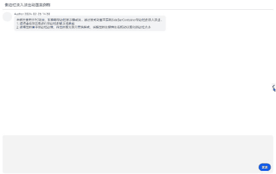

# SideBarContainer侧边栏淡入淡出动效实现案例

### 介绍

在2in1或平板上，群聊侧边栏是一种较为常用的功能，虽然HarmonyOS已经具备了基本的动效，但是部分情况下开发者可能有定制侧边栏动效的需求，本例主要介绍了如何基于显式动画实现侧边栏的淡入淡出动效。

### 效果图预览



**使用说明**：

1. 点击右侧三角按钮进行侧边栏的显示与隐藏
1. 当前动效过渡时间较短，如果要更清晰地观察动画效果，可以将[动效的持续时间SIDEBAR_ANIMATION_DURATION](./src/main/ets/constants/SideBarAnimationViewConstants.ets)
更改长一点，如1000
1. 注意，由于手机屏幕边缘较难响应事件，请用2in1或或平板进行测试

## 实现思路

1. 由于SideBarContainer的controlButton无法实现对其动效的自定义，所以需要禁用默认的button，通过自定义的Button来控制SideBar的显隐，并为SideBar添加了透明度的变化动效

    ```typescript
    SideBarContainer(this.sidebarType) {
      SideBarView()
        .opacity(this.isShowSideBar ? SideBarAnimationViewConstants.SIDEBAR_OPACITY_SHOW : SideBarAnimationViewConstants.SIDEBAR_OPACITY_HIDDEN)

      SideBarContentView({ isShowSideBar: this.isShowSideBar })
    }
    .showSideBar(this.isShowSideBar)
    .showControlButton(SideBarAnimationViewConstants.SIDEBAR_IS_SHOW_BUTTON)
    .autoHide(SideBarAnimationViewConstants.SIDEBAR_IS_AUTO_HIDE)
    ```

1. 通过显式动画控制侧边栏的显隐，以便实现自定义动效
   ```typescript
   animateTo({ duration: SideBarAnimationViewConstants.SIDEBAR_ANIMATION_DURATION }, () => {
       this.isShowSideBar = !this.isShowSideBar;
   })
   ```

### 高性能知识点

不涉及

### 工程结构&模块类型

   ```
   sidebaranimation                                // har
   |---constants                                   // 常量定义
   |---view
   |   |---SideBarAnimationView.ets                // 入口组件 
   |   |---SideBarContentView.ets                  // 内容区组件
   |   |---SideBarView.ets                         // 侧边栏组件
   ```

### 模块依赖

1. [路由模块](../routermodule)：供entry模块实现路由导航
2. [utils模块](../../common/utils)：功能介绍

### 参考资料

1. [SideBarContainer](https://developer.huawei.com/consumer/cn/doc/harmonyos-references/ts-container-sidebarcontainer-0000001820880937#ZH-CN_TOPIC_0000001820880937__buttonstyle%E5%AF%B9%E8%B1%A1%E8%AF%B4%E6%98%8E)
2. [显式动画](https://developer.huawei.com/consumer/cn/doc/harmonyos-references/ts-explicit-animation-0000001774121350)
3. [计算特性](https://developer.huawei.com/consumer/cn/doc/harmonyos-references/ts-universal-attributes-size-0000001774280842#ZH-CN_TOPIC_0000001774280842__示例)