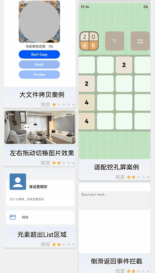

 # 侧滑返回事件拦截案例

### 介绍

  在编辑场景中，存在用户误触返回，导致内容未保存就退出编辑页的现象;
  本示例介绍使用NavDestination组件的onBackPressed回调对返回事件进行拦截，提示用户保存编辑内容，并使用preferences实例持久化保存内容。

### 效果预览图

 

**使用说明**
1. 编辑状态侧滑返回弹出弹窗提醒用户是否保存。
2. 点击弹窗空白区域，弹窗消失，继续编辑。
3. 点击保存按钮，返回主页，保存用户编辑的数据，再次进入编辑页可在上次编辑的基础上再次编辑。

### 实现思路

1. 因为功能是以har的形式集成在主工程中，没有@Entry修饰的组件，也无法作为入口组件，不能使用@Entry组件的onBackPress生命周期函数。

2. 在使用方面onBackPressed是NavDestination自己的事件，需配合NavDestination组件使用；
   且组件本身用于显示Navigation内容区，作为子页面的根容器，因此若拦截子页面的返回事件，可使用onBackPressed回调。

3. onBackPress生命周期函数只能在@Entry组件中使用，因此若对入口组件的返回事件拦截可使用onBackPress生命周期函数。

4. 通过NavDestination组件的onBackPressed回调对返回事件进行拦截；源码参考[MainPage.ets](src/main/ets/components/mainpage/MainPage.ets)。

  ```ts
  // 应用主页用NavDestination承载，用于显示Navigation的内容区
      Navigation(this.pageStackForComponentSharedPages) {
      }
      .onAppear(() => {
        this.pageStackForComponentSharedPages.pushPathByName("MainPage", null, false);
      })
      // 创建NavDestination组件，需使用此组件的onBackPressed回调拦截返回事件
      .navDestination(this.textArea)
      
      @Builder textArea(name: string) {
        NavDestination() {
          Column() {
            TextArea({
              text: this.text,
              placeholder: 'input your word...',
              controller: this.controller
            })
              .onChange((value: string) => {
                this.text = value;
              })
          }
          .justifyContent(FlexAlign.Start)
          .width('100%')
          .height('100%')
      }
      .onBackPressed(() => {
          // 此处可添加拦截处理逻辑，然后return true放行
          return true
      }
     }
  ```


### 高性能知识点

**不涉及**

### 工程结构&模块类型

   ```
   sideslipintercept                                   // har类型
   |---mainpage
   |   |---Mainpage.ets                                // 视图层-组件页面 
   ```

### 模块依赖

本场景依赖了路由模块来[注册路由](../routermodule/src/main/ets/router/DynamicsRouter.ets)。

### 参考资料

[navigation](https://developer.huawei.com/consumer/cn/doc/harmonyos-references/ts-basic-components-navigation-0000001821000861)

[NavDestination](https://developer.huawei.com/consumer/cn/doc/harmonyos-references/ts-basic-components-navdestination-0000001774280918)

[@ohos.data.preferences (用户首选项)](https://developer.harmonyos.com/cn/docs/documentation/doc-references-V2/js-apis-data-preferences-0000001580026194-V2)
