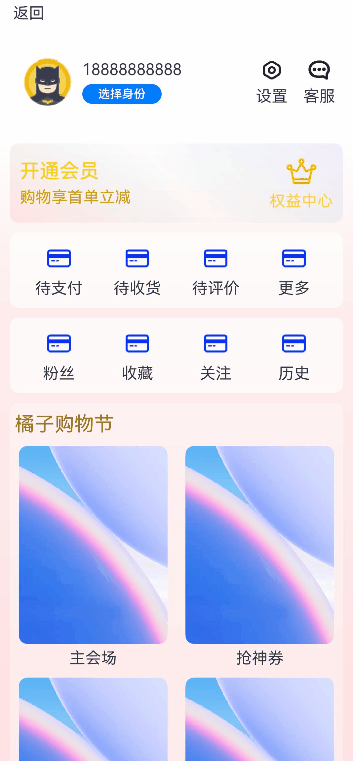

# 滑动页面信息隐藏与组件位移效果

### 介绍

在很多应用中，向上滑动"我的"页面，页面顶部会有如下变化效果：一部分信息逐渐隐藏，另一部分信息逐渐显示，同时一些组件会进行缩放或者位置移动。向下滑动时则相反。

### 效果图预览



##### 使用说明

1. 向上滑动页面，出现如下变化：手机号/选择身份/设置图标/消息图标逐渐隐藏，用户头像尺寸逐渐缩小并向右上平移，顶部"返回"文本后方手机号逐渐显示。
2. 滑动到顶部后，向下滑动页面，出现如下变化：用户头像尺寸逐渐变大并向左下平移，顶部"返回"文本后方的手机号逐渐隐藏，原来的手机号/选择身份/设置图标/消息图标逐渐显示。

### 实现思路

本例涉及的关键特性和实现方案如下：

1. 将屏幕从上向下分为三部分，第一部分Row组件包含"返回"和初始状态下隐藏的手机号，第二部分Row包含用户头像/手机号/选择身份/设置/消息，下方其余部分位第三部分。本例场景的变化体现在第一和第二部分。源码参考[SlideToHideAndDisplace](./src/main/ets/SlideToHideAndDisplace.ets)
```typescript
Column() {
  Row() {...}
  .padding($r('app.integer.padding_small'))
  .width($r('app.string.size_full'))
  .alignItems(VerticalAlign.Center)
  Row() {...}
  .height($r('app.integer.height_one_hundred'))
  .width($r('app.string.size_full'))
  Scroll() {...}
}
```
2. 在第一和第二部分中，使用[@State装饰器](https://developer.huawei.com/consumer/cn/doc/harmonyos-guides/arkts-state-0000001774279614)装饰相关的组件属性，使之与自定义组件的渲染绑定起来，状态变量改变时，UI会发生对应的渲染改变。用户头像的缩放通过改变其width和height属性值的大小来刷新，用户头像的位移通过改变其margin属性中的top和left的大小来刷新。其他一些组件的显隐变化通过改变其[opacity](https://developer.huawei.com/consumer/cn/doc/harmonyos-references/ts-universal-attributes-opacity-0000001820880817)属性值的大小来刷新。源码参考[SlideToHideAndDisplace](./src/main/ets/SlideToHideAndDisplace.ets)
```typescript
  @State userRowOpacity: number = 1;
  @State userImageHeight: number = 50;
  ...

  build() {
    Column() {
      Row() {
        ...
        Text($r('app.string.phone_number'))
          .opacity(this.userNameOpacity) // userNameOpacity控制顶部用户名的透明度
        Blank()
        Text("设置")
          .opacity(this.userNameOpacity) // 设置的文字透明度与顶部用户名相同
        Text("客服")
          .opacity(this.userNameOpacity) // 客服的文字透明度与顶部用户名相同
      }

      Row() {
        Image($r('app.media.batman'))
          .width(this.userImageHeight)
          .height(this.userImageHeight) // userImageHeight控制头像尺寸
          // userImageMarginTop和userImageMarginLeft控制头像在父容器内的位置
          .margin({ top: this.userImageMarginTop, left: this.userImageMarginLeft })

        Column() {...}
        .alignItems(HorizontalAlign.Start)
        .opacity(this.userRowOpacity) // 控制Row组件的透明度
      }
      ...
    }
  }
```
3. 第三部分页面滚动通过[Scroll](https://developer.huawei.com/consumer/cn/doc/harmonyos-references/ts-container-scroll-0000001821000913)组件实现，其中第二栏和第三栏相似，使用[@Builder装饰器](https://developer.huawei.com/consumer/cn/doc/harmonyos-guides/arkts-builder-0000001774119930)封装了两个自定义构建函数IconAndDescription和CustomRow，增加代码复用。源码参考[SlideToHideAndDisplace](./src/main/ets/SlideToHideAndDisplace.ets)
```typescript
  // 自定义构建函数，将重复使用的UI元素抽象成一个方法。此处样式为：上方图标下方文字
  @Builder
  IconAndDescription(icon: Resource, description: string | Resource, iconSize?: Size, radius?: number) {
    Column() {
      Image(icon)
        .size(iconSize === undefined ? { height: $r('app.integer.icon_default_height'),
          width: $r('app.integer.icon_default_height') } : iconSize)
        .borderRadius(radius)
      Text(description)
        .margin({ top: $r('app.integer.margin_between_icon_and_description') })
    }
  }

  // 自定义构建函数。此处样式为：在Row组件中横向排列IconAndDescription
  @Builder
  CustomRow(iconsAndDescriptions: IconAndDescription[]) {
    Row() {
      ForEach(iconsAndDescriptions, (item: IconAndDescription) => {
        this.IconAndDescription(item.icon, item.description)
      })
    }
    .width($r('app.string.size_full'))
    .justifyContent(FlexAlign.SpaceAround)
    .padding($r('app.integer.padding_small'))
    .margin({ top: $r('app.integer.margin_small') })
    .backgroundColor($r('app.color.color_transparent_aa'))
    .borderRadius($r('app.integer.border_radius'))
  }
```
### 高性能知识点

本例中Scroll组件绑定onScroll滚动事件回调，onScroll属于频繁回调，在回调中需要尽量减少耗时和冗余操作，例如减少不必要的日志打印。

### 工程结构&模块类型

```
   slidetohideanddisplace                                      // har包
   |---model
   |   |---Util.ets                         				   // 提供测试数据类     
   |---SlideToHideAndDisplace.ets                              // 滑动变化效果实现页面
```

### 模块依赖

不涉及。

### 参考资料

[@State装饰器](https://developer.huawei.com/consumer/cn/doc/harmonyos-guides/arkts-state-0000001774279614)

[@Builder装饰器](https://developer.huawei.com/consumer/cn/doc/harmonyos-guides/arkts-builder-0000001774119930)

[透明度设置](https://developer.huawei.com/consumer/cn/doc/harmonyos-references/ts-universal-attributes-opacity-0000001820880817)

[Scroll](https://developer.huawei.com/consumer/cn/doc/harmonyos-references/ts-container-scroll-0000001821000913)

