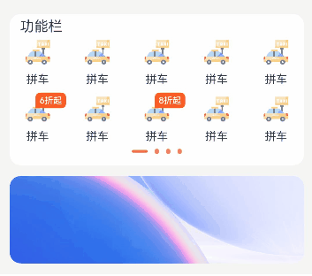

# Swiper高度可变化效果实现

### 介绍

在很多应用中，swiper组件每一个page的高度是不一致的，所以需要swiper组件下方页面的高度跟着一起变化。

### 效果图预览



##### 使用说明

向左滑动swiper组件，上方swiper组件高度变高，下方页面随着swiper的变化而平滑的变化。

### 实现思路

实现方案如下：
1. 生成四个Swiper页面，来进行左右滑动，GridBuilderFunction是生成Swiper的page。
```typescript
Swiper() {
  Column() {
    Stack() {
      Text('功能栏')
        .textAlign(TextAlign.Center)
        .margin({ top: $r('app.integer.margin_small'), left: $r('app.integer.default_padding') })
            // swiper第一个page
        this.GridBuilderFunction(this.dataPageOne, Const.GRID_DOUBLE_HEIGHT, Const.GRID_TEMPLATE)
    }
    .alignContent(Alignment.TopStart)
  }

  // swiper第二个page
  this.GridBuilderFunction(this.dataPageTwo, Const.GRID_DOUBLE_HEIGHT, Const.GRID_TEMPLATE)
  // swiper第三个page
  this.GridBuilderFunction(this.dataPageThree, Const.GRID_DOUBLE_HEIGHT, Const.GRID_TEMPLATE)
  // swiper第四个page
  this.GridBuilderFunction(this.dataPageFour, Const.GRID_DOUBLE_HEIGHT, Const.GRID_TEMPLATE)
}
```
2. Swiper组件的回调，通过左右滑动的距离来计算对应的上下位置的变化，在页面跟手滑动过程中，逐帧触发onGestureSwipe回调，swiperDistance发生变化。
```typescript
Swiper{
  ...
}
.onGestureSwipe((index: number, extraInfo: SwiperAnimationEvent) => {
  animateTo({
    duration: Const.DURATION,
    curve: Curve.EaseOut,
    playMode: PlayMode.Normal,
    onFinish: () => {
      logger.info('play end');
    }
  }, () => { // 通过左右滑动的距离来计算对应的上下位置的变化
    if (index === 0 && extraInfo.currentOffset < 0) {
      this.swiperDistance = extraInfo.currentOffset / Const.SCROLL_WIDTH * Const.SMALL_FONT_SIZE;
    } else if (index === 1 && extraInfo.currentOffset > 0) {
      this.swiperDistance = extraInfo.currentOffset / Const.SCROLL_WIDTH * Const.SMALL_FONT_SIZE - Const.SMALL_FONT_SIZE;
    } else if (index === 2 && extraInfo.currentOffset < 0) {
      this.swiperDistance = extraInfo.currentOffset / Const.SCROLL_WIDTH * Const.GRID_SINGLE_HEIGHT - Const.SMALL_FONT_SIZE;
    } else if (index === 3 && extraInfo.currentOffset > 0) {
      this.swiperDistance = extraInfo.currentOffset / Const.SCROLL_WIDTH * Const.GRID_SINGLE_HEIGHT - Const.SMALL_FONT_SIZE - Const.GRID_SINGLE_HEIGHT;
    }
  })
})
```
3. Swiper组件的回调，用来达到平滑变化的效果，切换动画开始时触发onAnimationStart回调。
```typescript
Swiper{
  ...
}
.onAnimationStart((_: number, targetIndex: number) => {
  animateTo({
    duration: Const.DURATION,
    curve: Curve.EaseOut,
    playMode: PlayMode.Normal,
    onFinish: () => {
      logger.info('play end');
    }
  }, () => {
    if (targetIndex === 0) {
      this.swiperDistance = 0;
    } else if (targetIndex === 1 || targetIndex === 2) {
      this.swiperDistance = -Const.SMALL_FONT_SIZE;
    } else {
      this.swiperDistance = -Const.SMALL_FONT_SIZE - Const.GRID_SINGLE_HEIGHT;
    }
  })
})
```
### 高性能知识点

1. 本例中swiper组件绑定onGestureSwipe回调，该回调为逐帧回调函数，避免在回调内部使用冗余和耗时操作。
2. 本例中Text绑定visibility属性方法，进而控制组件的显隐状态，避免组件的频繁创建与销毁，提升性能。

### 工程结构&模块类型

```
   swipersmoothvariation                // har包
   |---common
   |   |---CommonConstants.ets          // 提供自定义数据    
   |---pages
   |   |---MainPage.ets                 // 滑动变化效果实现页面
```

### 模块依赖

不涉及。

### 参考资料

[swiper](https://developer.huawei.com/consumer/cn/doc/harmonyos-references/ts-container-swiper-0000001774121298)

