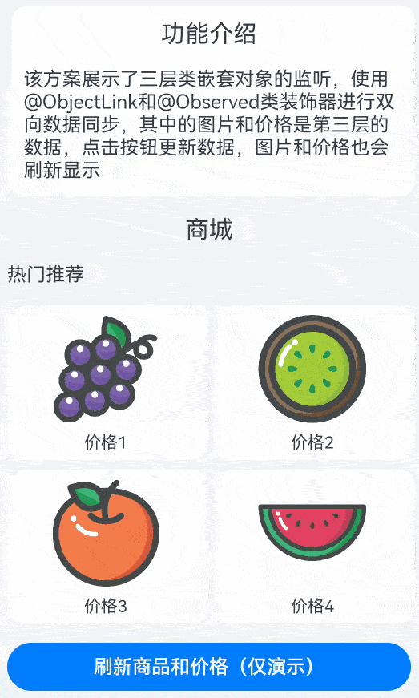

# 多层嵌套类对象监听

### 介绍

本示例介绍使用@Observed装饰器和@ObjectLink装饰器来实现多层嵌套类对象属性变化的监听。

### 效果图预览



**使用说明**

1. 加载完成后显示商品列表，点击刷新按钮可以刷新商品图片和价格。

### 实现思路

1. 创建FistGoodsModel类，类对象是用@Observed修饰的类SecondGoodsItemList，SecondGoodsItemList类对象是用@Observed修饰的ThirdGoodsItem类，ThirdGoodsItem类对应的商品信息，是要被监听的对象。源码参考[GoodsModel.ets](./src/main/ets/model/GoodsModel.ets)
```ts
/**
 * 表示商品详细数据的类型，是嵌套类的第三层
 * @class
 */
@Observed
export class ThirdGoodsItem {
  imgSrc: Resource; // 商品图片
  price: string; // 商品价格

  constructor(imgSrc: Resource, price: string) {
    this.imgSrc = imgSrc;
    this.price = price;
  }
}

/**
 * 表示商品列表的类型，是嵌套类的第二层
 * @class
 */
@Observed
export class SecondGoodsItemList {
  itemList: Array<ThirdGoodsItem>;

  constructor(imgSrc: Array<ThirdGoodsItem>) {
    this.itemList = imgSrc;
  }
}

/**
 * 表示商品模型的类型，是嵌套类的首层
 * @class
 */
export class FistGoodsModel {
  itemList: SecondGoodsItemList;

  constructor(itemList: SecondGoodsItemList) {
    this.itemList = itemList;
  }
}
```
2. 自定义组件中用@ObjectLink修饰对应class实例。源码参考[ProductView.ets](./src/main/ets/view/ProductView.ets)
```ts
@Component
export default struct GoodViewStruct {
  @Link model: FistGoodsModel;

  build() {
    Column() {
      SecondViews()
    }
  }
}

@Component
struct SecondViews {
  @ObjectLink data: SecondGoodsItemList

  build() {
    List() { ... }
  }
}

@Component
struct ThirdView {
  @ObjectLink item: ThirdGoodsItem

  build() {
    Column() { ... }
  }
}
```
3. 更新第三层嵌套class ThirdGoodsItem的数据，UI刷新。源码参考[VariableWatchView.ets](./src/main/ets/view/VariableWatchView.ets)
```ts
this.itemList.forEach((item, index) => {
  item.imgSrc = originItemList[index].imgSrc;
  item.price = originItemList[index].price;
}
```

### 高性能知识点

本示例介绍使用@Observed装饰器和@ObjectLink装饰器来解决需要单独监听多层嵌套类对象属性的方案。

### 工程结构&模块类型

   ```
   VariableWatchView                               // har类型
   |---model
   |   |---GoodsModel.ets                          // 数据模型
   |---view
   |   |---ProductView.ets                         // 视图层-场景列表页面
   |   |---VariableWatchView.ets                   // 视图层-场景主页面
   ```

### 模块依赖

**不涉及**

### 参考资料

[@Observed装饰器和@ObjectLink装饰器：嵌套类对象属性变化](https://developer.huawei.com/consumer/cn/doc/harmonyos-guides-V2/arkts-observed-and-objectlink-0000001473697338-V2)