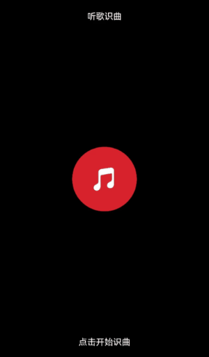

# 听歌识曲水波纹特效案例

### 介绍

在很多应用中，会出现点击按钮出现水波纹的特效。

### 效果图预览



### 使用说明

1. 进入页面，点击按钮，触发水波纹动画。
2. 再次点击按钮，停止水波纹动画。

### 实现思路

本例涉及的关键特性和实现方案如下：

1. 要实现存在两个连续的涟漪，需要两个层叠的Stack分别以一定延迟进行相同的动画。源码参考[WaterRipples.ets](./src/main/ets/WaterRipples.ets)。

   ```typescript
   Stack()
   .ripplesStyle()
   .opacity(this.immediatelyOpacity)
   .scale(this.immediatelyScale)
   Stack()
   .ripplesStyle()
   .opacity(this.delayOpacity)
   .scale(this.delayScale)
   ```
2. 通过点击按钮来判断isListening变量，如果为true则添加动画。涟漪动画实际上的效果为透明度0.8->0，半径扩大到6倍的动画，持续时间无限。源码参考[WaterRipples.ets](./src/main/ets/WaterRipples.ets)。

   ```typescript
   /** TODO: 知识点：新建两个动画，分别修改两个Stack的属性，设置延迟200ms，展示为两个连续的涟漪，iterations设置为-1表示无限重复
   * 高性能知识点：建议使用系统提供的动画接口，如果使用自定义动画，在动画曲线计算过程很容易引起UI线程高负载。
   * 参考《减少动画丢帧》文章
   * https://docs.openharmony.cn/pages/v4.0/zh-cn/application-dev/performance/reduce-animation-frame-loss.md/
   **/
   animateTo({ duration: this.ANIMATION_DURATION, iterations: -1, curve: Curve.EaseInOut }, () => {
     this.immediatelyOpacity = 0;
     this.immediatelyScale = { x: 6, y: 6 };
   })
   animateTo({ duration: this.ANIMATION_DURATION, iterations: -1, curve: Curve.EaseInOut, delay: 200 }, () => {
     this.delayOpacity = 0;
     this.delayScale = { x: 6, y: 6 };
   })
   ```

3. 如果isListening为false，则用持续时间为0的动画来打断持续时间无限的动画。源码参考[WaterRipples.ets](./src/main/ets/WaterRipples.ets)。

   ```typescript
   // TODO: 知识点：用一个持续时间为0的闭包函数修改所有的变量去打断动画
   animateTo({ duration: 0 }, () => {
     this.immediatelyOpacity = 0.8;
     this.delayOpacity = 0.8;
     this.immediatelyScale = { x: 1, y: 1 };
     this.delayScale = { x: 1, y: 1 };
   })
   ```

### 高性能知识点

本例使用了系统提供的动画接口，降低了系统负载，提升动画帧率。

### 工程结构&模块类型

```
   waterriples                                      // har包
   |---WaterRipples.ets                             // 水波纹效果实现页面
```

### 模块依赖

不涉及。

### 参考资料

[@显式动画（animateTo）](https://developer.huawei.com/consumer/cn/doc/harmonyos-references/ts-explicit-animation-0000001774121350)
