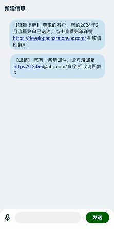

# 文字识别案例

### 介绍

本示例介绍使用text组件的enableDataDetector属性实现文本特殊文字识别。

### 效果图预览



**使用说明**

1. 进入页面，输入带有特殊文字的信息并发送，对话列表中文本会自动识别并标识特殊文字。目前支持识别的类型包括电话号码、链接、邮箱和地址，被识别的文字会变成蓝色并增加下划线。

### 实现思路

1. 使用text组件的enableDataDetector属性实现文本特定文字识别。源码参考[WordRecognition.ets](./src/main/ets/pages/WordRecognition.ets)
    ```typescript
    text()
      .enableDataDetector(true)
    ```
2. 使用text组件的dataDetectorConfig属性设置允许识别的类型。源码参考[WordRecognition.ets](./src/main/ets/pages/WordRecognition.ets)
    ```typescript
    const TYPES:TextDataDetectorType[] = [PHONE_NUMBER,URL,EMAIL]
   
    text()
      .dataDetectorConfig({types : TYPES})
    ```

### 高性能知识点

本示例使用了LazyForEach进行信息列表数据懒加载。

### 工程结构&模块类型
   ```
   WordRecognition                                  // har类型
   |---pages
   |---|---WordRecognition.ets                      // 视图层-场景列表页面
   ```

### 模块依赖

[@ohos/routermodule(动态路由)](../../feature/routermodule)

### 参考资料

[enableDataDetector属性](https://developer.huawei.com/consumer/cn/doc/harmonyos-references/ts-basic-components-text-0000001821000881#ZH-CN_TOPIC_0000001821000881__%E5%B1%9E%E6%80%A7)
[@ohos/LazyForEach](https://developer.huawei.com/consumer/cn/doc/harmonyos-guides/arkts-rendering-control-lazyforeach-0000001820879609)
