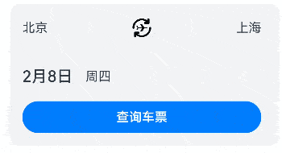
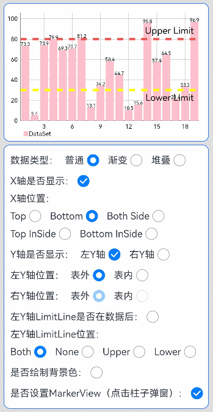
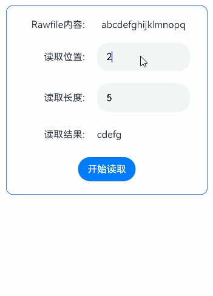
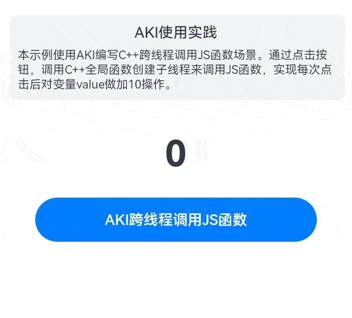
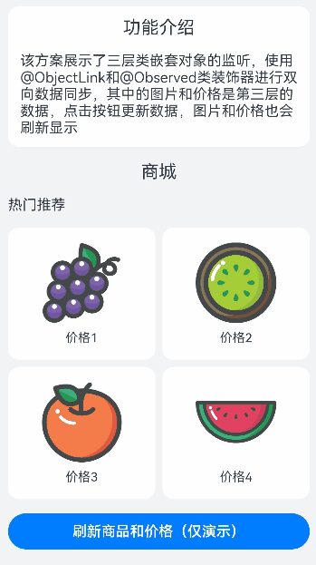
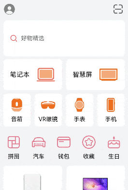
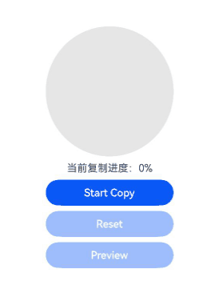
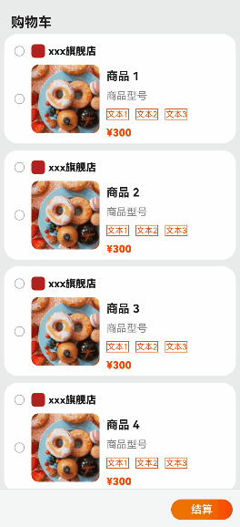
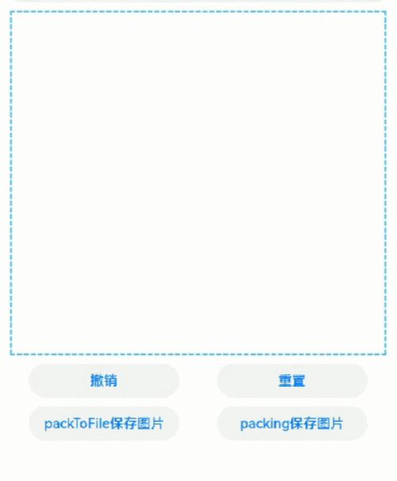

# HarmonyOS NEXT应用开发案例集

## 概述

随着应用代码的复杂度提升，为了使应用有更好的可维护性和可扩展性，良好的应用架构设计变得尤为重要。本篇文章将介绍一个应用通用架构的设计思路，以减少模块间的耦合、提升团队开发效率，为开发者呈现一个清晰且结构化的开发框架。
本文以“应用通用开发范例App”为例，从分层架构设计和模块化设计的方面介绍应用的架构组成。

**分层架构设计**：将应用划分为产品定制层、基础特性层和公共能力层，可以降低层间的依赖性，从而提升代码的可维护性。应用通用开发范例App分层架构如下：

   ```
   common_app_development
   |---AppScope
   |---common    // 公共能力层，包括公共UI组件、数据管理、通信和工具库等
   |---feature   // 基础特性层，包含独立的业务模块，如启动页、登录模块、导航栏等
   |---libs      // 三方依赖库
   |---product   // 产品定制层，作为不同设备或场景应用入口，例如phone、tv等
   ```

**模块化设计**：应用被分解为多个功能模块，其中每个模块负责执行特定的功能。通过模块化设计提高了代码的可理解性和可复用性，使应用的扩展和维护变得更为简便，同时降低了系统各部分之间的耦合度。应用通用开发范例App模块化结构如下：

   ```
   common_app_development
   |---AppScope
   |---common                          // 公共能力层
   |   |---utils  
   |   |   |---component               // 公共布局，如功能介绍布局
   |   |   |---log                     // 日志打印 
   |---feature                         // 基础特性层
   |   |---addressexchange             // 地址交换动画案例
   |   |---akiusepractice              // AKI使用实践
   |   |---applicationexception        // 应用异常处理案例
   |   |---barchart                    // MpChart图表实现案例
   |   |---customtabbar                // 自定义TabBar页签 案例
   |   |---eventpropagation            // 阻塞事件冒泡案例
   |   |---fitfordarkmode              // 深色模式适配案例
   |   |---functionalscenes            // 主页瀑布流实现 
   |   |---gbktranscoding              // Axios获取网络数据案例
   |   |---handletabs                  // Tab组件实现增删Tab标签案例
   |   |---imageviewer                 // 图片预览方案
   |   |---marquee                     // 跑马灯案例
   |   |---modalwindow                 // 全屏登录页面案例
   |   |---nativeprogressnotify        // Native侧进度通知到ArkTS
   |   |---nativerawfile               // Native读取Rawfile中文件部分内容
   |   |---navigationparametertransfer // Navigation页面跳转对象传递案例
   |   |---pageturninganimation        // 翻页动效案例
   |   |---pendingitems                // 列表编辑实现案例
   |   |---photopickandsave            // 图片选择和下载保存案例
   |   |---pulltorefreshnews           // 下拉刷新与上滑加载案例
   |   |---secondarylinkage            // 二级联动实现案例
   |   |---slidetohideanddisplace      // 滑动页面信息隐藏与组件位移效果案例
   |   |---variablewatch               // 多层嵌套类对象监听案例
   |   |---verifycode                  // 验证码布局
   |   |---vibrateeffect               // 基础特性层-抖动动画及手机振动效果
   |   |---customcalendarpickerdialog  // 基础特性层-自定义日历选择器
   |   |---navigationbarchange         // 基础特性层-状态栏显隐变化案例
   |   |---customview                  // 基础特性层-自定义视图实现Tab效果
   |   |---waterripples                // 基础特性层-听歌识曲水波纹特效案例
   |   |---citysearch                  // 城市选择案例
   |   |---componentstack              // 组件堆叠案例
   |   |---dragandexchange             // Grid和List内拖拽交换子组件位置案例
   |   |---foldablescreencases         // 折叠屏音乐播放器案例
   |   |---imagecomment                // 发布图片评论案例
   |   |---mediafullscreen             // 视频全屏切换案例
   |   |---swipercomponent             // 多层级轮播图案例
   |   |---swipersmoothvariation       // Swiper高度可变化效果案例
   |   |---decompressfile              // Worker子线程中解压文件案例
   |   |---paintcomponent              // 使用绘制组件实现自定义进度动画案例
   |   |---lottieview                  // Lottie
   |   |---imagecompression            // 图片压缩方案
   |   |---votingcomponent             // 投票组件
   |   |---webgetcameraimage           // WebView拉起原生相机案例
   |   |---sidebaranimation            // SideBarContainer侧边栏淡入淡出动效实现案例
   |   |---imageenableanalyzer         // 图片拖拽AI抠图案例
   |   |---indicatorbelowswiper        // swiper指示器导航点位于swiper下方
   |   |---bigfilecopy                 // 大文件拷贝案例
   |   |---diggingholescreen           // 适配挖孔屏案例
   |   |---dragtoswitchpictures        // 左右拖动切换图片效果案例
   |   |---listitemoverflow            // 元素超出List区域
   |   |---multiplefilesdownload       // 多文件下载监听案例
   |   |---searchcomponent             // 搜索页一镜到底案例
   |   |---dynamicattributes           // 跨文件样式复用和组件复用
   |   |---etswrapper                  // NAPI封装ArkTS接口案例
   |   |---handwritingtoimage          // 手写绘制及保存图片
   |   |---indicatorbelowswiper        // swiper指示器导航点位于swiper下方
   |   |---multimodaltransion          // 多模态页面转场动效实现案例
   |   |---nativeembed                 // ArkWeb同层渲染
   |   |---sideslipintercept           // 侧滑返回事件拦截案例
   |   |---webpdfviewer                // Web组件预览PDF文件实现案例
   |   |---listslidetohistory          // 长列表滑动到指定列表项动效实现案例
   |   |---imagetheft                  // 正确配置ImageKnife请求头实现防盗链功能
   |---libs
   |---product 
   |   |---entry                       // 产品定制层-应用入口
   ```

## 工程框架和实现设计

### 产品定制层

产品定制层专注于满足不同设备或使用场景（如应用/元服务）的个性化需求，包括UI设计、资源和配置，以及针对特定场景的交互逻辑和功能特性。

产品定制层的功能模块独立运作，同时依赖基础特性层和公共能力层来实现具体功能。

可参考如下示例：

[**phone产品应用入口**](./CommonAppDevelopment/product/entry/src/main/ets/pages/EntryView.ets)

### 基础特性层

基础特性层位于公共能力层之上，用于存放基础特性集合，例如相对独立的功能UI和业务逻辑实现。该层的每个功能模块都具有高内聚、低耦合、可定制的特点，以支持产品的灵活部署。

基础特性层为上层的产品定制层提供稳健且丰富的基础功能支持，包括UI组件、基础服务等。同时依赖于下层的公共能力层为其提供通用功能和服务。

首页以[Navigation组件](./CommonAppDevelopment/product/entry/README.md)为基础，通过[路由管理](./CommonAppDevelopment/feature/routermodule/README.md)实现了页面或者模块间的跳转。

#### 主页瀑布流实现案例

本示例使用WaterFlow+LazyForeEach实现了瀑布流场景。具体方案可以参考[详细说明文档](./CommonAppDevelopment/feature/functionalscenes/README.md)。


#### 全屏登录页面案例

本例介绍各种应用登录页面。在主页面点击跳转到全屏登录页后，显示全屏模态页面，全屏模态页面从下方滑出并覆盖整个屏幕，模态页面内容自定义，此处分为默认一键登录方式和其他登录方式。[详细说明文档](./CommonAppDevelopment/feature/modalwindow/README.md)。


#### 滑动页面信息隐藏与组件位移效果案例

在很多应用中，向上滑动"我的"页面，页面顶部会有如下变化效果：一部分信息逐渐隐藏，另一部分信息逐渐显示，同时一些组件会进行缩放或者位置移动。向下滑动时则相反。[详细说明文档](./CommonAppDevelopment/feature/slidetohideanddisplace/README.md)。


#### 地址交换动画案例

在出行类订票软件中，一般都有此动画效果，点击交换后，起点和终点互换。地址交换动画的方案可以参考此[详细说明文档](./CommonAppDevelopment/feature/addressexchange/README.md)。



#### 阻塞事件冒泡案例

事件冒泡是指触发子组件事件的时候，事件会传递到父组件，这样会导致父组件的事件也会触发。阻塞事件冒泡的方案可以参考此[详细说明文档](./CommonAppDevelopment/feature/eventpropagation/README.md)。


#### 自定义TabBar页签案例

TabBar在大部分的APP当中都能够使用到，不同的APP可能存在不一样的TabBar样式，Tab组件自带的TabBar属性对于部分效果无法满足，如页签中间显示一圈圆弧外轮廓等，
因此我们需要去自己定义一个TabBar页签来满足开发的需要。自定义TabBar页签的方案可以参考此[详细说明文档](./CommonAppDevelopment/feature/customtabbar/README.md)。


#### 二级联动实现案例

二级联动是指一个列表（一级列表）的选择结果，来更新另一个列表（二级列表）的选项。二级联动的方案可以参考此[详细说明文档](./CommonAppDevelopment/feature/secondarylinkage/README.md)。


#### 列表编辑实现案例

列表的编辑模式用途十分广泛，常见于待办事项管理、文件管理、备忘录的记录管理等应用场景。列表编辑实现方案可以参考此[详细说明文档](./CommonAppDevelopment/feature/pendingitems/README_zh.md)。


#### MpChart图表实现案例

MpChart是一个包含各种类型图表的图表库，方便开发者快速实现图表UI。使用MpChart可以实现柱状图UI效果，具体方案可以参考此[详细说明文档](./CommonAppDevelopment/feature/barchart/README.md)。



#### 读取Rawfile中文件部分内容案例

使用native从rawfile中文件读取部分内容。具体方案可以参考此[详细说明文档](./CommonAppDevelopment/feature/nativerawfile/README.md)。



#### 图片缩放效果实现案例

本模块基于Image组件实现了简单的图片预览功能，支持双指捏合等效果。图片预览方案可参考此[详细说明文档](./CommonAppDevelopment/feature/imageviewer/README.md)。


#### Axios获取解析网络数据案例

本示例介绍使用第三方库的Axios获取GBK格式的网络数据时，通过util实现GBK转换UTF-8格式。该场景多用于需要转换编码格式的应用。[详细说明文档](./CommonAppDevelopment/feature/gbktranscoding/README.md)。


#### Tab组件实现增删Tab标签方案案例

本示例介绍使用了Tab组件实现自定义增删Tab页签的功能。该场景多用于浏览器等场景。[详细说明文档](./CommonAppDevelopment/feature/handletabs/README.md)。


#### 使用AKI轻松实现跨语言调用

AKI提供了极简语法糖使用方式，一行代码完成JS与C/C++的无障碍跨语言互调，使用方便。本模块将介绍使用AKI编写C++跨线程调用JS函数场景，为开发者使用AKI提供参考。AKI使用实践可参考此[详细说明文档](./CommonAppDevelopment/feature/akiusepractice/README.md)。



#### 多层嵌套类监听案例

对于多层嵌套的情况，比如二维数组，或者数组项class，或者class的属性是class，他们的第二层的属性变化是无法观察到的。@Observed/@ObjectLink装饰器可以解决，
多层嵌套类对象监听方案可以参考[详细说明文档](./CommonAppDevelopment/feature/variablewatch/README.md)。



#### 图片选择和下载保存案例

本示例介绍图片相关场景的使用：包含访问手机相册图片、选择预览图片并显示选择的图片到当前页面，下载并保存网络图片到手机相册或到指定用户目录两个场景。[详细说明文档](./CommonAppDevelopment/feature/photopickandsave/README.md)。


#### 应用异常处理案例

本示例介绍了通过应用事件打点hiAppEvent获取上一次应用异常信息的方法，主要分为应用崩溃、应用卡死以及系统查杀三种。[详细说明文档](./CommonAppDevelopment/feature/applicationexception/README.md)。


#### 深色模式案例

本示例介绍在开发应用以适应深色模式时，对于深色和浅色模式的适配方案，采取了多种策略。[详细说明文档](./CommonAppDevelopment/feature/fitfordarkmode/README.md)。


#### 跑马灯案例

本示例介绍了文本宽度过宽时，如何实现文本首尾相接循环滚动并显示在可视区，以及每循环滚动一次之后会停滞一段时间后再滚动。[详细说明文档](./CommonAppDevelopment/feature/marquee/README.md)。


#### 下拉刷新上滑加载案例

本示例介绍使用第三方库的PullToRefresh组件实现列表的下拉刷新数据和上滑加载后续数据。[详细说明文档](./CommonAppDevelopment/feature/pulltorefreshnews/README.md)。


#### 翻页动效案例

翻页动效是应用开发中常见的动效场景，常见的有书籍翻页，日历翻页等。本例将介绍如何通过ArkUI提供的显示动画接口animateTo实现翻页的效果。[详细说明文档](./CommonAppDevelopment/feature/pageturninganimation/README.md)。


#### 在Native侧实现进度通知功能

本示例通过模拟下载场景介绍如何将Native的进度信息实时同步到ArkTS侧。[详细说明文档](./CommonAppDevelopment/feature/nativeprogressnotify/README.md)。


#### 验证码布局

本示例介绍如何使用Text组件实现验证码场景，并禁用对内容的选中、复制、光标。[详细说明文档](./CommonAppDevelopment/feature/verifycode/README.md)。


#### 使用弹簧曲线实现抖动动画及手机振动效果案例

抖动动画和手机振动效果是手机使用时常见的效果。抖动动画及手机振动效果案例可以参考[详细说明文档](./CommonAppDevelopment/feature/vibrateeffect/README.md)。


#### 自定义日历选择器

日历选择器是出行类应用常见模块。自定义日历选择器案例可以参考[详细说明文档](./CommonAppDevelopment/feature/customcalendarpickerdialog/README.md)。


#### 状态栏显隐变化案例

本示例介绍使用Scroll组件的滚动事件 **onScroll** 实现状态栏显隐变化。该场景多用于各种软件的首页、我的等页面中。状态栏显隐变化的方案可以参考此[详细说明文档](./CommonAppDevelopment/feature/navigationbarchange/README.md)。


#### 自定义视图实现Tab效果

本示例介绍使用Text、List等组件，添加点击、动画等事件 **onClick** **animateTo** 自定义视图实现类似Tab效果。自定义视图实现Tab效果的方案可以参考此[详细说明文档](./CommonAppDevelopment/feature/customview/README.md)。


#### 听歌识曲水波纹特效案例

本示例介绍水波纹的特效。该场景多用于各种软件的按钮。听歌识曲水波纹特效案例可以参考此[详细说明文档](./CommonAppDevelopment/feature/waterripples/README.md)。


#### 城市选择案例

本示例介绍城市选择场景的使用：通过AlphabetIndexer实现首字母快速定位城市的索引条导航。[详细说明文档](./CommonAppDevelopment/feature/citysearch/README.md)


#### 组件堆叠案例

本示例介绍运用Stack组件以构建多层次堆叠的视觉效果。通过绑定Scroll组件的onScroll滚动事件回调函数，精准捕获滚动动作的发生。当滚动时，实时地调节组件的透明度、高度等属性，从而成功实现了嵌套滚动效果、透明度动态变化以及平滑的组件切换。[详细说明文档](./CommonAppDevelopment/feature/componentstack/README.md)



#### Grid和List内拖拽交换子组件位置案例

本示例分别通过onItemDrop()和onDrop()回调，实现子组件在Grid和List中的子组件位置交换。[详细说明文档](./CommonAppDevelopment/feature/dragandexchange/README.md)


#### 折叠屏音乐播放器案例

本示例介绍使用ArkUI中的容器组件FolderStack在折叠屏设备中实现音乐播放器场景。[详细说明文档](./CommonAppDevelopment/feature/foldablescreencases/README.md)


#### 发布图片评论案例

本示例将通过发布图片评论场景，介绍如何使用startAbilityForResult接口拉起相机拍照，并获取相机返回的数据。[详细说明文档](./CommonAppDevelopment/feature/imagecomment/README.md)


#### 视频全屏切换案例

本示例介绍了Video组件和@ohos.window接口实现媒体全屏的功能。该场景多用于首页瀑布流媒体播放等。。[详细说明文档](./CommonAppDevelopment/feature/mediafullscreen/README.md)


#### 多层级轮播图案例

本示例介绍使用ArkUIstack组件实现多层级瀑布流。该场景多用于购物、资讯类应用。[详细说明文档](./CommonAppDevelopment/feature/swipercomponent/README.md)


#### Worker子线程中解压文件案例

本示例介绍在Worker子线程使用@ohos.zlib提供的zlib.decompressfile接口对沙箱目录中的压缩文件进行解压操作，解压成功后将解压路径返回主线程，获取解压文件列表。[详细说明文档](./CommonAppDevelopment/feature/decompressfile/README.md)


#### 使用绘制组件实现自定义进度动画

本示例介绍使用绘制组件中的Circle组件以及Path组件实现实时进度效果。该场景多用于手机电池电量、汽车油量、水位变化等动态变化中。[详细说明文档](./CommonAppDevelopment/feature/paintcomponent/README.md)


#### Lottie

Lottie是一个适用于OpenHarmony的动画库，它可以解析Adobe After Effects软件通过Bodymovin插件导出的json格式的动画，并在移动设备上进行本地渲染，可以在各种屏幕尺寸和分辨率上呈现，并且支持动画的交互性，通过添加触摸事件或其他用户交互操作，使动画更加生动和具有响应性。[详细说明文档](./CommonAppDevelopment/feature/lottieview/README.md)


#### 图片压缩方案

本示例介绍如何通过packing和scale实现图片压缩到指定大小以内。[详细说明文档](./CommonAppDevelopment/feature/imagecompression/README.md)


#### 投票动效实现案例

本示例介绍使用绘制组件中的Polygon组件配合使用显式动画以及borderRadius实现投票pk组件。[详细说明文档](./CommonAppDevelopment/feature/votingcomponent/README.md)


#### Web获取相机拍照图片案例

本示例介绍如何在HTML页面中拉起原生相机进行拍照，并获取返回的图片。[详细说明文档](./CommonAppDevelopment/feature/webgetcameraimage/README.md)


#### SideBarContainer侧边栏淡入淡出动效实现案例

在pc或平板上，群聊侧边栏是一种较为常用的功能，虽然HarmonyOS已经具备了基本的动效，但是部分情况下开发者可能有定制侧边栏动效的需求，本例主要介绍了如何基于显式动画实现侧边栏的淡入淡出动效。[详细说明文档](./CommonAppDevelopment/feature/sidebaranimation/README.md)


#### 图片拖拽AI抠图案例

本示例介绍图片AI抠图案例的使用：通过Image.enableAnalyzer(true)实现长按图片抠图并拖拽/复制到其他应用中。[详细说明文档](./CommonAppDevelopment/feature/imageenableanalyzer/README.md)


#### swiper指示器导航点位于swiper下方

本示例介绍通过分割swiper区域，实现指示器导航点位于swiper下方的效果。[详细说明文档](./CommonAppDevelopment/feature/indicatorbelowswiper/README.md)


#### 大文件拷贝案例

文件拷贝是应用开发中的一个常见场景，通常有两种方式，一是直接读写文件的全部内容，二是使用buffer多次读写。前者的优点在于使用简单，但是在大文件场景下，内存占用较高，影响应用性能；后者的优点在于内存占用较小，但是编程稍显复杂。本例将展示如何使用buffer来将大文件的rawfile复制到应用沙箱。[详细说明文档](./CommonAppDevelopment/feature/bigfilecopy/README.md)



#### 适配挖孔屏案例

本示例介绍使用屏幕属性getDefaultDisplaySync、getCutoutInfo接口实现适配挖孔屏。该场景多用于沉浸式场景下。[详细说明文档](./CommonAppDevelopment/feature/diggingholescreen/README.md)


#### 左右拖动切换图片效果案例

本示例使用滑动手势监听，实时调整左右两侧内容显示区域大小和效果。通过绑定gesture事件中的PanGesture平移手势，实时获取拖动距离。当拖动时，实时地调节左右两个Image组件的宽度，从而成功实现左右拖动切换图片效果的功能。[详细说明文档](./CommonAppDevelopment/feature/dragtoswitchpictures/README.md)


#### 元素超出List区域

本示例介绍在List组件内实现子组件超出容器边缘的布局样式的实现方法。[详细说明文档](./CommonAppDevelopment/feature/listitemoverflow/README.md)


#### 多文件下载监听案例

本示例介绍如何使用request上传下载模块实现多文件下载监听，如监听每个文件下载任务的进度，下载暂停，下载完成等文件下载情况。[详细说明文档](./CommonAppDevelopment/feature/multiplefilesdownload/README.md)


#### 搜索页一镜到底案例

本示例介绍使用bindContentCover、transition、animateTo实现一镜到底转场动画，常用于首页搜索框点击进入搜索页场景。[详细说明文档](./CommonAppDevelopment/feature/searchcomponent/README_transition.md)


#### Navigation.Mode实现一多适配案例

本示例介绍如何使用Navigation的mode属性实现一套代码多设备适配。[详细说明文档](./CommonAppDevelopment/doc/MULTIDEVICE_ADAPTATION.md)


#### 跨文件样式复用和组件复用

本示例主要介绍了跨文件样式复用和组件复用的场景。在应用开发中，我们通常需要使用相同功能和样式的ArkUI组件，例如购物页面中会使用相同样式的Button按钮、Text显示文字，我们常用的方法是抽取公共样式或者封装成一个自定义组件到公共组件库中以减少冗余代码。[详细说明文档](./CommonAppDevelopment/feature/dynamicattributes/README.md)



#### NAPI封装ArkTS接口案例

部分应用的主要开发语言为C/C++，但是HarmonyOS的部分接口仅以ArkTS的形式暴露，因此需要将ArkTS的接口封装为Native接口。本例以DocumentViewPicker的Select方法为例，提供了Napi封装ArkTSAPI的通用方法。[详细说明文档](./CommonAppDevelopment/feature/etswrapper/README.md)


#### 手写绘制及保存图片

本示例使用drawing库的Pen和Path结合NodeContainer组件实现手写绘制功能，并通过image库的packToFile和packing接口将手写板的绘制内容保存为图片。[详细说明文档](./CommonAppDevelopment/feature/handwritingtoimage/README.md)



#### swiper指示器导航点位于swiper下方

本示例介绍通过分割swiper区域，实现指示器导航点位于swiper下方的效果。[详细说明文档](./CommonAppDevelopment/feature/indicatorbelowswiper/README.md)


#### 多模态页面转场动效实现案例

本示例介绍多模态页面转场动效实现：通过半模态转场实现半模态登录界面，与全屏模态和组件转场结合实现多模态组合登录场景，其中手机验证码登录与账号密码登录都为组件，通过TransitionEffect.move()实现组件间转场达到近似页面转场的效果。[详细说明文档](./CommonAppDevelopment/feature/multimodaltransion/README.md)


#### 侧滑返回事件拦截案例

本示例介绍使用NavDestination组件的onBackPressed回调对返回事件进行拦截，提示用户保存编辑内容，并使用preferences实例持久化保存内容。[详细说明文档](./CommonAppDevelopment/feature/sideslipintercept/README.md)


#### ArkWeb同层渲染

该方案展示了ArkWeb同层渲染：将系统原生组件直接渲染到前端H5页面上，原生组件不仅可以提供H5组件无法实现的一些功能，还能提升用户体验的流畅度[详细说明文档](./CommonAppDevelopment/feature/nativeembed/README.md)


#### Web组件预览PDF文件实现案例

本案例通过Web组件实现预览本地PDF文件和预览网络PDF文件，代码为Tabs容器组件包含了两个独立的TabContent子组件，分别标示为预览本地PDF文件和预览网络PDF文件。每个子组件内部构建一个Web组件。第一个Web组件利用resource协议关联本地PDF文件路径以预览本地存储的PDF资源；第二个Web组件则通过配置网络链接属性，实现从互联网加载并预览远程PDF文件内容。[详细说明文档](./CommonAppDevelopment/feature/webpdfviewer/README.md)


#### 长列表滑动到指定列表项动效实现案例

本示例使用currentOffset方法获取并记录偏移量，然后使用scrollTo方法跳转到上次浏览记录功能，可以流畅滑动到上次列表的位置。[详细说明文档](./CommonAppDevelopment/feature/listslidetohistory/readme.md)


#### 正确配置ImageKnife请求头实现防盗链功能

本案例使用了第三方库imageknife，通过在请求头中添加Referer来获取防盗链图片功能。也可以基于此功能设置请求头中的其他参数，例如User-Agent、Origin甚至ETag等等。[详细说明文档](./CommonAppDevelopment/feature/imagetheft/readme.md)


### 公共能力层

公共功能层用于存放公共基础能力，集中了例如公共UI组件、数据管理、外部交互以及工具库等的共享功能。应用与元服务都可以共享和调用这些公共能力。

公共能力层为上层的基础特性层和产品定制层提供稳定可靠的功能支持，确保整个应用/元服务的稳定性和可维护性。

应用通用开发范例App公共能力层包含以下模块：[**日志打印**](./CommonAppDevelopment/common/utils/src/main/ets/log/Logger.ets)、[**功能介绍布局**](./CommonAppDevelopment/common/utils/src/main/ets/component/FunctionDescription.ets)

## 配套平台

1. 适用最新HarmonyOS Next版本；

2. 适用Stage模型，SDK版本为API11；

3. 适用最新DevEco Studio版本。

