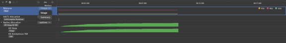

# 内存分析器Allocation Profiler使用指导

DevEco Studio集成的DevEco Profiler性能调优工具（以下简称为Profiler），提供Time、Allocation、Snapshot、CPU等场景化分析任务类型。开发者可使用Profiler的Allocation内存分析器，在应用或服务运行时实时显示内存使用情况，识别可能会导致应用卡顿、内存泄漏、内存抖动的问题，或找到导致内存瓶颈的问题。

## 使用约束

已通过USB连接设备并在设备上打开需要调试的设备。

仅在应用为debug编译模式时使用

仅支持OpenHarmony API 9及以上版本的Stage工程

## 场景示例

本示例设置两个页面，通过内存分析器来分析页面跳转场景下是否存在内存分配不合理的问题。

主页面代码如下：

```ts
import router from '@ohos.router'

@Entry
@Component
struct Index {
 build() {
  Row() {
   Column() {
    Button("点击跳转").onClick(() => {
     onJumpClick();
    })
   }
   .width('100%')
  }
  .height('100%')
 }
}

// 跳转下个页面
function onJumpClick(): void {
 router.pushUrl({
  url: 'pages/second' // 目标url
 }, router.RouterMode.Standard, (err) => {
  if (err) {
   console.error(`Invoke pushUrl failed, code is ${err.code}, message is ${err.message}`);
   return;
  }
  console.info('Invoke pushUrl succeeded.');
 });
}
```

跳转后页面代码如下：

```ts
@Component
struct SwiperChild {
 @State arr: number[] = [];

 aboutToAppear(): void {
 for (let i = 1; i <= 10; i++) {
  this.data.push(i);
 }
}

 build() {
  Column() {
   List({ space: 20 }) {
    ForEach(this.arr, (index: number) => {
     ListItem() {
      Text(index.toString())
       .height('4.5%')
       .fontSize(16)
       .textAlign(TextAlign.Center)
       .backgroundColor(0xFFFFFF)
     }
     .border({ width: 2, color: Color.Green })
    }, (index: number) => index.toString());
   }
   .height("95%")
   .width("95%")
   .border({ width: 3, color: Color.Red })
   .lanes({ minLength: 40, maxLength: 40 })
   .alignListItem(ListItemAlign.Start)
   .scrollBar(BarState.Off)

  }.width('100%').height('100%').padding({ top: 5 });
 }
}

@Entry
@Preview
@Component
struct SecondPage {
 @State data: Number[] = [];

 aboutToAppear(): void {
  let list = []
  for (let i = 1; i <= 100; i++) {
   list.push(i);
  }
 }

 build() {
  Column({ space: 5 }) {
   Swiper() {
    ForEach(this.data, (_: number) => {
     ChildPage();
    }, (item: number) => item.toString());
   }
   .loop(false)
   .indicator(true)
   .duration(100)
   .curve(Curve.Linear)

  }.width('100%')
  .margin({ top: 5 })
 }
}
```

## 如何创建内存分析任务

以DevEco Studio 4.0.0.400版本为例，在DevEco Studio菜单栏上单击***\*View\**** > ***\*Tool Windows\**** > ***\*Profiler\****，或者在DevEco Studio底部工具栏单击Profiler按钮，打开Profiler性能分析器，点选Allocation选项，再点击Create Session按钮创建耗时分析任务。


点击“Launch Mode”按钮以开关Launch Mode，开启后，任务开始时应用会自动冷启动，有助于分析启动场景下的应用内存问题。
内存分析任务支持在录制前单击按钮指定要录制的泳道：


Memory泳道：按照所选维度，显示框选时间段的内存统计数据。在该泳道的下拉列表中，可选择显示维度：

选择“Usage”，显示指定占用类型的内存数据，当前支持的内存占用类型包括：

PSS：进程独占内存和按比例分配共享库占用内存之和。

RSS：进程独占内存和相关共享库占用内存之和。

USS：进程独占内存。

选择“Summary”，显示指定应用类型的内存数据，当前支持的内存类型包括：

ArkTS：方舟虚拟机占用的内存。

Native：C或C++代码所占用的内存。

Stack：应用/服务中栈上使用的内存。

Code：应用/服务用于处理代码和资源的内存。

Others：其他不归属以上分类的内存。

单击上述内存类型标识，可在Memory的泳道堆叠图中隐藏此类内存。方便开发者查看单类内存的使用趋势。

ArkTS Allocation泳道：显示方舟虚拟机上的内存分配信息。

Native Allocation泳道：显示具体的Native内存分配情况，包括静态统计数据、分配栈、每层函数栈消耗的Native内存等信息。单击Native Allocation泳道的“options”下拉列表，可以设置最小跟踪内存和栈深度。默认最小跟踪内存为4096Bytes，默认栈深度为10层。设置完成后，在录制期间小于此大小的内存分配将被忽略，最大栈深度将达到设置的值。


### 提示

设置的最小跟踪内存数值越小、栈深度越大，对应用造成的影响就越大，可能会导致Profiler卡顿。请根据应用实际的调测情况进行合理设置。

在任务分析窗口，可以通过“Ctrl+鼠标滚轮”缩放时间轴，通过“Shift+鼠标滚轮”左右移动时间轴。

内存分析任务会降低设备的性能，请勿将分析结果作为性能参考。

## 内存分析任务中的操作


点击“Collect garbage”按钮可启动内存回收机制。当方舟虚拟机的调优对象的某个程序/进程占用的部分内存空间在后续的操作中不再被该对象访问时，内存回收机制会自动将这部分空间归还给系统，降低程序错误概率，减少不必要的内存损耗。通常在分析启动时触发，用于降低内存回收对内存统计准确性的影响。

点击按钮停止内存分析任务。

针对示例场景，在内存分析任务开始后，进行跳转页面动作。

### 注意

在任务录制（recording）及分析（analyzing）的过程中，请不要主动断开应用或者设备，否则可能导致分析任务异常失败。

## 进行内存分析

在目标泳道上长按鼠标左键并拖拽，框选要展示分析的时间段。
Details区域中显示此时间段内指定类型的内存分析统计信息：

Memory泳道：显示指定维度的内存统计信息。

Usage维度：显示当前框选时间段内PSS内存统计信息。该维度下，默认只显示PSS的统计图，如需要查看USS或RSS，需要在Memory泳道的右上角点选相关数据类型。可以看出，在页面跳转开始1.6s内，PSS内存急剧增加。


Summary维度：显示当前框选时间段内所有类型的应用内存的峰谷值与平均值统计信息。可以看出，在页面跳转开始1.6s内，应用内存占用高低差值达到了35MB。


ArkTS Allocation泳道：显示当前框选时段内运行对象的内存使用情况，包括层级、对象自身内存大小、对象关联内存大小等。


“Details”区域中带标识的对象，表示其可以通过窗口访问。

Native Allocation泳道：框选子泳道后显示具体的内存分配，包括静态统计数据、分配栈等。


Statistics页签中显示该段时间内的静态分配情况，包括分配方式（Malloc或Mmap）、总分配内存大小、总分配次数、尚未释放的内存大小、尚未释放次数、已释放的内存大小、已释放次数。双击任意对象，可跳转至此类对象的详细占用/分配信息。

Call Info页签显示线程的调用栈的内存分配情况，包括对象名称、占用空间、类型等。单击任一调用栈，“More”区域将显示内存分配最多的调用栈。

Allocations List显示内存分配的详细信息，包括内存块起始地址、时间戳、当前活动状态、大小、调用的库、调用库的具体函数、事件类型（与Statistics页签的分配方式对应）等。选择任一对象，右侧会展示与该对象相关的所有库和调用者。

根据分析结果，双击可能存在问题的调用栈，如调用栈涉及应用代码，则跳转至相关代码。开发者可根据实际需要进行优化。

## 分析数据筛选

内存分析器提供多种数据筛选方式，方便开发者缩小分析范围，更精确地定位问题所在。

### 通过内存状态筛选


在内存分析过程中，对“Native Allocation”泳道的内存状态信息进行过滤，便于开发者定位内存问题。在“Native Allocation”泳道的“Detail”区域左下方的下拉框中，可以选择过滤内存状态：

All：详情区域展示当前框选时间段内的所有内存分配信息。

Existing：详情区域展示当前框选时间段内分配未释放的内存。

Released：详情区域展示当前框选时间段内分配已释放的内存。

### 通过统计方式筛选


在“Native Allocation”泳道的“Statistics”页签中，可以打开“Native Size”选择统计方式以过滤统计数据：

Native Size：详情区域按照对象的原生内存进行展示。

Native Library：详情区域按照对象的so库进行展示。

### 通过so库名筛选


在“Native Allocation”泳道的“Allocations List”页签中，可以单击“Click to choose”选择要筛选的so库以过滤出与目标so库相关的数据，帮助应用发现内存占用过大的动态库。

## 分析结论

通过以上分析得出结论：应用在进行页面跳转时内存占用过大，需要优化。可将跳转后页面中的Swiper组件搭LazyForEach进行懒加载操作以优化内存占用。

## 代码优化

Swiper组件使用LazyForEach懒加载机制替换ForEach，使得页面跳转时不一次性加载所有的Swiper子组件。跳转后页面代码修改为如下所示：

```ts
class MyDataSource implements IDataSource { // LazyForEach的数据源
 private list: number[] = [];

 constructor(list: number[]) {
  this.list = list;
 }

 totalCount(): number {
  return this.list.length;
 }

 getData(index: number): number {
  return this.list[index];
 }

 registerDataChangeListener(_: DataChangeListener): void {
 }

 unregisterDataChangeListener(): void {
 }
}

@Component
struct ChildPage { // 带有100个ListItem的List组件
 @State arr: number[] = [];

 aboutToAppear(): void {
  for (let i = 1; i <= 100; i++) {
   this.arr.push(i);
  }
 }

 build() {
  Column() {
   List({ space: 20 }) {
    ForEach(this.arr, (index: number) => {
     ListItem() {
      Text(index.toString())
       .height('4.5%')
       .fontSize(16)
       .textAlign(TextAlign.Center)
       .backgroundColor(0xFFFFFF)
     }
     .border({ width: 2, color: Color.Green })
    }, (index: number) => index.toString());
   }
   .height("95%")
   .width("95%")
   .border({ width: 3, color: Color.Red })
   .lanes({ minLength: 40, maxLength: 40 })
   .alignListItem(ListItemAlign.Start)
   .scrollBar(BarState.Off)

  }.width('100%').height('100%').padding({ top: 5 });
 }
}

@Entry
@Preview
@Component
struct SecondPage {
 private dataSrc: MyDataSource = new MyDataSource([]);

 aboutToAppear(): void {
  let list = []
  for (let i = 1; i <= 100; i++) {
   list.push(i);
  }
  this.dataSrc = new MyDataSource(list);
 }

 build() {
  Column({ space: 5 }) {
   Swiper() {
    LazyForEach(this.dataSrc, (_: number) => { // 使用懒加载机制
     ChildPage();
    }, (item: number) => item.toString());
   }
   .loop(false)
   .cachedCount(1) // 提前加载后一项的内容
   .indicator(true)
   .duration(100)
   .curve(Curve.Linear)

  }.width('100%')
  .margin({ top: 5 })
 }
}
```

## 优化结果

如图所示，优化后，页面跳转时应用内存占用高低差值从35MB降低到了7MB。

