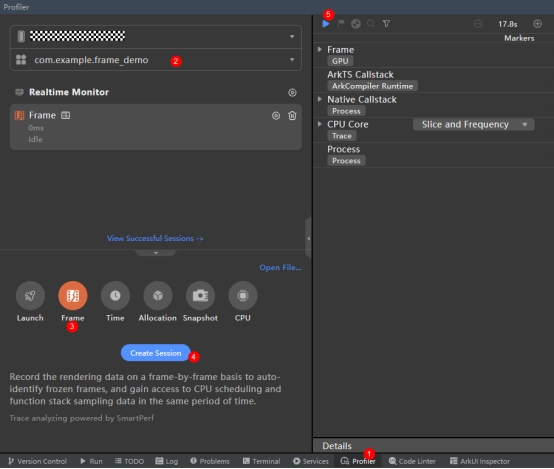
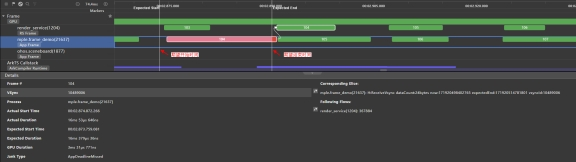
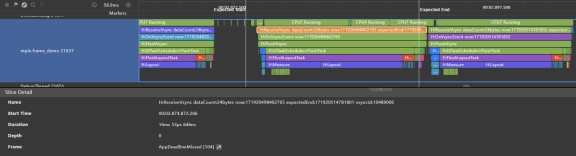
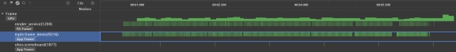

# 帧率分析工具 Frame Profiler使用指导

## **Frame Profiler概述**

DevEco Studio内置Profiler分析调优工具，其中Frame分析调优功能，用于录制GPU数据信息，录制完成展开之后的子泳道对应录制过程中各个进程的帧数据，主要用于深度分析应用或服务卡顿丢帧的原因。此外，Frame任务窗口还集成了Time、CPU场景分析任务的功能，方便开发者在分析丢帧数据时同步对比同一时段的其他资源占用情况。

## **场景示例**

如下代码使用了Grid来实现一个网格，但是在外层套了3层stack容器，会导致组件刷新和渲染耗时长，文章后续将以本案例场景来简单介绍Frame Profiler的使用。

```ts
@Entry
@Component
struct Index {
 @State children: Number[] = Array.from(Array(2000), (_v, k) => k);

 build() {
  Scroll() {
   Grid() {
    ForEach(this.children, (item) => {
     GridItem() {
      Stack() {
       Stack() {
        Stack() {
         Text(item.toString())
        }
       }
      }
     }
    }, item => item)
   }
   .columnsTemplate('1fr 1fr 1fr 1fr')
   .columnsGap(0)
   .rowsGap(0)
   .size({ width: "100%", height: "100%" })
  }
 }
}
```

## **Frame Profiler使用约束**

- 已通过USB连接设备

- 仅支持OpenHarmony API 10及以上版本的Stage工程

## **如何使用Frame Profiler录制数据**

1. 首先打开Profiler，以DevEco Studio 4.0.0.400版本为例，可以通过如下三种方式打开Profiler：

- 在DevEco Studio顶部菜单栏中选择“View -> Tool Windows -> Profiler”。

- 在DevEco Studio底部工具栏中单击“Profiler”。

- 按“Double Shift”或者“Crtl+Shift+A”打开搜索功能，搜索“Profiler”。

2. 创建Frame分析任务并录制相关数据



① 打开Profiler性能分析器；

② 选择待分析的设备与应用进程；

③ 选择Frame工具；

④ 点击Create Session创建录制任务；

⑤ 准备好调试环境后，点击开始录制数据，再次点击结束录制。

**说明：** 在任务录制（recording）及分析（analyzing）的过程中，请不要主动断开应用或者设备，否则可能导致分析任务异常失败。

## **如何使用Frame Profiler分析数据**

结束录制任务后，找到Frame泳道并展开，如下图：



- Frame泳道展开之后的子泳道对应录制过程中各个进程的帧数据，在RS Frame和App Frame标签的泳道中绿色帧为正常帧，红色帧为卡顿帧。点击相关的帧提交数据，如果有关联的App侧帧/RS侧帧，则会进行连线表示提交关系。

- 一帧绘制的期望耗时，与FPS的大小有关，一般情况下FPS为60，对应的Vsync周期为16.6ms，即App侧/RS侧的帧耗时，一般需要在16.6ms内绘制完成。App侧帧/RS侧帧卡顿的计算标准为帧的实际结束时间晚于帧的期望结束时间即为卡顿。

- 对于卡顿帧，浅红色和深红色的分界处为期望结束时间。同时针对卡顿帧，点击之后也会出现两条线，代表此帧的期望开始时间（Expected Start）和期望结束时间（Expected End）。

通过Frame泳道，开发者们可以快速发现丢帧的位置，并完成初步的定界：

- 如果是App侧帧处理有红色帧出现，那需要进一步审视在UI线程中的处理逻辑，是否过于复杂或低效，又或者是被别的什么任务抢占了资源；

- 如果是RS侧帧处理有红色帧出现，那需要审视是否是界面布局过于复杂。

后者可以借助ArkUI Inspector等工具进一步分析，具体参考页面布局检查器ArkUI Inspector工具使用指导。上述案例中的场景明显属于前者中App侧的发送帧卡顿，针对前一种现象可以点击查看卡顿帧的Details信息，点击以跳转到此帧对应的trace数据。如下所示，卡顿帧对应Trace中的FlushLayoutTask为重新测量和布局所有的Item。



去除3层stack容器后，得到的Frame泳道数据如下，可以看到滑动页面无丢帧现象。



开发者在使用Frame Profiler分析工具时需要结合应用代码进行相关信息的分析，确定需要优化的代码，避免造成视图嵌套层次过多。

此外，需要说明的是Frame泳道可以快速定位到出现卡顿丢帧的时段，并且能够对丢帧原因做一个初步判断，深层次根因开发者还可以基于ArkTS Callstack泳道进行分析，具体使用方式可以参考耗时分析器Time Profiler工具使用指导。

## **提示**

1. 帧率（FPS）的计算公式为：**FPS = 1 / 时间间隔**，其中，时间间隔指的是相邻两帧之间的时间差，可以框选两个正常帧的起始位置查看时间差。例如，如果两帧之间的时间间隔为16.6ms，则帧率为1/0.0166≈60FPS。
2. 在任务分析窗口，可以通过“Ctrl+鼠标滚轮”缩放时间轴，通过“Shift+鼠标滚轮”左右移动时间轴。
3. Profiler为Frame分析数据提供了全局搜索能力。单击分析窗口左上角的，根据界面提示信息输入需要搜索的项目，可获取到相关内容的定位，使用搜索框的<、>按键可依次显示返回结果的详细内容。
