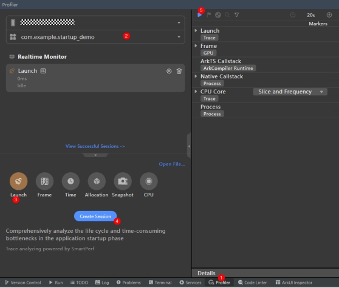
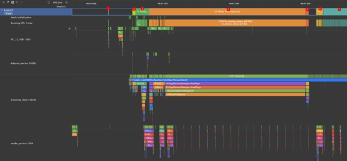
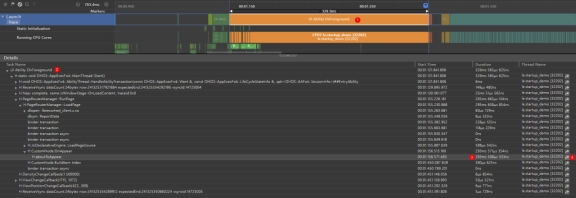
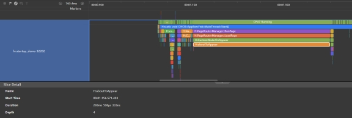
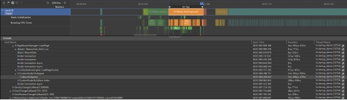
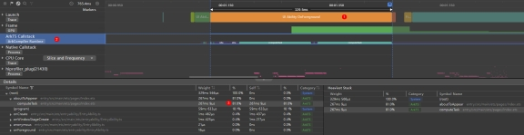
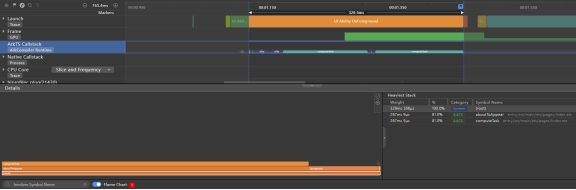
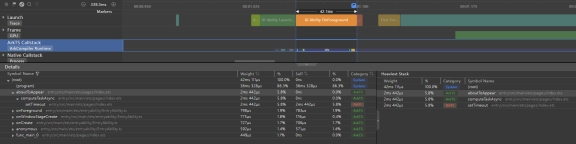

# 启动分析工具Launch Profiler使用指导

## **Launch Profiler概述**

DevEco Studio内置Profiler分析调优工具。其中Launch主要用于分析应用或服务的启动耗时，分析启动周期各阶段的耗时情况、核心线程的运行情况等，协助开发者识别启动缓慢的原因。此外，Launch任务窗口还集成了Time、CPU、Frame场景分析任务的功能，方便开发者在分析启动耗时的过程中同步对比同一时段的其他资源占用情况。

## **场景示例**

如下代码在页面绘制之前的aboutToAppear生命周期函数内执行了耗时的计算任务，导致应用冷启动耗时长，文章后续将以本案例场景来简单介绍Frame Profiler的使用。

```ts
@Entry
@Component
struct Index {
 @State private text: string = "hello world";
 private count: number = 0;

 aboutToAppear() {
  this.computeTask();
 }

 build() {
  Column({space: 10}) {
   Text(this.text).fontSize(50)
  }
  .width('100%')
  .height('100%')
  .padding(10)
 }

 computeTask() {
  this.count = 0;
  while (this.count < 10000000) {
   this.count++;
  }
 }
}
```

## **使用约束**

- 已通过USB连接设备

- 仅支持OpenHarmony API 10及以上版本的Stage工程

- 不支持对命令拉起的release应用进行Launch分析，也不可对其进行Launch录制。

## **如何使用Launch Profiler录制数据**

1. 首先打开profiler，以DevEco Studio 4.0.0.400版本为例，可以通过如下三种方式打开Profiler：

- 在DevEco Studio顶部菜单栏中选择“View -> Tool Windows -> Profiler”。

- 在DevEco Studio底部工具栏中单击“Profiler”。

- 按“Double Shift”或者“Crtl+Shift+A”打开搜索功能，搜索“Profiler”。

2. 创建Launch任务并启动录制



① 打开Profiler性能分析器；

② 选择待分析的设备与应用进程；

③ 选择Launch工具；

④ 点击create Session按钮创建启动分析任务；

⑤ 准备好调试环境后，点击开始录制启动数据，再次点击结束录制。

**说明：**

1. 针对调测应用的当前运行情况，Profiler对其做如下处理：

- 如选择的是已安装但未启动的应用，在启动该分析任务时，会自动拉起应用，进行数据录制，结束录制后可正常进入解析阶段。

- 如选择的是正在运行的应用，在启动该分析任务时，会先将应用关停，再自动拉起应用，进行数据录制，结束录制后可正常进入解析阶段。

2. 在任务录制（recording）及分析（analyzing）的过程中，请不要主动断开应用或者设备，否则可能导致分析任务异常失败。

## **如何使用Launch Profiler分析数据**

“Launch”泳道显示启动生命周期各阶段的耗时分布情况，如下图：



① Process Creating：进程创建阶段。该阶段主要是AppSpawn fork子进程，AMS创建ability

② Application Launching：应用程序启动阶段。该阶段主要是资源加载、Application相关对象的创建与初始化、依赖模块的加载等

③ UI Ability Launching：UIAbiity启动阶段。该阶段主要是资源加载、Ability相关对象的创建与初始化、依赖模块的加载等

④ UI Ability OnForeground：UIAbility置为前台阶段。该阶段主要是加载应用首页的源码和so以及创建应用首页内各个组件

⑤ First Frame - App Phase：应用侧首帧。在FlushTask中把之前加载的组件上树并布局

⑥ First Frame - Render Phase：渲染侧首帧。render_service接受下一帧应用来的首页布局信息，并绘制渲染

⑦ EntryAbility：渲染完成，首页显示

展开“Launch”泳道还包含多个与进程启动有关联的子泳道：

- “Static Initialization”子泳道：展示启动过程中各静态资源库的加载耗时；

- “Running CPU Cores”子泳道：展示启动过程中的主线程具体运行在哪个CPU核心；

- “le.startup_demo”子泳道：展示启动过程的主线程的状态和Trace数据；

针对应用冷启动问题的性能分析，有以下两种方式可以选择，一种是分析主线程的Trace数据，另一种则是分析采样得到的函数热点。

### **分析主线程的Trace数据**

从“Launch”泳道可以很明显的看出UI Ability OnForeground阶段的耗时占据应用冷启动过程的大部分时间，如下图



① 单击“Launch”泳道上的UI Ability OnForeground阶段，在下方的“Details”详情面板中，可查看到所选阶段的耗时统计情况；

② 展开UI Ability OnForeground统计信息折叠表，可以看到各函数的具体耗时信息；

③ 根据Duration找到耗时最长的函数aboutToAppear；

④ 单击按钮，可直接跳转至主线程的打点任务中，查看相关Trace数据，如下图



可以发现aboutToAppear函数的耗时占据UI Ability OnForeground阶段的大部分时间，结合应用代码将aboutToAppear函数中的耗时计算任务以异步延迟的方式处理后，可以得到如下“Launch”泳道。

### 

上述对比可以发现将耗时的计算任务以异步延迟的方式处理后可以显著缩短UI Ability OnForeground阶段的耗时，提升应用的冷启动速度。

### **分析采样得到的函数热点**

我们也可以分析采样得到的函数热点直观的显示应用冷启动过程中具体函数的耗时，如下图



① 单击“Launch”泳道上的UI Ability OnForeground阶段；

② 选择“ArkTS Callstack”泳道，其会基于时间轴展示CPU使用率和状态的变化，以及当前调用栈名称和调用类型；

③ 下方“Details”详情面板中查看到这段时间内的函数热点，其会以Top-Down形式的树状列表进行展示。很明显aboutToAppear函数中的computeTask函数耗时最多，占整个阶段的81%

此外，点击Flame Chart按钮打开火焰图可以更直观的看出热点函数的耗时情况，如下图:



根据上述步骤，使用异步延迟处理后的函数热点如下，可以发现aboutToAppear函数的执行耗时只占整个UI Ability OnForeground阶段的5.8%。



上述方法开发者可以选择自己习惯的方式去查看。一般来说，如果所选的时间段里，函数栈比较复杂的话，用火焰图找热点会更高效。当锁定到某个热点函数之后，只需要双击函数结点，Profiler工具就会为您自动打开对应的源文件，并聚焦到相应代码行。上述前提是这个源文件须是属于当前工程，并且是在DevEco Studio内完成编译的。

在使用Launch Profiler工具获取启动各阶段的耗时信息时，需要应用结合实际开发需要修改。无特殊情况下，应该避免在应用启动的生命周期函数内执行耗时操作，若需要可以使用异步延迟处理或者抛到其他线程处理。

## **提示**

1. Profiler为Launch分析数据提供了全局搜索能力。单击分析窗口左上角的，根据界面提示信息输入需要搜索的项目，可获取到相关内容的定位，使用搜索框的<、>按键可依次显示返回结果的详细内容。
2. 在任务分析窗口，可以通过“Ctrl+鼠标滚轮”缩放时间轴，通过“Shift+鼠标滚轮”左右移动时间轴。
