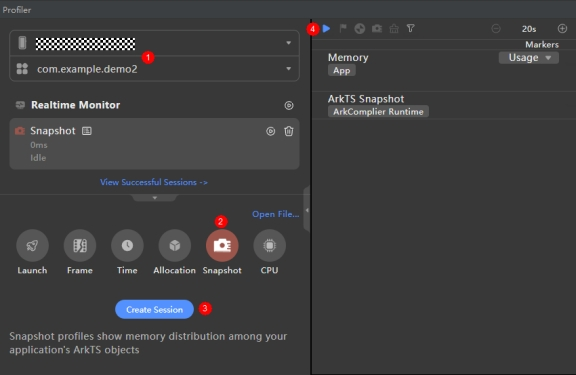
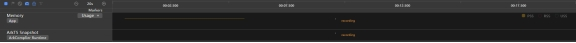
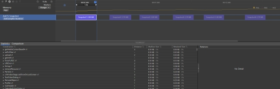
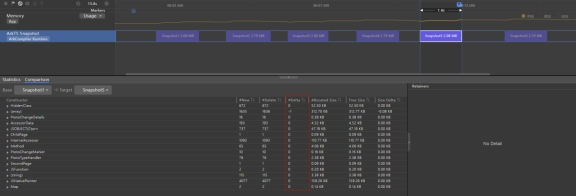

# 内存快照Snapshot Profiler功能使用指导

DevEco Studio集成的DevEco Profiler性能调优工具（以下简称为Profiler），提供Time、Allocation、Snapshot、CPU等场景化分析任务类型。内存快照（Snapshot）是一种用于分析应用程序内存使用情况的工具，通过记录应用程序在运行时的内存快照，可以快速查看应用程序在某一时刻的内存占用情况以及内存占用详情。针对方舟虚拟机，Profiler提供了内存快照分析能力，结合Memory实时占用情况，分析不同时刻的方舟虚拟机内存对象占用情况及差异。

## 使用约束

已通过USB连接设备并在设备上打开需要调试的设备。

仅在应用为debug编译模式时使用。

仅支持OpenHarmony API 9及以上版本的Stage工程。

## 场景示例

本示例设置两个页面，通过内存快照来分析页面跳转场景下是否存在内存泄露问题。

主页面代码如下：

```ts
import router from '@ohos.router'

@Entry
@Component
struct Index {
 build() {
  Row() {
   Column() {
    Button("点击跳转").onClick(() => {
     onJumpClick();
    })
   }
   .width('100%')
  }
  .height('100%')
 }
}

// 跳转下个页面
function onJumpClick(): void {
 router.pushUrl({
  url: 'pages/second' // 目标url
 }, router.RouterMode.Standard, (err) => {
  if (err) {
   console.error(`Invoke pushUrl failed, code is ${err.code}, message is ${err.message}`);
   return;
  }
  console.info('Invoke pushUrl succeeded.');
 });
}
```

跳转后页面代码如下：

```ts
@Component
struct ChildPage {
 @State arr: number[] = [];

 aboutToAppear(): void {
  for (let i = 1; i <= 100; i++) {
   this.arr.push(i);
  }
 }

 build() {
  Column() {
   List({ space: 20 }) {
    ForEach(this.arr, (index: number) => {
     ListItem() {
      Text(index.toString())
       .height('4.5%')
       .fontSize(16)
       .textAlign(TextAlign.Center)
       .backgroundColor(0xFFFFFF)
     }
     .border({ width: 2, color: Color.Green })
    }, (index: number) => index.toString());
   }
   .height("95%")
   .width("95%")
   .border({ width: 3, color: Color.Red })
   .lanes({ minLength: 40, maxLength: 40 })
   .alignListItem(ListItemAlign.Start)
   .scrollBar(BarState.Off)

  }.width('100%').height('100%').padding({ top: 5 });
 }
}

@Entry
@Preview
@Component
struct SecondPage {
 @State data: Number[] = [];

 aboutToAppear(): void {
 for (let i = 1; i <= 10; i++) {
  this.data.push(i);
 }
}

 build() {
  Column({ space: 5 }) {
   Swiper() {
    ForEach(this.data, (_: number) => {
     ChildPage();
    }, (item: number) => item.toString());
   }
   .loop(false)
   .indicator(true)
   .duration(100)
   .curve(Curve.Linear)

  }.width('100%')
  .margin({ top: 5 })
 }
}
```

## 如何开始内存快照任务

以DevEco Studio 4.0.0.400版本为例，在DevEco Studio菜单栏上单击***\*View\**** > ***\*Tool Windows\**** > ***\*Profiler\****，或者在DevEco Studio底部工具栏单击Profiler按钮，打开Profiler性能分析器。具体步骤如下：
① 选择待分析的设备与进程；

② 点选Snapshot工具；

③ 点击create Session按钮创建内存分析任务；

④ 准备好内存抓取环境后，点击开始按钮开始内存分析任务。



单击任务栏上方的按钮进行泳道的新增和删除，再次单击此按钮可关闭设置并生效。

### 注意

在任务录制（recording）及分析（analyzing）的过程中，请不要主动断开应用或者设备，否则可能导致分析任务异常失败。

## 如何录制内存快照



开始录制后可观察Memory泳道的内存使用情况

在需要定位的时刻点击“Take Heap Snapshot”按钮来创建内存快照，“ArkTS Snapshot”泳道的紫色区块表示一次快照完成。

点击“Collect garbage”按钮可启动内存回收机制。当方舟虚拟机的调优对象的某个程序/进程占用的部分内存空间在后续的操作中不再被该对象访问时，内存回收机制会自动将这部分空间归还给系统，降低程序错误概率，减少不必要的内存损耗。通常在分析启动时触发，用于降低内存回收对内存快照统计准确性的影响。

点击按钮停止内存分析任务

针对示例场景，在设备上多次进行页面跳转动作，并在页面跳转完成前后分别进行一次快照。

## 查看快照详情



ArkTS Snapshot泳道的紫色色块代表抓取的内存快照，点击色块查看快照中的内存详情分析。“Statistic”页签中显示当前快照的详细信息，包括构造函数名称、从GC roots到这个对象的层级深度、自身内存大小、相关内存大小等。

构造函数名称后的“x1”、“x2”、“xN”，表示该类型对象的数量，可单击折叠按钮展开。

单击列表中任一对象，右侧区域会显示从GC roots到这个对象的路径，通过这些路径可以看到该对象的句柄被谁持有，从而方便定位问题产生的原因。

带标识的对象，表示其可以通过窗口访问。

图中可以看出，每次页面跳转结束回到主页后抓取的内存快照大小基本没有差异。

## 比较快照差异



在“Snapshot”的“Comparison”页签中，可进行两次快照的差异比较，比较内容包括新增数、删除数、个数增量、分配大小、释放大小、大小增量等等。通过不断对比，可快速分析和定位内存问题的具体位置。

在“Base”和“Target”列表中选择要比较的快照名称，即可得到两次快照信息的比较结果。

针对示例场景，对比在主页时的第一次与最后一次快照，发现两次快照的内存大小与内存的构成项几乎没有差异，甚至最后一次快照的内存低于首次快照的内存。

通过以上分析得出结论：示例场景不存在内存泄露问题。
