# 性能测试工具SmartPerf Editor使用指导
## 概述
SmartPerf Editor是一款PC端桌面应用，通过监测、采集应用运行时FPS、CPU、GPU、Memory、Battery、Network等性能数据，帮助开发者了解应用的性能状况。SmartPerf Editor还集成了DrawingDoc功能，可录制Render Service绘制指令，回放并生成不同图形库文件。通过逐帧逐绘制指令回放，来识别是否存在冗余绘制、是否可以优化绘制指令的数量，从而提升页面绘制性能。本文首先介绍DrawingDoc录制回放原理，然后结合场景示例阐述DrawingDoc在性能实践中的应用。SmartPerf Editor更多信息可查看[SmartPerf Editor](https://developer.huawei.com/consumer/cn/doc/AppGallery-connect-Guides/smartperf-tool-overview-0000001581304157)。

## 原理介绍
图1 Render Service处理流程图

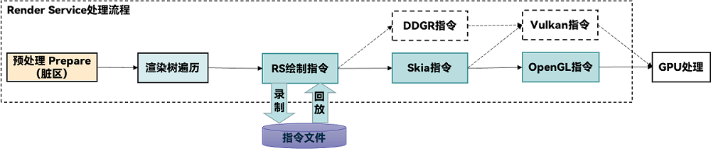

Render Service详细步骤如下：
1. 预处理：Render Service会接收渲染请求，并对其进行预处理，这个过程包括解析渲染指令、准备渲染资源、设置渲染环境等。
2. 渲染树遍历：Render Service遍历构建生成的渲染树，对每个节点进行适当的处理，包括应用样式、计算布局、生成绘制指令等。
3. RS绘制指令录制回放：在遍历渲染树的过程中，Render Service会生成RS绘制指令。RS指令录制时仅录制每帧的脏区内容，并将RS侧的绘制指令打包写入到文件中。RS指令回放时，使用OpenHarmony原本渲染库和程序读取指令文件。
4. 生成Skia指令和DDGR指令：RS绘制指令会被转换为Skia指令和DDGR指令，Skia和DDGR是一个2D图形库，用于绘制各种形状、文本和图像。
5. 生成Vulkan指令和OpenGL指令：DDGR指令会被转换为Vulkan指令，Skia指令会被转换为Vulkan指令和OpenGL指令。Vulkan和OpenGL是图形API，用于在硬件上执行高效的图形计算。
6. GPU处理：Vulkan指令或OpenGL指令被发送到GPU进行处理，GPU会将接收到的指令转换为像素渲染操作，最终将页面渲染到屏幕上。

## 使用约束
- Windows 7及以上操作系统的电脑。
- 工具需要使用华为账号登录，需要提前注册。
- 工具下载地址：XXX。
- 支持OpenHarmony，HarmonyOS和Android操作系统（其中DrawingDoc功能目前仅支持OpenHarmony操作系统）。
- USB连接或者WIFI连接。

## 场景示例
图2 场景预览图


```ts
@Entry
@Component
struct Index {
  @State isVisible: Visibility = Visibility.None;

  build() {
    Column() {
      Button("显示/隐藏Image")
        .onClick(() => {
          if (this.isVisible == Visibility.Visible) {
            this.isVisible = Visibility.None
          } else {
            this.isVisible = Visibility.Visible
          }
        })
      Stack() {
        Row().width('40%').height('40%').backgroundColor(Color.Pink)
        Text("Hello World").fontSize(40)
        Image($r('app.media.image')).width('100%').height('100%')
      }.width('100%').height('100%').backgroundColor(Color.Green).visibility(this.isVisible)
    }.width('100%')
  }
}
```
下文基于上述场景介绍SmartPerf Editor中DrawingDoc的使用，以及如何使用Skia Debugger工具网站分析skp文件。

## 录制数据
在分析skp文件之前，需要先使用DrawingDoc录制Skia指令，生成skp文件，具体步骤如下：
1. 打开SmartPerf Editor，在主界面左侧导航点击“DrawingDoc”>“录制”。

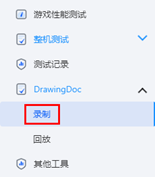

2. 点击“跳过安装”。

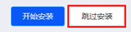

3. 设置“录制最大帧”。本示例中录制最大帧设置40。
4. 点击“开始录制”，同时在测试设备上操作要录制的测试页面，刷新上一步设定的帧数后，即自动完成录制。本示例中，点击测试页面的“显示/隐藏Image”按钮，显示图片。

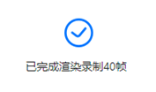

5. 录制完成后，点击右下角的“导出文件”。
6. 导出文件进度结束后，在主界面左侧导航点击“DrawingDoc”>“回放”。
7. “回放文件来源”选择“使用设备最近一次录制”，点击“导入文件”。也可以选择“从本地文件选择”，选择指定的frame开头的文件夹。frame开头的回放文件夹默认存放在D:\ProgramData\SmartPerf_Editor\graphic。

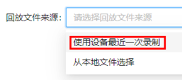

8. 打开“生成skp文件”。

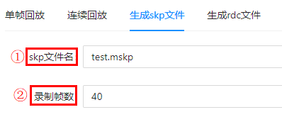

① 设置skp文件名。.mskp表示生成多帧录像文件，.skp表示生成单帧录像文件。本示例中使用多帧录像文件，skp文件名设置为test.mskp。

② 设置录制帧数。录制帧数不得大于前面设置的录制最大帧。本示例中录制帧数设置为40。

9. 点击“设置SKP参数”，“开始生成”，会在“SKP文件列表”显示生成的test.mskp文件。再点击“结束生成”，“导出SKP文件”。在D:\ProgramData\SmartPerf_Editor\graphic目录下，找到最新时间的skp开头的目录，里面存放的就是当前最新生成的mskp文件。mskp文件会记录整个录制过程中的产生的Skia指令。
以上就是录制Skia指令生成mskp文件的过程。

## 分析数据
使用Skia Debugger工具网站分析上述获取的mskp文件，具体步骤如下：
1. 打开“生成skp文件”页面上“导出SKP文件”按钮右边的链接“打开SKP Debugger”或者直接打开https://debugger.skia.org/，会跳转到SKP Debugger工具网页。点击“选择文件”，在D:\ProgramData\SmartPerf_Editor\graphic目录下找到要分析的skp文件。本示例中选择前面生成的test.mskp文件。

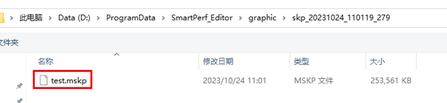

打开后可以看到如下界面，这里介绍一下SKP Debugger的常用功能。有关SKP Debugger的详细介绍可查看[Skia Debugger](https://skia.org/docs/dev/tools/debugger/)。

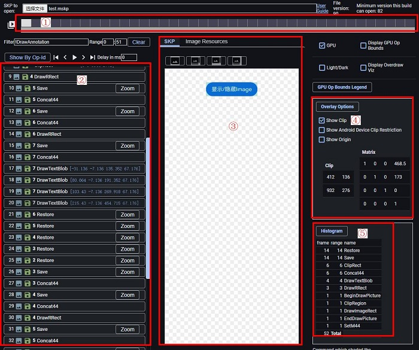

① SKP文件播放进度条。可循环播放录制的画面，也可以点击选中一帧，查看它的Skia指令和视图。

② Skia指令栏。显示选中一帧上所有的Skia指令。点击单个Skia指令可以查看该指令相关的Skia属性。比如像Image绘制指令里useCubic属性为true，表示该Image组件使用了useCubic算法，可以推测出Image使用了图片插值属性interpolation。使用高图片插值可能会影响图片渲染的速度，开发者可以考虑是否优化。

③ SKP视图。显示当前选中的Skia指令对应的视图。“Image Resources”会显示skp文件用到的所有图片资源。

④ Show Clip。勾选Show Clip后，可以查看单个Skia指令目前执行的位置，会有浅蓝色背景选中效果。Clip表示当前执行的Skia指令绘制区域的左上角和右下角坐标位置。Matrix是3D变换的矩阵信息。

⑤ Skia命令直方图。统计当前帧上每个Skia指令出现的次数。Draw开头的是绘制指令。

2. 点击播放键，查看本示例中test.mskp记录的40帧视图的变化过程。
3. 找到本示例中绘制图片的帧。

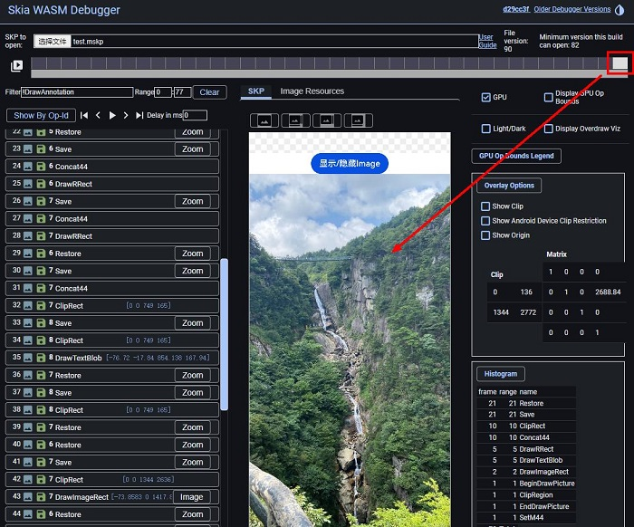

4. 单击右下角Skia命令直方图上的指令项，指令项背景会变粉色，可过滤掉选定的Skia指令。本示例主要关注Draw开头的绘制指令，这里把Draw开头的绘制指令筛选出来。

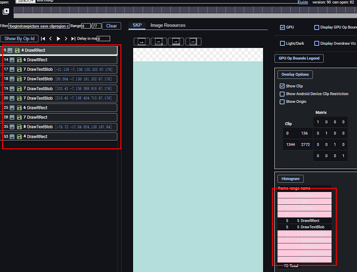

5. 点击播放按钮观察这一帧的绘制过程。也可以手动在左侧Skia指令栏从上到下依次点击绘制指令查看。

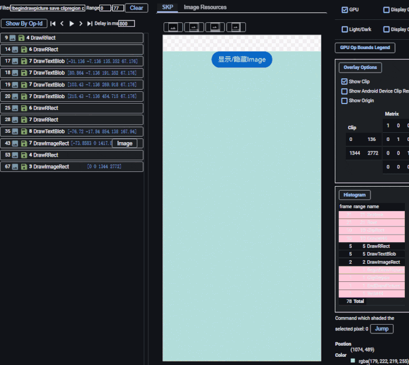

6. 通过观察SKP视图上这一帧的绘制过程，可以发现在图片绘制之前，先绘制一个粉色背景和一段“Hello World”的文字。这些被图片遮挡的内容用户无法感知，也没有实际的作用，开发者就可以分析出存在冗余的绘制组件。

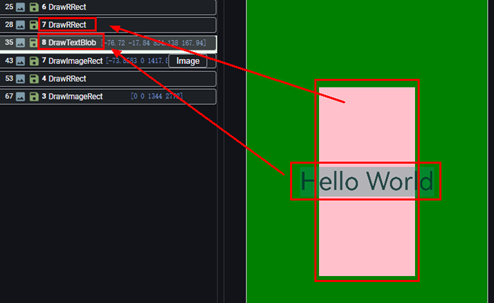

7. 在本示例中根据SKP视图找到并删除对应页面上的冗余组件。

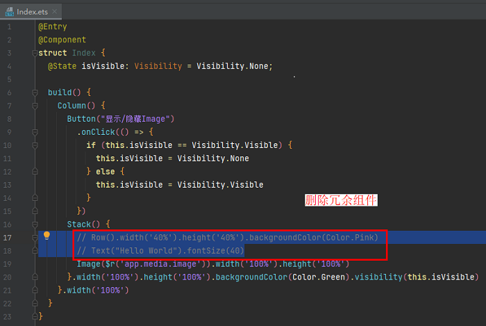

8. 使用优化后的应用，重新录制mskp，在Skia Debugger上可以看出绘制指令有所减少。

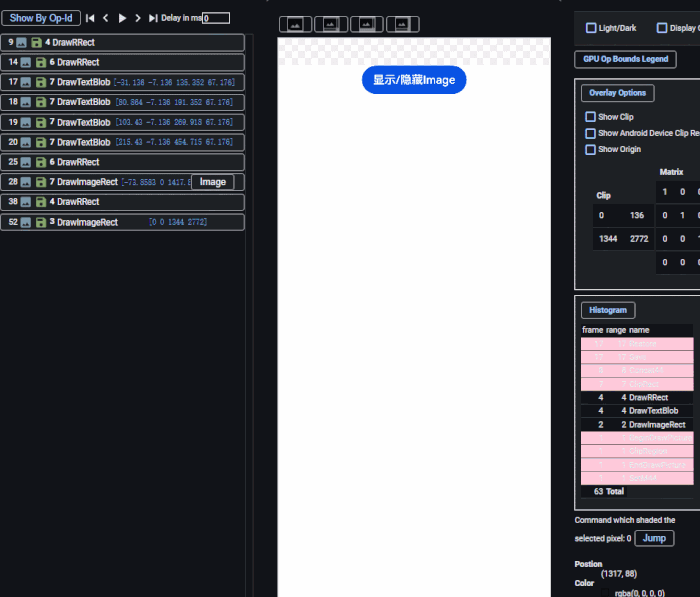

对比优化冗余组件前后的skp文件可以看出，去除冗余组件后绘制指令由原来的12个降低到10个，页面需要执行的Skia指令总数由78个下降到63个，Skia指令总量下降19%，有效提升页面的绘制性能。
冗余组件删除前后Skia指令数量对比：

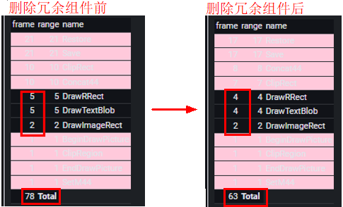

通过上述示例介绍DrawingDoc录制回放，以及使用Skia Debugger分析应用页面是否存在冗余绘制，进而对其进行优化。在实际复杂的应用页面中，如果存在冗余组件，页面绘制时执行额外的Skia指令会加重GPU负载，使页面组件刷新和渲染耗时变长，影响页面性能。使用DrawingDoc和Skia Debugger，可以通过抓取底层Skia指令，逐帧逐绘制指令回放应用页面上各个组件的绘制细节，从而帮助开发者减少应用页面的冗余绘制，有效提升应用绘制性能。


